:icons: font 

:toc: 

== Deploy the Contract First Module

TODO: deploy the solution through BackStage


== Objectives

We will be covering a lot of ground in this module. There are two disttint sections in this module

* Setting up Mobile App: Red Hat SSO' OpenID Connects provides  user SSO logins and also secure access to backend sytems. 
* Setting up Partner Portal Access: Users are managed by partners themselves, and Red Hat SSO' OpenID Connects only secures access to backend sytems. 

 Before you delve in, here is an outline of the activities.

* Configure *Red Hat SSO* for OpenID Configurations
* *Design an API* using Red Hat API Designer
** Import a template for *Globex Mobile OpenAPI* and *Partner Portals OpenAPI*
** Edit the Security Scheme of the template to include OpenID Connect (TBC need URL from Red Hat SSO)
* Manage specs in *Service Registry* 
** Manage application schema - in this case the OpenAPI Specifications - as a single source of truth
** Turn on Content vaidations
** Explore how OpenAPI can be used by the ecosytem
* Secure and managed APIs with *3scale API Management*
** Create Client account for Client ID management on Red Hat SSO
** Create 3scale Backend, Product and ActiveDoc
* Setup Mobile Gateway and Mobile App
* Setup Partner Gateway and Partner App

== 0. Setup your Devspaces 
You are going to use OpenShift Dev Spaces for a number of activities. OpenShift Dev Spaces uses Kubernetes and containers to provide a consistent, secure, and zero-configuration development environment, accessible from a browser window.

* In a browser window, navigate to the browser tab pointing to the Developer perspective of the OpenShift cluster. If you don't have a browser tab open on the console, navigate to %openshift_cluster_console%[OpenShift Console^, window=_console]. If needed login with your username and password (%user_name%/%user_password%).

* On the top menu of the console, click on the image:images/openshift-application-menu.png[] icon, and in the drop-down box, select *Red Hat OpenShift Dev Spaces*.
+
image::images/openshift-application-menu-2.png[]

* Login in with your OpenShift credentials (%user_name%/%user_password%). If this is the first time you access Dev Spaces, you have to authorize Dev Spaces to access your account. In the _Authorize Access_ window click on *Allow selected permissions*. 
+
image::images/devspace-auth-access.png[width=70%]

* You are directed to the Dev Spaces overview page, which shows the workspaces you have access to. You should see a single workspace, called *cloud-architecture-workshop*. The workspace needs a couple of seconds to start up.
+
image::images/devspaces-workspace-starting.png[]

* Click on the *Open* link of the workspace.
+
image::images/devspaces-workspace-started-1.png[]

* This opens the workspace, which will look pretty familiar if you are used to work with VS Code. Before opening the workspace, a pop-up might appear asking if you trust the contents of the workspace. Click *Yes, I trust the authors* to continue.
+
image::images/devspaces-trust-contents.png[]

* The workspace contains all the resources you are going to use during the workshop. In the project explorer on the left of the workspace, navigate to the *workshop/module-apim* folder
+
image::images/apim/apim-devspaces.png[] 

* You can deploy various resources needed in this workshop to the OpenShift cluster directly from Dev Spaces. To do so, you will need accessto the built-in Terminal. Click on the image:images/devspaces-menu.png[] icon on the top of the left menu, and select *Terminal/New Terminal* from the drop-down menu.
+
image::images/apim/apim-devspaces-menu-new-terminal.png[]

* This opens a terminal in the bottom half of the workspace.
+
image::images/apim/apim-devspaces-menu-terminal.png[]

* The OpenShift Dev Spaces environment has access to a plethora of command line tools, including *oc*, the OpenShift  command line interface. Through OpenShift Dev Spaces you are automatically logged in into the OpenShift cluster. You can verify this with the command *oc whoami*.
+

[source,bash,role=copy]
----
oc whoami
----
+
.Output
----
%user_name%
----
+
[IMPORTANT]
====
If the the output of the `oc whoami` command does not correspond to your username (%user_name%), you need to logout and login again with the correct username.

[source,bash,role=copy]
----
oc logout
oc login -u %user_name% -p %user_password% 
----

====

* You will be working in the `globex-apim-%user_name%` namespace. So run this following command to start using that particular project

+
[source,bash,role=copy]
----
oc project `globex-apim-%user_name%`
----
+
.Output
----
%user_name%
----

+
image::images/apim/apim-terminal-setup.png[]

=== Scratchpad
As you work through this Contract First APIs module, there are a few variables and URLs that are needed throughout this activity. To make things easier and manageable we've setup a scratchpad within Devspaces. You can fill this scrachpad up with information needed as you are guided below so that you can progress through this activity faster.

== 1. Red Hat SSO 

Red Hat SSO is used in this module to both offer single-sign on to Mobile users, and also for securing the APIs. You can access Red Hat SSO from  %sso_tenant_console% and login using username and password (%user_name%/%user_password%).

We will be using OpenID Connect which offers a discovery mechanism, called OpenID Connect Discovery, where an OpenID server (here Red Hat SSO based on Keycloak) publishes its metadata at a well-known URL. This URL is typically a collection of various endpoints the server offers.

* Click on the *OpenID Endpoint Configuration* link to view the Well Known confguration. 
+
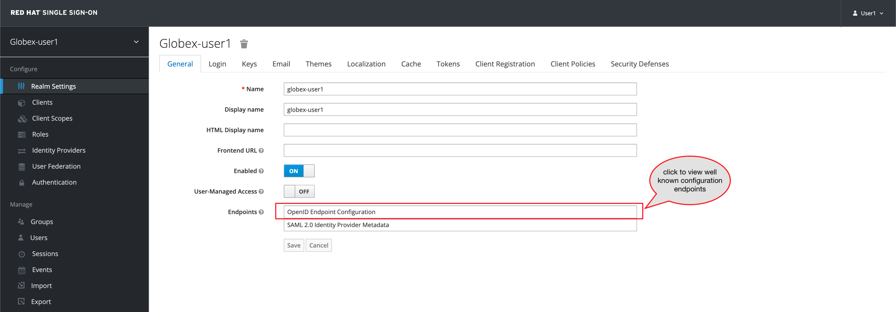
* Here is how the *well-known OpenID configuration* looks like
+
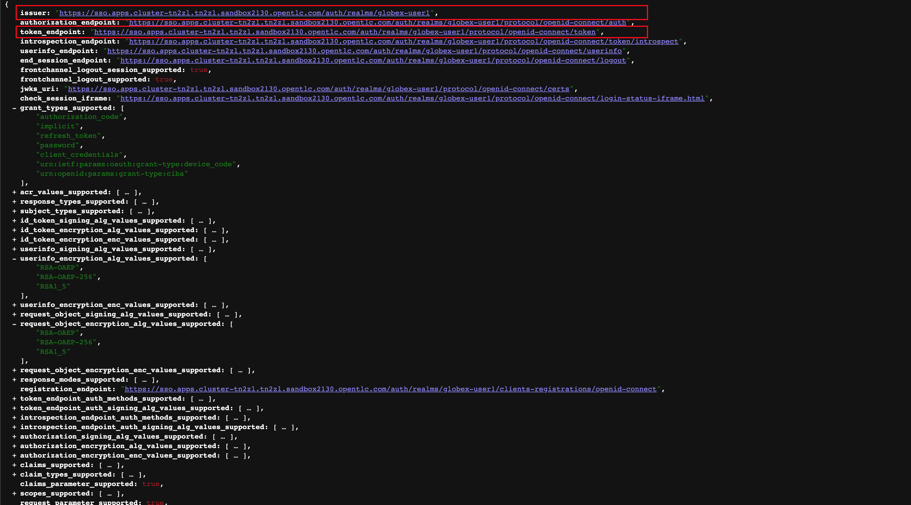
* We are interested specifically in the following enpoints

[cols="20%,80%"]
|===
|Endpoint  | Description

| *OpenID Wellknown configuration*:  

\https://sso.%openshift_subdomain%/auth/realms/globex-%user_name%/.well-known/openid-configuration | This URL provides a mechanism to discover the End-User's OpenID Provider and obtain information needed to interact with it, including OpenID/OAuth endpoint locations. The following endpoints is fetched from this URL


| *issuer*:  

\https://sso.%openshift_subdomain%/auth/realms/globex-%user_name% | This value is needed when we need to authorise a user through single sign-on

| *token_endpoint* : 

\https://sso.%openshift_subdomain%/auth/realms/globex-%user_name%/protocol/openid-connect/token | clients  can obtain access tokens from the server using this token endpoint and use these same tokens to access  protected resources  (APIs in our case).

|===


== 2. Design and Manage Mobile OpenAPI Specification

API design refers to the process of developing application programming interfaces (APIs) that expose data and application functionality for use by developers and users. Red Hat API Designer, based on Apicurio, is a lightweight tool that helps you to design APIs. The API Designer sessions are stateless and you must save your API definition as a JSON file at the end of each session. 

In this step you will import the draft OpenAPI specs for *Mobile App* and *Partner Portal*  and edit them to include *Security Schemes*. Once the API design phase is complete you will then manage that within Red Hat Service Registry.

*Here is a outline of what you will achieve:*

* Import the Mobile OpenAPI  and Partner OpenAPI 
* Add security schemes to both the specifications and include Red Hat SSO's OpenID well-known configurations
* Manage the OpenAPIs with a Service Registry

We will handle the Mobile OpenAPIAPI first, and then onto Partner OpenAPI


=== Design Mobile OpenAPI
Within API designer you can import the content as text OR you may choose to upload the draft specification. To keep things simple, we'll import the content by simply pasting the draft spec as YAML based text into the API designer.

[NOTE]
====
In a real-world scenario you would do the inverse: start with an empty API specification, and define the different elements of the spec document. You then export the spec in JSON or YAML format (by copying the contents from the source editor) to your local file system and push it to version control.
====


* Launch API Designer by clicking on this link %api_designer_url%[API Designer^]
* Click on the *New API* button.
+
image:images/apim/api-designer.png[] 
* Click on the *Source Tab* on the *New API* page. 
+
image::images/apim/api-new-api.png[]
* Navigate to the 
* Copy `(Ctrl+A and Ctrl+C)` the  draft Moile OpenAPI specification template (in YAML) that is  be found at https://raw.githubusercontent.com/rh-cloud-architecture-workshop/globex-mobile-gateway/main/src/main/resources/mobile-gateway-openapi.yaml[Mobile Gateway OpenAPI^]
+
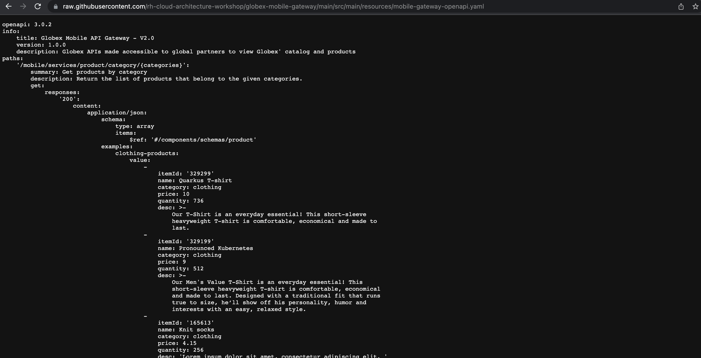
* Now replace the current content and paste `(Ctrl+A and Ctrl+V)` the copied draft OpenAPI spec into the API designer's *Source Tab*, and click on *Save* button as highlighted in the screenshot below.
image:images/apim/mobile-draft-imported.png[]
* Navigate back to the *Design Tab*
+
image:images/apim/api-design-tab.png[]
* You will now need to update the security scheme. Under the *SECURITY SCHEMES* section, click on *Add a security scheme* link
+
image::images/apim/api-designer-sec-scheme.png[]
* You are presented with the *Define the Security Scheme* page. Provide the following values in the form, and click on *Save*

[cols="20%,80%"]
|====
| *Name* | `openid-connect`
| *Description* | `OpenID Connect security scheme`
| *Security Type* | Choose `OpenID Connect`
| *OpenID Connect URL* | `\https://sso.%openshift_subdomain%/auth/realms/globex-%user_name%/.well-known/openid-configuration`
|====

image::images/apim/define-security-scheme.png[]


* You are navigated back to the homepage. Verify that you can see the *SECURITY SCHEMES* has been updated with your configuration
+
image::images/apim/security-scheme-complete.png[]
* The OpenAPI specificaion is now ready to be downloaded. Click on the *Save As -> Save as YAML*  button found on top-right of the page. Save the file in a place you can easily access.
* Don't close this broswer tab. You will use the Mobile OpenAPI  YAML content from the API Designer in the next step.
+
image::images/apim/api-download-as-yaml.png[]


=== Manage the Mobile OpenAPI with Service Registry

* Launch *Service Registry* by accessing this URL: %service_registry_url%[Service Registry^]
+
image::images/apim/service-registry-landing.png[]
* Click on the *Upload artifact* button as show in the above screenshot. You will be presented with a *Upload Artifact* wizard 
+
image::images/apim/sr-upload-artifact.png[]

* In the wizard, enter the following details, and click on the *Upload* button
|====
| Group | `globex`
| ID of the artifact | `mobileapi`
| Artifact textarea | Copy `(Ctrl+A and Ctrl+C)`  the YAML content of the Mobile OpenAPI specification from the API Designer, and Paste `(Ctrl+C)` into the textarea in *Service Registry*.
|====


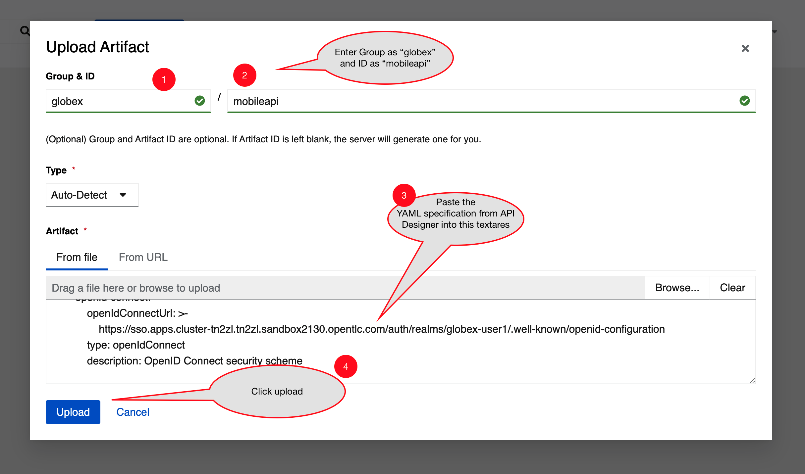

* Note that the *Globex Mobile API Gateway* artifact has been uploaded and  stored within *Service Registry*
+
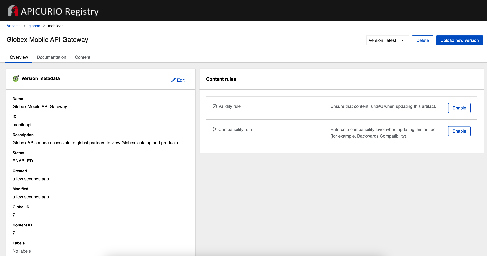

* You can share this OpenAPI schema with others via this link 
+
----
%service_registry_url%/apis/registry/v2/groups/globex/artifacts/mobileapi
----

[NOTE]
====
Note if you have provided different values for Group and ID in the previous steps, the URL will vary accordingly.
====


----
Thus far, you have completed the OpenAPI design of Mobile API, added Security Scheme to it, and imported it into Service Registry to manage and govern the API spefication.

In the next step, you will perform a similar set of activities for the Partner OpenAPI specs.
----


== 4. Code generation
=== View Quarkus generated code from OpenAPI Spec for Partner Gateway Serverside code

----
Thus far, you have seen how the schema can be used for Code Generation.
The next step involves managing these Mobile and Partner APIs using Red Hat 3scale API Management.
----

== 5. API Management

The Mobile API has been designed, and is now managed and governed by Red Hat Service Registry. Fast forward a bit of time, and the backend API team has built the backend APIs and the API services are running on OpenShift.

In order to manage and secure these API end points, in this section, you will 

* setup Red Hat SSO to manage access to users single-sign-on
* secure the APIs with OpenID Connect. 
* access the API Management's Developer Portal as Mobile Developer to sign up for access of these APIs
* test the finished configuration


=== Explore deployment architecture

=== Explore 3scale setup

=== Red Hat SSO
* Launch Red Hat SSO at %sso_tenant_console%
* All wellknown endpoints are here %sso_tenant_console%/auth/realms/%username%/.well-known/openid-configuration

* In order to setup OpenID Connect that will be used to seucre the backed services, you will now create client id especially for *Client Management*  <TBC - clarity needed here>
* Click on *Client* from the left-hand navigation. And, then click on the *Create* button on the right side as shown below
+
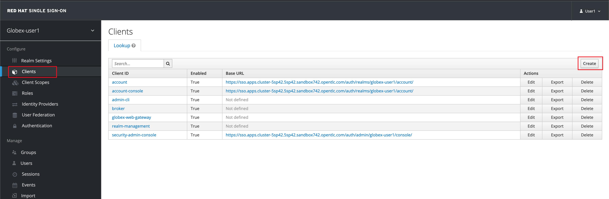

* You are presented with the *Add Client* wizard. Enter the following details in the wizard.
|====
| Name | Value

|Client Id | `client-manager`
|Client Protocol (dropdown) |  `openid-connect`
|====


image::images/apim/client-manager.png[]


* Click on *Save* button
+
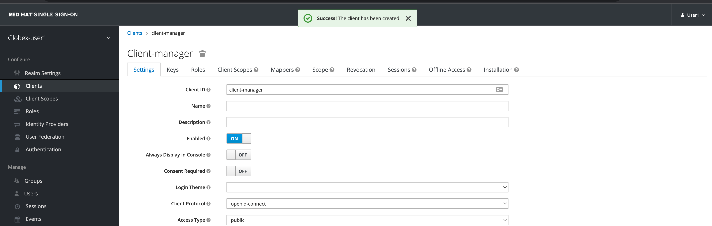

* You will setup the Grant flows for this Client Id you've just created.
** Change *Access Type* to `Confidential`
** Once the Access Types is Confidential you will see a new toggle button *Service Accounts Enabled*
** Keep *Service Accounts Enabled* as ON, and turn all other Grants and Flow OFF to match the following screenshot.
+
This confguration allows only Services based access using Servce Accounts, and will be used by 3scale API Management sytem in the next steps, when mobile users sign up for access.

+
image::images/apim/client-manager-setting.png[]

* Click on *Save* button at the bottom of the page. You will be notified that the changes are saved successfully. +

image::images/apim/client-manager-save.png[]

* Now you will need to setup *Client Roles* for this client id, so that it can manage client (create, amend and delete) on behalf of 3scale API Management <TBC more articulation on why SSO openid client manager>
** Click on the *Service Account Roles* tab from the top tab navigation.
** From the *Client Roles* dropdown, choose `realm-management`
+
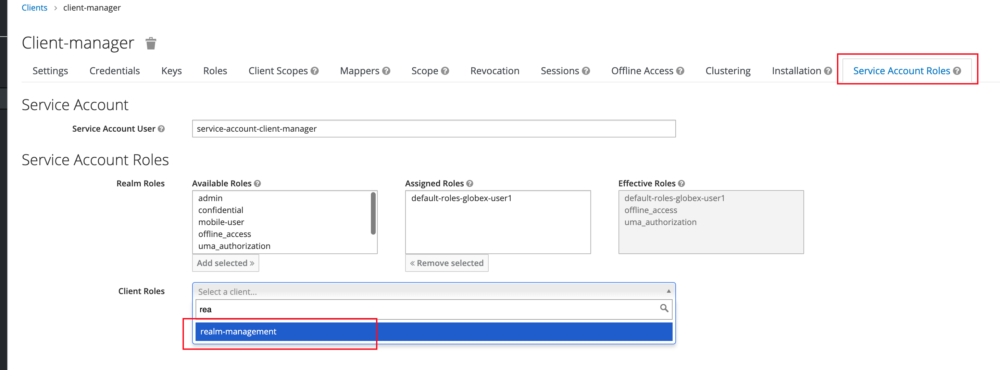
* From the *Available Roles* multichoice field, choose `manage-clients`, and click on *Add selected >>* button
** The mappings will get auto-saved.
+
image::images/apim/client-realm-management.png[]

* You can view the credentials of this client-id by choosed the *Credentials* tab. You will need this when setting up the 3scale products +

image::images/apim/client-manager-credentials.png[]


== 7. Setup 3scale configurations for Mobile API, and Mobile App configurations
In this section you will integrate Globex Mobile App with the Globex Mobile APIs/

The *Mobile Gateway* has been build in Quarkus and acts as an API gateway for all of the Mobile app calls. The source code can be found here https://github.com/rh-cloud-architecture-workshop/globex-mobile-gateway[globex-mobile-gateway^]. 

The  Mobile Gateway has pre-deployed under the `module-apim-%username%` namespace on OpenShift. 

To create the API endpoints, and secure and managed them, we will need to make certain necesssary configurations on 3scale API management. 

<TBC - what is backend, product, active doc etc etc>

=== Create Mobile Gateway Backend and Product on 3scale
* Create Backend for Mobile Gateway
* In devspaces %devspaces_dashboard%[Devspaces^], navigate to the folder `workshop -> module-apim -> mobile -> gateway`. 
* In the file `mobile-gateway-backend.yaml`, you need to update the `<replace-me>` placeholder with the Service endoint if the Globex Mobile Gateway API which has been predeployed +
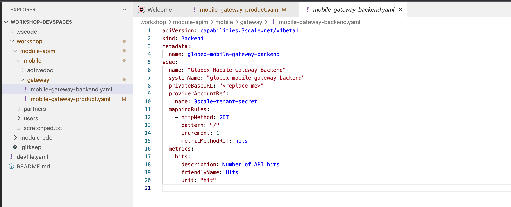

[NOTE]
====
<TBC >- Deplyoyments having services and routes.. here we choose services - becaue 3scale runs in the same cluster. this means there is no way to access the backend diretly from external system.
====

* The service endppoint of the `Mobile Gateway API` deployment can accessed from the OpenShift console.
* Navigate to the `globex-apim-%username%` namespace on the OpenShift console by clicking here https://console-openshift-console.apps.cluster-rg8f9.rg8f9.sandbox1535.opentlc.com/topology/ns/globex-apim-user1[APIM module on OpenShift^]
* In the "Find by name" file type `mobile-gateway`. The  `globex-mobile-gateway` deployment is highlighted. Clicking on this deployment opens the context menu for this deployment
image::images/apim/globex-mobile-gateway-deplpyment.png[]
* Under *Services* section you can note name of the services assocated with this deployment. Click on the `globex-mobile-gateway` link and you will be taken to the Services page. 
**  Under *Service routing -> Hostname*, you can find the service's hostname.
+
image:images/apim/mobile-gateway-services.png[]
* The same Service hostname is displayed below, and use this to replace the `privateBaseURL: "<replace-me>"` in Devspaces
+
[source,bash,role=copy]
.Copy Service hostname
----
http://globex-mobile-gateway.globex-apim-%username%.svc.cluster.local:8080
----

* The *privateBaseURL* in the *mobile-gateway-backend.yaml* file should read like this:
+
----
privateBaseURL: "http://globex-mobile-gateway.globex-apim-user1.svc.cluster.local:8080"
----
* From the Terminal of Devspaces that should be open already, run the following commands 
+
[source,bash,role=copy]
.Command
----
oc apply -f /projects/workshop-devspaces/workshop/module-apim/mobile/gateway/mobile-gateway-backend.yaml 
----

* You will see the output as 
+
.Output
----
backend.capabilities.3scale.net/globex-mobile-gateway-backend configured
----

* The next step is to *Create the Product*
* In the same folder  `workshop -> module-apim -> mobile -> gateway`, ppen the file `mobile-gateway-product.yaml` and update the following 2 values as directed below.
+
image::images/apim/mobile-gateway-product.png[] 

**  *<client-credentials>* : Value of Client Credentials of the *client-manager* client you created in Red Hat SSO  in the previous step +
image:images/apim/client-manager-credentials.png[]
** *<issuer-endpoint>* : Red Hat SSO's *Issuer URL*  from https://sso.%openshift_subdomain%/auth/realms/globex-%user_name%/.well-known/openid-configuration[well known configurations endpoint^]. From the JSON displayed on the browser, copy the URL againt the key `issuer` +
image:images/apim/sso-issuer-endpoint.png[] 
+
Alternative you can use the (same) URL as shown below for ease of use
+
[source,bash,role=copy]
----
https://sso.%openshift_subdomain%/auth/realms/globex-%user_name%
----

* The `mobile-gateway-product.yaml` file should looks like this now  <TBC> - <change screenshot> +

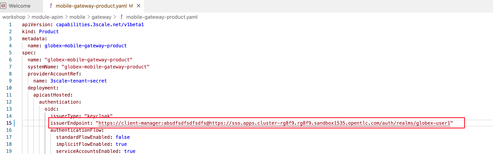
* Execute the following command in the Terminal to create this Product for Mobile Gateway 
+
[source,bash,role=copy]
.Execute command in Terminal
----
oc apply -f /projects/workshop-devspaces/workshop/module-apim/mobile/gateway/mobile-gateway-product.yaml 
----

* You will the see the following output confirming creation of 3scale Product for Mobile Gateway: 
+
.Output
----
product.capabilities.3scale.net/globex-partner-gateway-product created
----
* You can now see that the backend and product  on 3scale <TBC> talk about operators etc.. and show how instances  are managed.
+
image::images/apim/apim-partner-pro-be-setup.png[] <tbc change screenshot>

* You can now navigate to %3scale_tenant%[3scale^] and login using your username and password (%user_name%/%user_password%).
+
image::images/apim/apim-mobile-3scale-login.png[]
* You will notice that the Mobile Product and Backend have been created.
* Click on *globex-mobile-gateway-product* under *APIS -> Products* section. 
* You are presented with Product overview page for the Mobile API Product you created. Note the following elements
** Published Application Plans <TBC what are application plans>
** Backed has been attached to th product
+
image::images/apim/mobile-product-overview.png[]
* Navigate to *Integration -> Settings* page form from the Product overview page. You will notice that the Product has been setup with 
** OpenID Connect
** configured with the *client_manager* client that you had created in the previous steps.
** The *authorization flow* includes *Implicit Flow* because we would be authenticating the users SSO as well <TBC> more details needed here.
+
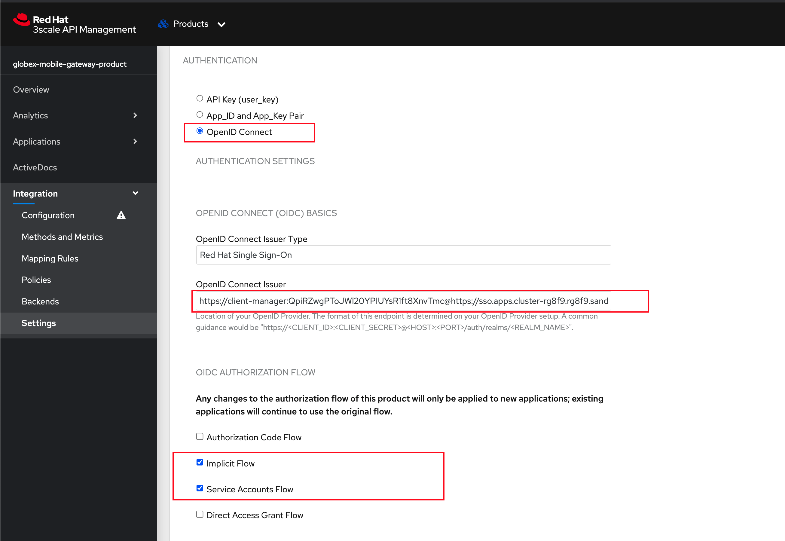

<TBC metod, metrics, mapping rules - script needs correction>
==== Create Active Doc for Mobile Gateway
<<why active docs TBC>

* In Devspaces, navigate to the folder `workshop -> module-apim -> mobile -> activedoc`, open the file `mobile-activedoc.yaml`
+
image::images/apim/mobile-activedoc-yaml.png[width=70%]
* Replace the `<replaceme>` placeholder with the  Service Registry OpenAPI endpoint
+
[source,bash,role=copy]
.Copy Service Registry OPENAPI endpoint
----
%service_registry_url%/apis/registry/v2/groups/globex/artifacts/mobileapi
----
* Create this Active Doc by running the following command
+
[source,bash,role=copy]
.Create Activdoc command
----
oc apply -f /projects/workshop-devspaces/workshop/module-apim/mobile/activedoc/mobile-activedoc.yaml 
----
+
.Output
----
activedoc.capabilities.3scale.net/mobile-gateway-activedoc created
----
* You can see all these created in OpenShift <TBC - CRs etc>
+
image::images/apim/apim_partner_openshift_full_setup.png[]
* The ActiveDoc is visible from 3scale portal as well under Products. <tbc - do we need this? refine>
+
image::images/apim/apim_3scale_activedoc.png[]
* Promote the Staging and Production API Cast by <TBC>
+
image::images/apim/mobile-promote-apicast.png[]

=== Setup Mobile users
* The Mobile developers of Globex will access the Developer Portal to signup for the APIs exposed to them.
* Typically they would access the developer portal and signup for an account which may as needed go through an approval process
* For the purpose of this workshop let us run a few commands to setup these users
* In the terminal run
+
[source,bash,role=copy]
.Create users command
----
oc apply -f /projects/workshop-devspaces/workshop/module-apim/users/mobile-dev-setup.yaml 
----

* You will see the output as 
+
.Output
----
developeraccount.capabilities.3scale.net/mobile-developeraccount created
secret/mobileuser.secret created
developeruser.capabilities.3scale.net/jane.mobile created
developeruser.capabilities.3scale.net/ron.mobile created
----
* You can view these users on the 3scale admin portal as well at %3scale_tenant%buyers/accounts


=== Sign up as a Mobile Developer
* Launch the Globex Developer Portal by clicking on this: %globex_developer_portal%[Developer Portal^]
* Sign in as one of the user you created in the previous section with
** username: `ron.mobile`
** password: `openshift`

=== Globex Developer Portal
<TBC what is>

=== Setup Dev Portal
* From the 3scale Admin portal navigate to the Audience page %3scale_tenant%buyers/accounts
* Navigate to `Settings -> Domains & Access` section at %3scale_tenant%/site/dns and remove the value in the textfield below the label `Developer Portal Access Code` as show below.. Click on `Update Account`

images::apim_domain_access.png[]
* This opens up the Developer Portal to public access without a accesscode

* The next step is to allow a Developer to access *Multiple Services* and *Multiple Applications*
* Navigate to `Developer Portal -> Feature Visibility` section, at %3scale_tenant%/p/admin/cms/switches 
* Click on the *Show* button against the features *Multiple Services* and *Multiple Applications* so that it appears as show and highlighted in the screenshot below. 

image::images/apim/apim_feature_visibility.png[]

* The Globex Developer Portal is all setup now for Partners to signup

=== Setup Mobile App

* In the previous section, you signed up for access as a Partner Developer and gained credentials to access the APIs Globex exposes.

* To update the Partner Web application you need 4 values
. Client ID
. Globex Mobile API Endpoint
. Token URL


* These values are part of `globex-partner-web` Deployment and are highlighted in the screenshot below <TBC

image::images/apim/mobile-deployment-env.png[]

* From the OpenShift console you can navigate to the Environment variables of `globex-mobile`. You can do so easily by clicking on %openshift_cluster_console%/k8s/ns/globex-apim-%username%/deployments/globex-mobile/environment. 
* To replace the environment variable `GLOBEX_MOBILE_GATEWAY` fetch the  Globex API Endpoint from the *Globex Developer Portal* %globex_developer_portal% - TBC
** Navigate to %globex_developer_portal% and click on Documentation
** Copy the service end point for Mobile Gateway
* To update the other values such as Client ID from Applications from 3scale Applications
* Redirect URL  - replace with <TBC> - ask to use scraptchpad to collect all this.
* SSO_AUTHORITY - <TBC>
Click on *Save* at the bottom of the page
* Navigate to %OPENSHIFT_CONSOLE% and navigate to globex_apim_%username% project. (https://console-openshift-console.%openshift_subdomain%/topology/ns/%username%?view=graph)
* Click on `globex-mobile-web` deployment

=== Setup mobile
* Signup for application plan
* Patch Mobile app with client ID and Authorization URL from Developer Portal
* Setup redirect as * 
* setup weborigins for the URL %PARTNER_WEB_URL%
* Setup redirect on SSO as + and URL of the mobile-app


image::https://chart.googleapis.com/chart?chs=150x150&amp;cht=qr&amp;chl=https://globex-mobile-globex-apim-user1.apps.cluster-27dmc.27dmc.sandbox2087.opentlc.com[Globex Mobile,250,350]
 

== 8. Setup Partner Gateway and Partner App
* Create Backend for Partner Gateway
* In devspaces %devspaces_dashboard%, under the folder   `workshop -> module-apim -> partners -> partner-gateway`, open the file `partner-gateway-product.yaml`
+
image::images/apim/[]

* Change the `issuerEndpoint` as highighterd

e.g `https://keycloak-redhatssonew.apps.jaya.local.sandbox1316.opentlc.com/auth/realms/globex-user1`

* It looks like this now

+
image::images/apim/product-gateway-product-issuerendpoint.png[]
```
cd /projects/workshop-devspaces/workshop/module-apim/partners
oc apply -f partner-gateway/partner-gateway-backend.yaml 
```

* You will see the output as +
```
backend.capabilities.3scale.net/globex-partner-gateway-backend configured
```

* Create Product for Partner Gateway by applying the change through the following command

```
oc apply -f partner-gateway/partner-gateway-product.yaml 
```

* You will the see the following output: +
`product.capabilities.3scale.net/globex-partner-gateway-product created`

* You can now see that the bacend and product have been created both on OpenShift and on 3scale
image::images/apim/apim-partner-pro-be-setup.png[]
* Navigate to %3scale_tenant%
https://3scale-user1-admin.apps.cluster-27dmc.27dmc.sandbox2087.opentlc.com/p/admin/dashboard
+
image::images/apim/apim-partner-3scale.png[]


=== Create Active Doc for Partner Gateway
* Create a secret to hold the OpenAPI specification. The specification can be accessed via a URL as well. But for this activity we will be storing the spec in a secret, and refer to it from the ActiveDocs are as about to setup

* Access  %RH_SSO% to view the well known openid configuration, access the `token_endpoint` url as highlghted here +
image::images/apim/apim_sso_token_endpoint.png[]

* In devspaces %devspaces_dashboard%, under the folder   `workshop -> module-apim -> partners -> activedoc`, open the file `partner-activedoc-secret.yaml`
* Replace  the `tokenUrl` with the value copied in the previous step as highlighted here
image::images/apim/partner-activedoc-secret.png

* Create this OpenAPI Specification in a secret
```
oc create secret generic partner-openapi-secret --from-file  ../partners/activedoc/partner-activedoc-secret.yaml
```


Output
```
secret/partner-openapi-secret created
```

* Create this Active Doc referencing this  secret
```
oc apply -f ./activedoc/partner-activedoc.yaml 
```


Output
```
activedoc.capabilities.3scale.net/partner-gateway-activedoc created
```

image::images/apim/apim_partner_openshift_full_setup.png[]


image::images/apim/apim_3scale_activedoc.png[]

=== Setup Partner users
* The Partners of Globex will access the Developer Portal to signup for the APIs exposed to them.
* Typically they would access the developer portal and signup for an account which may as needed go through an approval process
* For the purpose of this workshop let us run a few commands to setup these users

images::partner-account-setup.png[]

* You can view these users on the 3scale admin portal as well at %3scale_tenant%buyers/accounts

=== Setup Dev Portal
* From the 3scale Admin portal navigate to the Audience page %3scale_tenant%buyers/accounts
* Navigate to `Settings -> Domains & Access` section at %3scale_tenant%/site/dns and remove the value in the textfield below the label `Developer Portal Access Code` as show below.. Click on `Update Account`

images::apim_domain_access.png[]
* This opens up the Developer Portal to public access without a accesscode

* The next step is to allow a Developer to access *Multiple Services* and *Multiple Applications*
* Navigate to `Developer Portal -> Feature Visibility` section, at %3scale_tenant%/p/admin/cms/switches 
* Click on the *Show* button against the features *Multiple Services* and *Multiple Applications* so that it appears as show and highlighted in the screenshot below. 

image::images/apim/apim_feature_visibility.png[]

* The Globex Developer Portal is all setup now for Partners to signup


=== Setup Partner Access and Web app
* Now you will wear the hat of a Partner of Globex.
* You will need to 
** Signup for access to the Globex Partner APIs
** Patch your application with the  the access credentials obtained in the previous step so that all calls from the partner app will be authenticated by 3scale and Globex Partner API Gateway can then respond to your request.

==== Signup for application as a partner
* Navigate to the Developer Portal %DEVELOPER_PORTAL%
* Click on *SIGN IN* on top right of the page
* Login using the admin user you had created `june.partnerz` and password `openshift`

image::images/apim/apim-devportal-signin.png[]
* You are invited to *Create Application*. Click on the *Create Application* button
image::images/apim/apim-devportal-firstpage.png[]
* Click on 	*Subscribe to Globex Partner Gateway Product* link

image::images/apim/apim-devportal-subscribe.png[]
* You are sucessfully subcribed to the service

image::images/apim/apim-devportal-subscribe-success.png[]

* Navigate to the *Applications tab* found on the top menu
* Click on *Create new application* link  +

image::images/apim/apim-devportal-create-new-app.png[]

* Give the plan a *Name* and a *Description* and click on *Create Application* 

image::images/apim/apim-devportal-create-new-app-2.png[]

* An application is created successfully. Make a note of the *Client ID* and *Client Secret*. You will be using this in the Partner Web application.

image::images/apim/apim-devportal-app-success.png[]

* Enter the value asterisk (*) in the **REDIRECT URL** field and click on **Submit** button. This is to setup the right Redirect URL for OAuth using Red Hat SSO


=== Setup Partner Web Portal

* In the previous section, you signed up for access as a Partner Developer and gained credentials to access the APIs Globex exposes.

* To update the Partner Web application you need 4 values
. Client ID
. Client Secret
. Token URL
. Globex API Endpoint

* These values are part of `globex-partner-web` Deployment and are highlighted in the screenshot below

image::images/apim/partner-web-deployment-env.png[]

. From the OpenShift console you can navigate to the Environment variables of `globex-partner-web`. You can do so easily by clicking on %openshift_cluster_console%//k8s/ns/globex-apim-user1/deployments/globex-partner-web/environment. 
. To replace the environment variable `GLOBEX_PARTNER_GATEWAY` fetch the  Globex API Endpoint from the *Globex Developer Portal* %globex_developer_portal% - TBC
** Navigate to %globex_developer_portal% and click on Documentation
** Copy the service end point for Partner Gateway
. To update the other values such as Client ID, Secret and Token URL, the corresponding Secret needs to be updated.
. In the Dev workspace, open the file  `/projects/workshop-devspaces/workshop/module-apim/partners/partner-web/secret.yaml` 
. Launch the terminal by +
----
cd /projects/workshop-devspaces/workshop/module-apim/partners/partner-web
----

. Update the Client Id, Secret and Token URL from the values from Developer Portal +
----
oc apply -f secret.yaml 


You will see this Output +
secret/globex-partner-web configured
----


* Navigate to %OPENSHIFT_CONSOLE% and navigate to globex_apim_user(_n_) project. (https://console-openshift-console.apps.jaya.local.sandbox1316.opentlc.com/topology/ns/globex-apim-user1?view=graph)
* Click on `globex-partner-web` deployment


== 3. Design and Manage Partner OpenAPI Specification

=== Design Partner OpenAPI
* Launch API Designer by clicking on this link %api_designer_url%[API Designer^]. 

[NOTE]
====
If API Designer page is already open, you can just close the tab and relaunch it. We don't need the Mobile OpenAPI specs from the previous section anymore (within API designer)
====
* Click on the *New API* button.
+
image:images/apim/api-designer.png[] 
* Click on the *Source Tab* on the *New API* page. 
+
image::images/apim/api-new-api.png[]
* Copy `(Ctrl+A and Ctrl+C)` the draft Partner OpenAPI specification (in YAML) that is found at https://raw.githubusercontent.com/rh-cloud-architecture-workshop/globex-partner-gateway/main/src/main/resources/partner-gateway-openapi.yaml[Partner Gateway OpenAPI^]
+
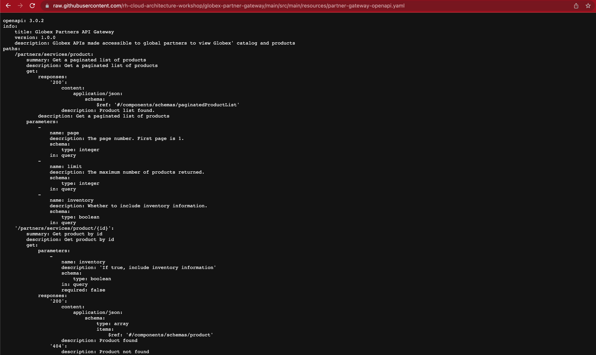
* Now replace the current content and paste `(Ctrl+A and Ctrl+V)` the copied draft Partner OpenAPI spec into the API designer's *Source Tab*, and click on *Save* button as highlighted in the screenshot below.
+
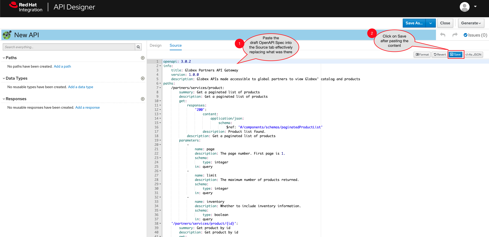
* Navigate back to the *Design Tab*
+
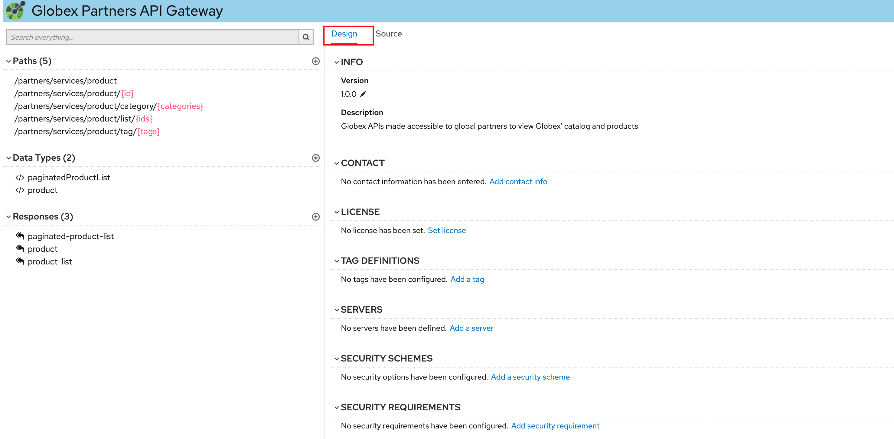
* You will now need to update the security scheme. Under the *SECURITY SCHEMES* section, click on *Add a security scheme* link
+
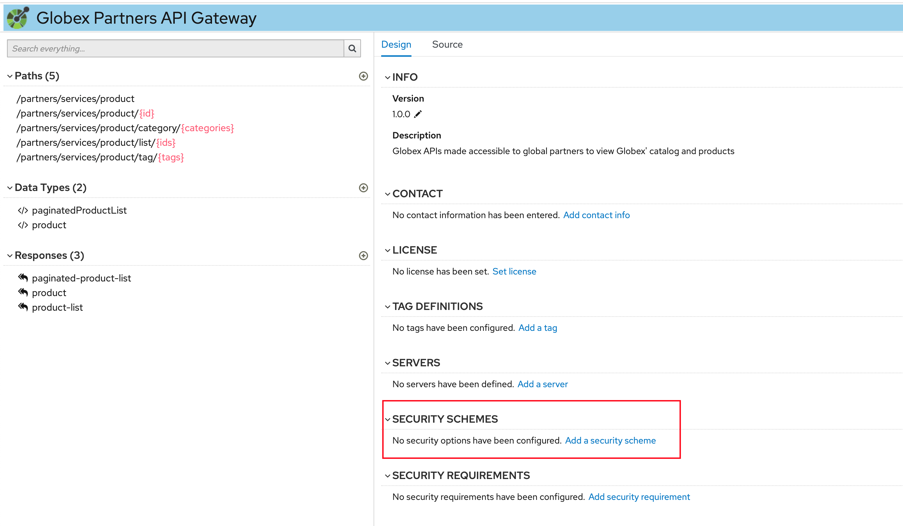
* You are presented with the *Define the Security Scheme* page. Provide the following values in the form, and click on *Save*

[cols="20%,80%"]
|====
| *Name* | `openid-connect`
| *Description* | `OpenID Connect security scheme`
| *Security Type* | Choose `OpenID Connect`
| *OpenID Connect URL* | `\https://sso.%openshift_subdomain%/auth/realms/globex-%user_name%/.well-known/openid-configuration`
|====

image::images/apim/define-security-scheme.png[]


* You are navigated back to the homepage. Verify that you can see the *SECURITY SCHEMES* has been updated with your configuration
+
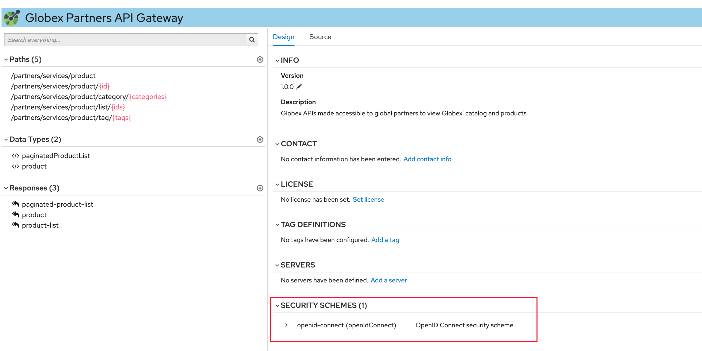
* The OpenAPI specificaion is now ready to be downloaded. Click on the *Save As -> Save as YAML*  button found on top-right of the page. Save the file in a place you can easily access.
* Don't close this broswer tab. You will use the Partner OpenAPI YAML content from the API Designer in the next step.
+
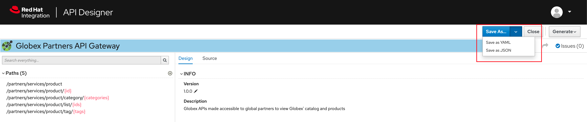


=== Manage the Partner OpenAPI with Service Registry

* Launch *Service Registry* by accessing this URL: %service_registry_url%[Service Registry^]

[NOTE]
====
If the Service Registry browser tab is already open, navigate to the home page. You will see the Mobile API on the browser.
====

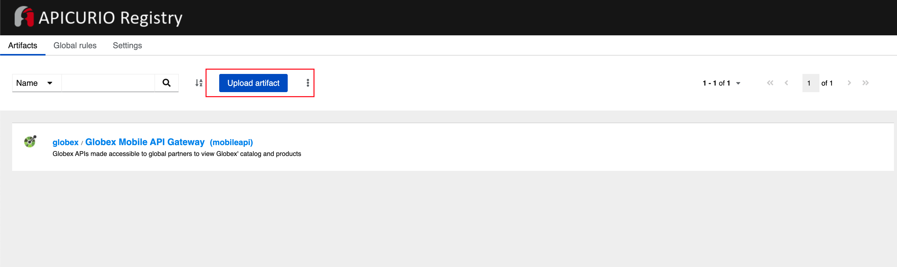

* Click on the *Upload artifact* button as show in the above screenshot. You will be presented with a *Upload Artifact* wizard 
+
image::images/apim/sr-upload-artifact.png[]

* In the wizard, enter the following details, and click on the *Upload* button
|====
| Group | `globex`
| ID of the artifact | `partnerapi`
| Artifact textarea | Copy `(Ctrl+A and Ctrl+C)`  the YAML content of the Partner OpenAPI specification from the API Designer, and Paste `(Ctrl+C)` into the textarea in *Service Registry*.
|====


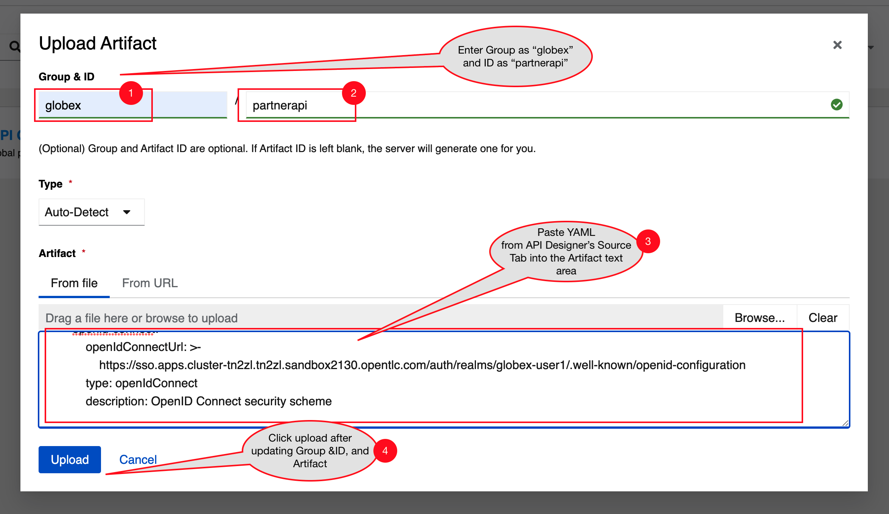

* Note that the *Globex Partner API Gateway* artifact has been uploaded and stored within *Service Registry*
+
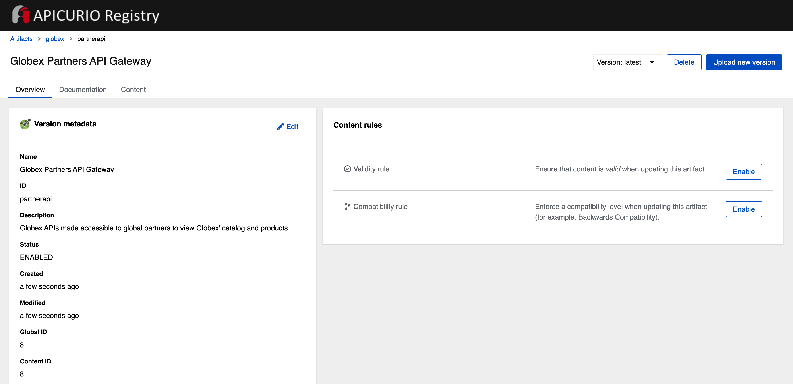

* You can share this OpenAPI schema with others via this link 
+
----
%service_registry_url%/apis/registry/v2/groups/globex/artifacts/partnerapi
----

[NOTE]
====
Note if you have provided different values for Group and ID in the previous steps, the URL will vary accordingly.
====


----
Thus far, you have completed the OpenAPI design of both Mobile API and Partner API, added Security Scheme to them, and imported it into Service Registry to manage and govern the API spefication.

In the next step, you will look at how the schema can be used for Code Generation
----


curl -X POST -H "Content-type: application/json; artifactType=OPENAPI" -H "X-Registry-ArtifactId: mobileapi" -d @<file-name> https://service-registry-user1.apps.cluster-tn2zl.tn2zl.sandbox2130.opentlc.com/api/artifacts


