:icons: font 

== Deploy the Contract First Module

TODO: deploy the solution through BackStage

== Deployment Overview

TODO: describe the deployment topology

image::images/apim/apim_deployment.png[] 

== Design APIs

Red Hat API Designer provides a lightweight tool to design APIs. In this section you will import an API which has been in development already and customise it.

=== Import API

* Launch API Designer through this link %api_designer_url%[API Designer^]
* The OpenAPI specification template can be found at 


=== Update security scheme
=== Keycloak token URL
=== Export to service registry

== Service Registry ??
=== Explore
=== Try out content validation
=== Used as a repository
=== Check: On prem access to API endpoints

== Code generation
=== View Quarkus generated code from OpenAPI Spec for Partner Gateway Serverside code

== API Management

=== Explore deployment architecture

=== Explore 3scale setup

== Red Hat SSO
* Explore Red Hat SSO %sso_tenant_console%


* All wellknown endpoints are here %sso_tenant_realm_url%/.well-known/openid-configuration

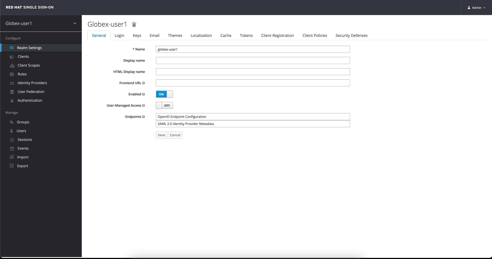

* Create client id for Client Management 
+
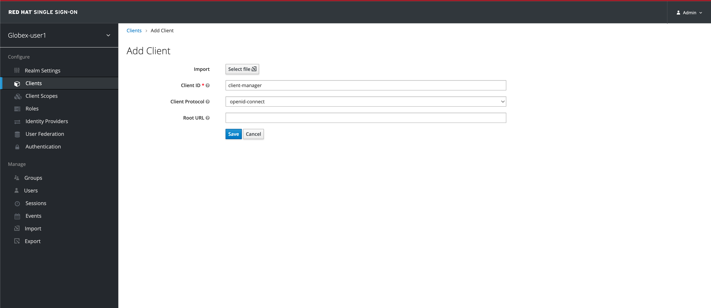


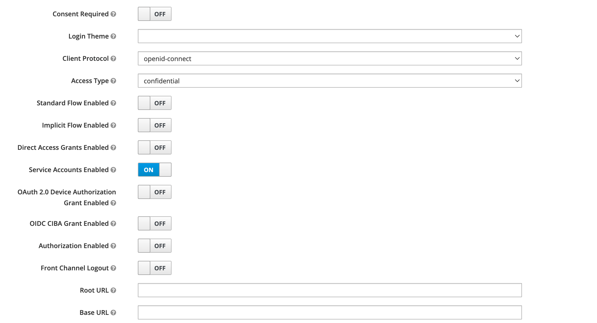

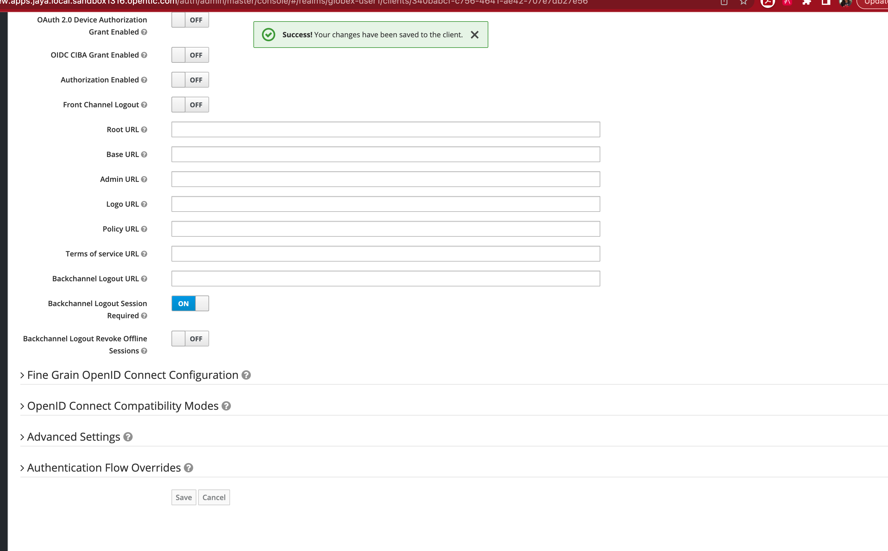

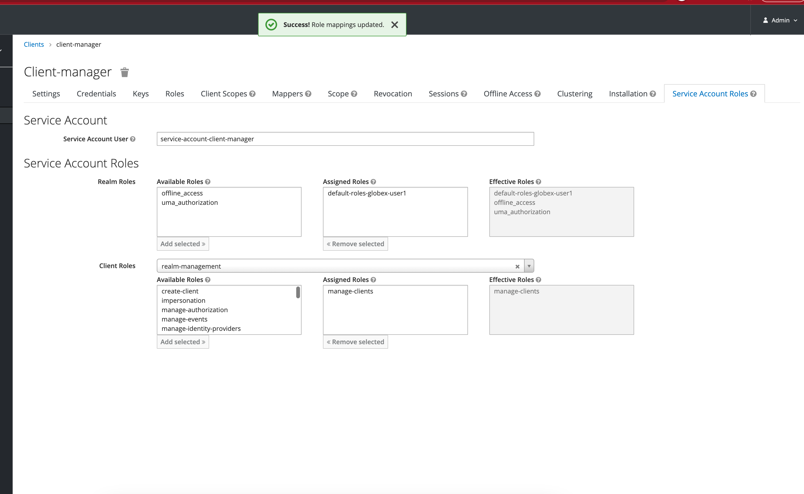

* Copy credentials. You will need this when setting up the 3scale products +

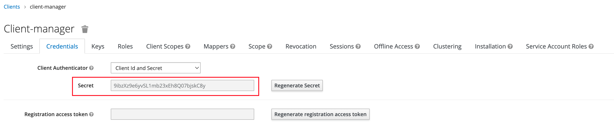

* You will also need the SSO *Issuer URL*. You can obtain this from Red Hat SSO's well known configurations endpoint %sso_tenant_realm_url%/.well-known/openid-configuration 
* From the JSON displayed on the browser, copy the URL againt the key `issuer`

+
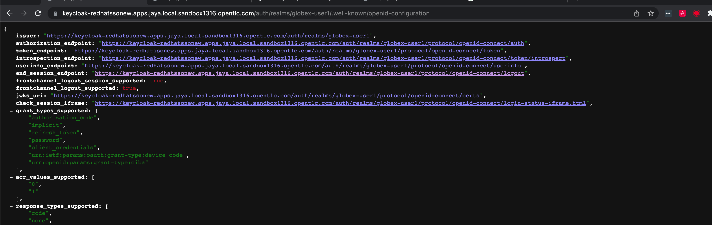

Alternatively you can use this URL which %sso_tenant_issuer_url%


=== Partner Gateway
* Create Backend for Partner Gateway
* In devspaces %DEVSPACES_URL%, under the folder   `workshop -> module-apim -> partners -> partner-gateway`, open the file `partner-gateway-product.yaml`
+
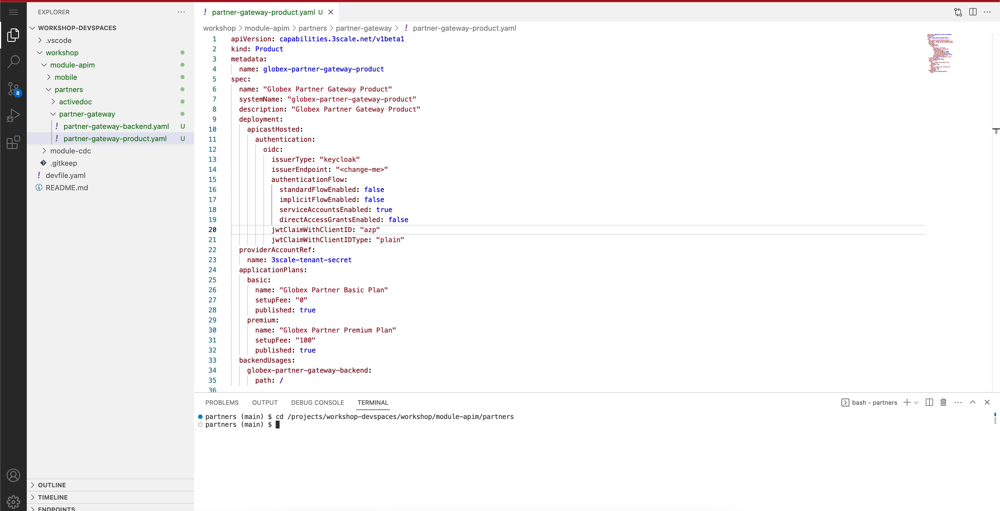

* Change the `issuerEndpoint` as highighterd

e.g `https://keycloak-redhatssonew.apps.jaya.local.sandbox1316.opentlc.com/auth/realms/globex-user1`

* It looks like this now

+
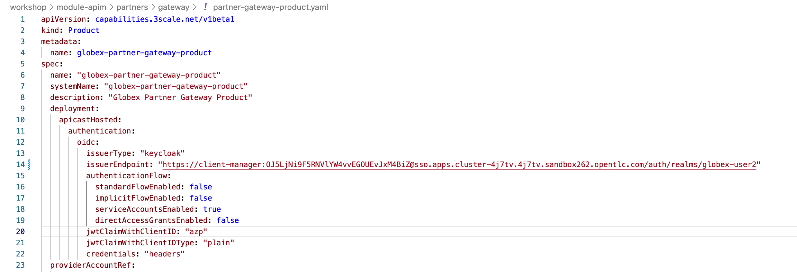
```
cd /projects/workshop-devspaces/workshop/module-apim/partners
oc apply -f partner-gateway/partner-gateway-backend.yaml 
```

* You will see the output as +
```
backend.capabilities.3scale.net/globex-partner-gateway-backend configured
```

* Create Product for Partner Gateway by applying the change through the following command

```
oc apply -f partner-gateway/partner-gateway-product.yaml 
```

* You will the see the following output: +
`product.capabilities.3scale.net/globex-partner-gateway-product created`

* You can now see that the bacend and product have been created both on OpenShift and on 3scale
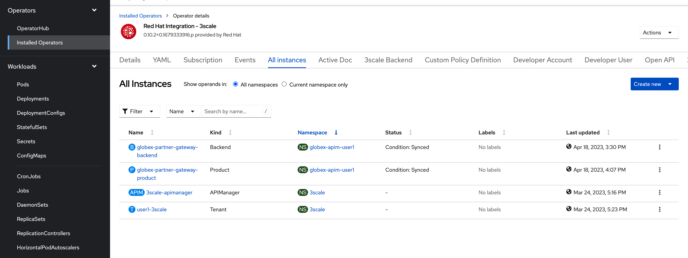
* Navigate to %3scale_tenant%
https://3scale-user1-admin.apps.cluster-27dmc.27dmc.sandbox2087.opentlc.com/p/admin/dashboard
+
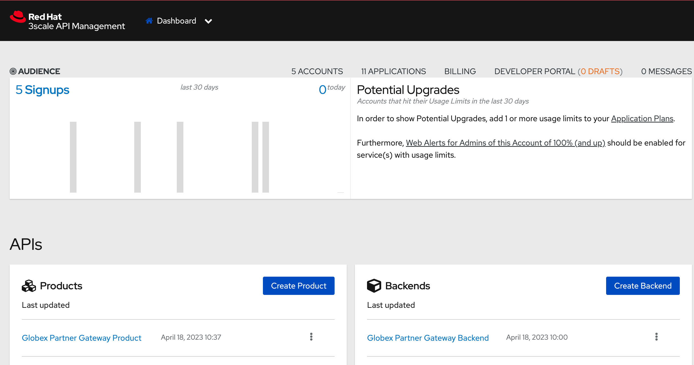


==== Create Active Doc for Partner Gateway
* Create a secret to hold the OpenAPI specification. The specification can be accessed via a URL as well. But for this activity we will be storing the spec in a secret, and refer to it from the ActiveDocs are as about to setup

* Access  %RH_SSO% to view the well known openid configuration, access the `token_endpoint` url as highlghted here +
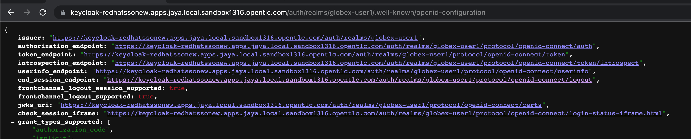

* In devspaces %DEVSPACES_URL%, under the folder   `workshop -> module-apim -> partners -> activedoc`, open the file `partner-activedoc-secret.yaml`
* Replace  the `tokenUrl` with the value copied in the previous step as highlighted here
image::images/apim/partner-activedoc-secret.png

* Create this OpenAPI Specification in a secret
```
oc create secret generic partner-openapi-secret --from-file  ../partners/activedoc/partner-activedoc-secret.yaml
```


Output
```
secret/partner-openapi-secret created
```

* Create this Active Doc referencing this  secret
```
oc apply -f ./activedoc/partner-activedoc.yaml 
```


Output
```
activedoc.capabilities.3scale.net/partner-gateway-activedoc created
```

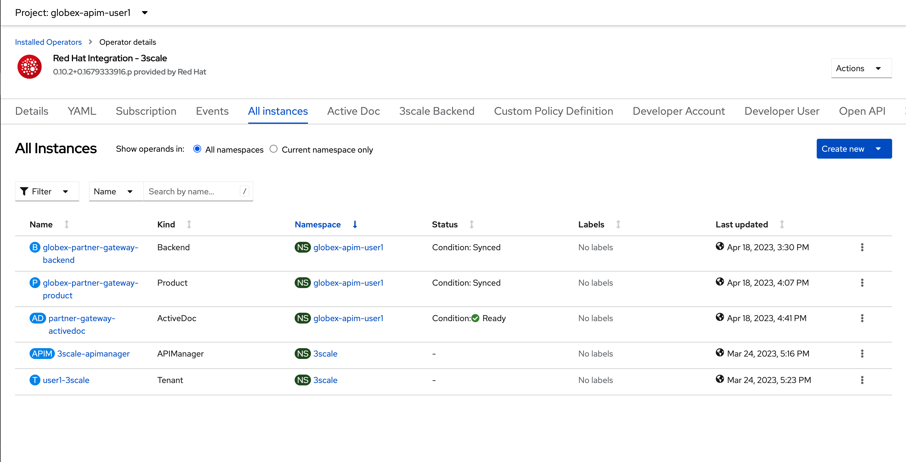


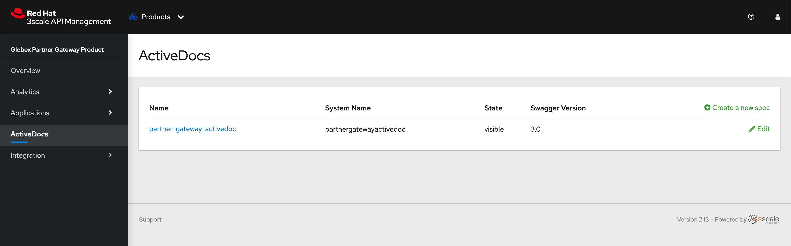

=== Setup Partner users
* The Partners of Globex will access the Developer Portal to signup for the APIs exposed to them.
* Typically they would access the developer portal and signup for an account which may as needed go through an approval process
* For the purpose of this workshop let us run a few commands to setup these users

images::partner-account-setup.png[]

* You can view these users on the 3scale admin portal as well at %3scale_tenant%buyers/accounts

=== Setup Dev Portal
* From the 3scale Admin portal navigate to the Audience page %3scale_tenant%buyers/accounts
* Navigate to `Settings -> Domains & Access` section at %3scale_tenant%/site/dns and remove the value in the textfield below the label `Developer Portal Access Code` as show below.. Click on `Update Account`

images::apim_domain_access.png[]
* This opens up the Developer Portal to public access without a accesscode

* The next step is to allow a Developer to access *Multiple Services* and *Multiple Applications*
* Navigate to `Developer Portal -> Feature Visibility` section, at %3scale_tenant%/p/admin/cms/switches 
* Click on the *Show* button against the features *Multiple Services* and *Multiple Applications* so that it appears as show and highlighted in the screenshot below. 

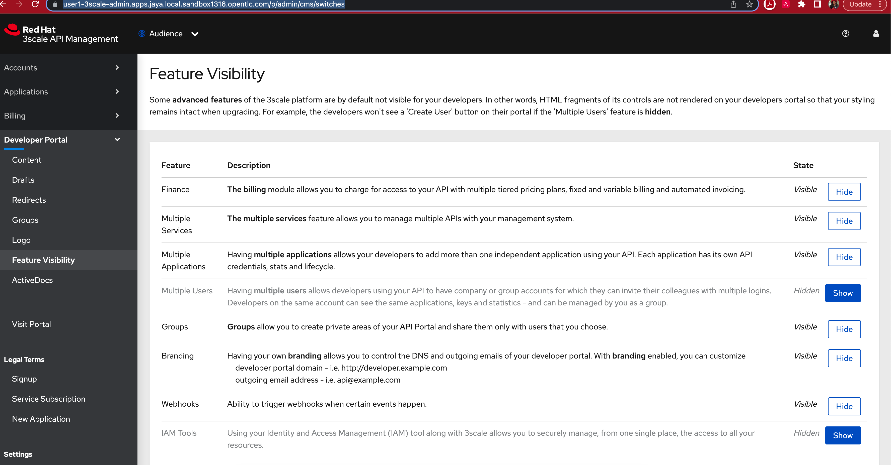

* The Globex Developer Portal is all setup now for Partners to signup


=== Setup Partner Access and Web app
* Now you will wear the hat of a Partner of Globex.
* You will need to 
** Signup for access to the Globex Partner APIs
** Patch your application with the  the access credentials obtained in the previous step so that all calls from the partner app will be authenticated by 3scale and Globex Partner API Gateway can then respond to your request.

==== Signup for application as a partner
* Navigate to the Developer Portal %DEVELOPER_PORTAL%
* Click on *SIGN IN* on top right of the page
* Login using the admin user you had created `june.partnerz` and password `openshift`

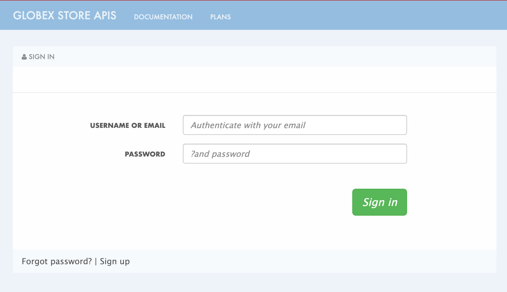
* You are invited to *Create Application*. Click on the *Create Application* button
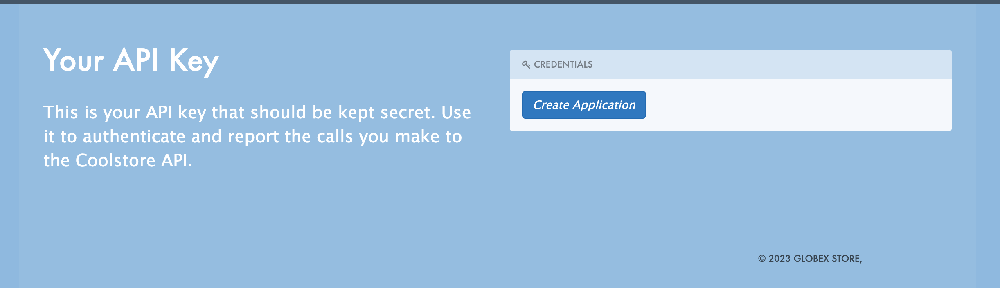
* Click on 	*Subscribe to Globex Partner Gateway Product* link

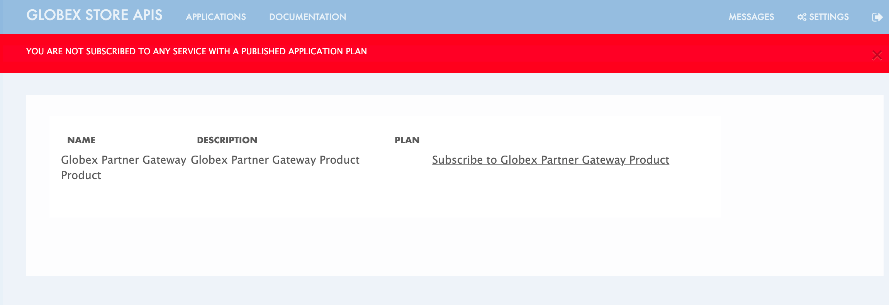
* You are sucessfully subcribed to the service

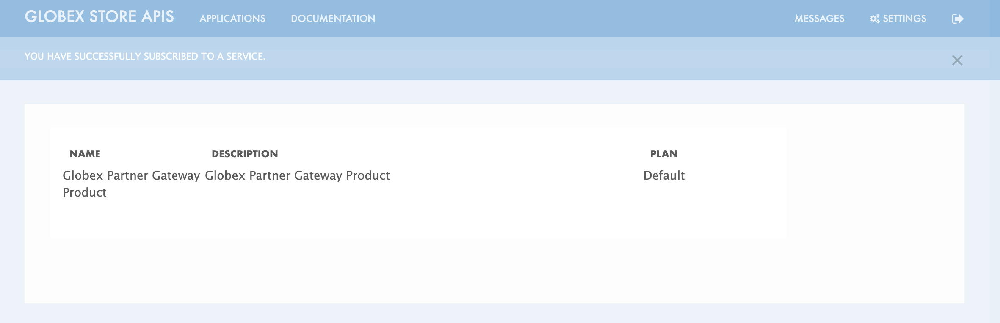

* Navigate to the *Applications tab* found on the top menu
* Click on *Create new application* link  +

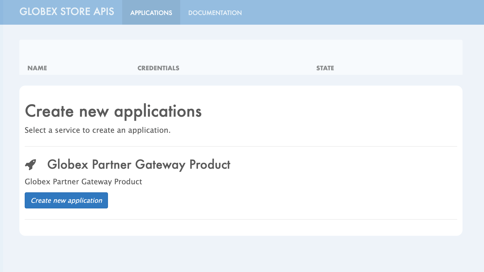

* Give the plan a *Name* and a *Description* and click on *Create Application* 

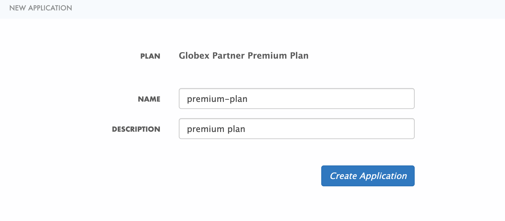

* An application is created successfully. Make a note of the *Client ID* and *Client Secret*. You will be using this in the Partner Web application.

image::images/apim/apim-devportal-app-success.png[]

* Enter the value asterisk (*) in the **REDIRECT URL** field and click on **Submit** button. This is to setup the right Redirect URL for OAuth using Red Hat SSO


=== Setup Partner Web Portal

* In the previous section, you signed up for access as a Partner Developer and gained credentials to access the APIs Globex exposes.

* To update the Partner Web application you need 4 values
. Client ID
. Client Secret
. Token URL
. Globex API Endpoint

. These values are part of `globex-partner-web` Deployment and are highlighted in the screenshot below
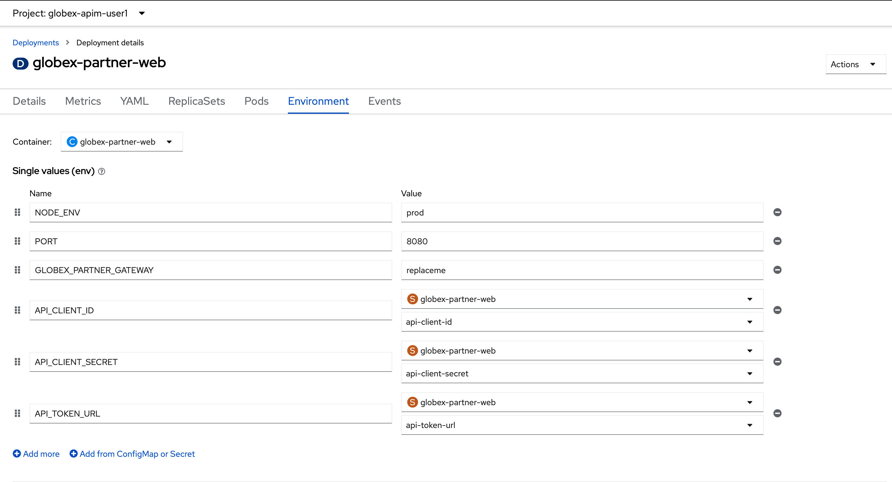


. From the OpenShift console you can navigate to the Environment variables of `globex-partner-web`. You can do so easily by clicking on %openshift_cluster_console%//k8s/ns/globex-apim-user1/deployments/globex-partner-web/environment. 
. To replace the environment variable `GLOBEX_PARTNER_GATEWAY` fetch the  Globex API Endpoint from the *Globex Developer Portal* %globex_developer_portal% - TBC
** Navigate to %globex_developer_portal% and click on Documentation
** Copy the service end point for Partner Gateway
. To update the other values such as Client ID, Secret and Token URL, the corresponding Secret needs to be updated.
. In the Dev workspace, open the file  `/projects/workshop-devspaces/workshop/module-apim/partners/partner-web/secret.yaml` +
. Launch the terminal by 
----
cd /projects/workshop-devspaces/workshop/module-apim/partners/partner-web
----

. Update the Client Id, Secret and Token URL from the values from Developer Portal +
----
oc apply -f secret.yaml 


You will see this Output +
secret/globex-partner-web configured
----


* Navigate to %OPENSHIFT_CONSOLE% and navigate to globex_apim_user(_n_) project. (https://console-openshift-console.apps.jaya.local.sandbox1316.opentlc.com/topology/ns/globex-apim-user1?view=graph)
* Click on `globex-partner-web` deploymen


=== Setup Mobile Gateway
In this section you will integrate with the Globex APIs exposed specially for Globex Mobile App.

The Mobile Gateway has been build in Quarkus and acts as an API gateway for all of the Mobile app calls. To create the API endpoints and secure it, we will need to make those configurations necesssary on 3scale API management.

==== Create Mobile Gateway Backend and Product on 3scale
* Create Backend for Mobile Gateway
* In devspaces %DEVSPACES_URL%, under the folder   `workshop -> module-apim -> partners -> partner-gateway`, open the file `partner-gateway-product.yaml`
+ <TBC> - <change screenshot>
image::images/apim/partner-gateway-product.png[]

* Change the `issuerEndpoint` as highighted

e.g `https://%keycloak-url%/auth/realms/globex-%username%`

* It looks like this now  <TBC> - <change screenshot> +


----
cd /projects/workshop-devspaces/workshop/module-apim/mobile
oc apply -f mobile-gateway/mobile-gateway-backend.yaml 
----

* You will see the output as +
----
backend.capabilities.3scale.net/globex-mobile-gateway-backend configured
----

* Create Product for Mobile Gateway by applying the change through the following command +
----
oc apply -f mobile-gateway/mobile-gateway-product.yaml 
----

* You will the see the following output: +
`product.capabilities.3scale.net/globex-partner-gateway-product created`

* You can now see that the backend and product  on 3scale


* Navigate to %3scale_tenant%
https://3scale-user1-admin.apps.cluster-27dmc.27dmc.sandbox2087.opentlc.com/p/admin/dashboard

+


==== Create Active Doc for Mobile Gateway

* Create a secret to hold the OpenAPI specification. The specification can be accessed via a URL as well. But for this activity we will be storing the spec in a secret, and refer to it from the ActiveDocs are as about to setup

* Access  %RH_SSO% to view the well known openid configuration, access the `token_endpoint` url as highlghted here +


* In devspaces %DEVSPACES_URL%, under the folder   `workshop -> module-apim -> mobile -> activedoc`, open the file `mobile-activedoc-secret.yaml`
* At the bottom of the file you will need to replace the `<replaceme>` placeholder with the  `Authorization URL` with the value copied in the previous step as highlighted here
image::images/apim/mobile-activedoc-secret.png

* Create this OpenAPI Specification in a secret +
----
oc create secret generic mobile-openapi-secret --from-file  /projects/workshop-devspaces/workshop/module-apim/mobile/activedoc/mobile-activedoc-secret.yaml
----
* Output
----
secret/mobile-openapi-secret created
----
* Create this Active Doc referencing this  secret
----
oc apply -f /projects/workshop-devspaces/workshop/module-apim/mobile/activedoc/mobile-activedoc.yaml 
----
* Output
----
activedoc.capabilities.3scale.net/mobile-gateway-activedoc created
----


=== Setup Mobile users
* The Mobile developers of Globex will access the Developer Portal to signup for the APIs exposed to them.
* Typically they would access the developer portal and signup for an account which may as needed go through an approval process
* For the purpose of this workshop let us run a few commands to setup these users
* In the terminal run
----
oc apply -f /projects/workshop-devspaces/workshop/module-apim/users/mobile-dev-setup.yaml 
----

* You will see the output as 
----
developeraccount.capabilities.3scale.net/mobile-developeraccount created
secret/mobileuser.secret created
developeruser.capabilities.3scale.net/jane.mobile created
developeruser.capabilities.3scale.net/ron.mobile created
----
* You can view these users on the 3scale admin portal as well at %3scale_tenant%buyers/accounts

=== Globex Developer Portal
The changes needed on the Developer Portal has already been completed in the Partner section. You can proceed to sign up for an application to access the Mobile APIs now.

=== Sign up as a Mobile Developer
* Launch the Globex Developer Portal by clicking on this: %globex_developer_portal%[Developer Portal^]
* Sign in as one of the user you created in the previous section with
** username: `ron.mobile`
** password: `openshift`

=== Setup mobile
* Signup for application plan
* Patch Mobile app with client ID and Authorization URL from Developer Portal
* Setup redirect as * 
* setup weborigins for the URL %PARTNER_WEB_URL%
* Setup redirect on SSO as + and URL of the mobile-app


image::https://chart.googleapis.com/chart?chs=150x150&amp;cht=qr&amp;chl=https://globex-mobile-globex-apim-user1.apps.cluster-27dmc.27dmc.sandbox2087.opentlc.com[Globex Mobile,250,350]
 