:toclevels: 1
:icons: font 
:sectanchors:
:sectnums:
:toc: 

:openshift_cluster_console: %openshift_cluster_console%
:user_name: %user_name%
:user_password: %user_password%
:devspaces_dashboard: %devspaces_dashboard%
:globex_user_password: %globex_user_password%
:openshift_subdomain: %openshift_subdomain%
:3scale_tenant: %3scale_tenant%
:globex_developer_portal: %globex_developer_portal%
:sso_tenant_console: %sso_tenant_console%
:sso_tenant_issuer_url: %sso_tenant_issuer_url%
:service_registry_url: %service_registry_url%
:api_designer_url: %api_designer_url%
:openshift_api_internal: %openshift_api_internal%

//:openshift_cluster_console: https://console-openshift-console.apps.cluster-jb86t.jb86t.sandbox3028.opentlc.com
//:user_name: user1
//:user_password: openshift
//:devspaces_dashboard: https://devspaces.apps.cluster-jb86t.jb86t.sandbox3028.opentlc.com
//:globex_user_password: openshift
//:openshift_subdomain: apps.cluster-jb86t.jb86t.sandbox3028.opentlc.com
//:3scale_tenant: https://3scale-user1-admin.apps.cluster-jb86t.jb86t.sandbox3028.opentlc.com
//:globex_developer_portal: https://3scale-user1.apps.cluster-jb86t.jb86t.sandbox3028.opentlc.com
//:sso_tenant_console: https://sso.apps.cluster-jb86t.jb86t.sandbox3028.opentlc.com/auth/admin/globex-user1/console
//:sso_tenant_issuer_url: https://sso.apps.cluster-jb86t.jb86t.sandbox3028.opentlc.com/auth/realms/globex-user1
//:service_registry_url: https://service-registry-user1.apps.cluster-jb86t.jb86t.sandbox3028.opentlc.com
//:api_designer_url: https://apicurio-designer.apps.cluster-jb86t.jb86t.sandbox3028.opentlc.com
//:openshift_api_internal: https://172.30.0.1:443" 

//== Deploy the Contract First Module

//TODO: deploy the solution through BackStage

== Objectives

Here is an outline of the activities you will achieve as part of this module.

.Activities overview
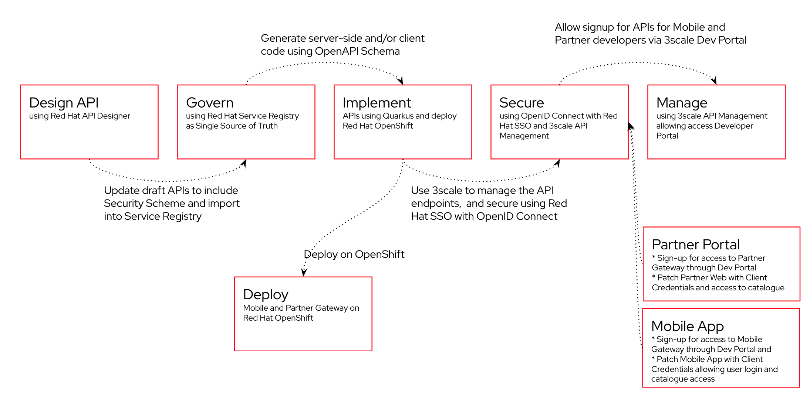

== Setup OpenShift Dev Spaces 
You are going to use *OpenShift Dev Spaces* for a number of activities. OpenShift Dev Spaces uses Kubernetes and containers to provide a consistent, secure, and zero-configuration development environment, accessible from a browser window.

=== Section Goals
* Access OpenShift Dev Spaces as *{user_name}*
* Ensure you are logged in to OpenShift as *{user_name}* 

=== Instructions
* In a browser window, navigate to the browser tab pointing to the Developer perspective of the OpenShift cluster. If you don't have a browser tab open on the console, click on {openshift_cluster_console}[OpenShift Console^, window="console"] to launch the console. If needed login with your username and password ({user_name}/{user_password}).

* On the top menu of the console, click on the image:images/openshift-application-menu.png[] icon, and in the drop-down box, select *Red Hat OpenShift Dev Spaces*.
+
.Access Red Hat Devspace
image::images/openshift-application-menu-2.png[]

* Login in with your OpenShift credentials ({user_name}/{user_password}). If this is the first time you access Dev Spaces, you have to authorize Dev Spaces to access your account. In the _Authorize Access_ window click on *Allow selected permissions*. 
+
.Red Hat Devspace - Allow selected permissions
image::images/devspace-auth-access.png[width=70%]

* You are directed to the Dev Spaces overview page, which shows the workspaces you have access to. You should see a single workspace, called *cloud-architecture-workshop*. The workspace needs a couple of seconds to start up.
+
.Red Hat Devspace - cloud-architecture-workshop
image::images/devspaces-workspace-starting.png[]

* Click on the *Open* link of the workspace.
+
.Red Hat Devspace - Open cloud-architecture-workshop
image::images/devspaces-workspace-started-1.png[]

* This opens the workspace, which will look pretty familiar if you are used to working with VS Code. Before opening the workspace, a pop-up might appear asking if you trust the contents of the workspace. Click *Yes, I trust the authors* to continue.
+
.Red Hat Devspace - Agree to trust the authors
image::images/devspaces-trust-contents.png[]

* The workspace contains all the resources you are going to use during the workshop. In the project explorer on the left of the workspace, open the *workshop/module-apim* folder as shown in the screenshot below
+
.Red Hat Devspace - API Module
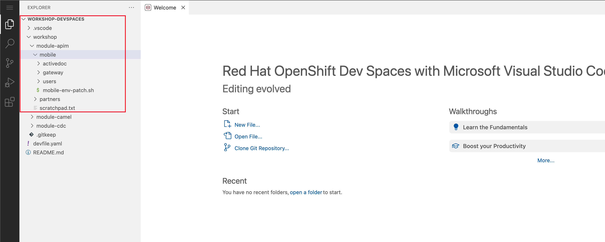 

* You can deploy the various resources needed in this workshop to the OpenShift cluster directly from Dev Spaces. To do so, you will need access to the built-in *Terminal*. Click on the image:images/devspaces-menu.png[] icon on the top of the left menu, and select *Terminal -> New Terminal* from the drop-down menu.
+
.Red Hat Devspace - New terminal
image::images/apim/apim-devspaces-menu-new-terminal.png[]

* This opens a terminal in the bottom half of the workspace.
+
.Red Hat Devspace - Open terminal
image::images/apim/apim-devspaces-menu-terminal.png[]

* The OpenShift Dev Spaces environment has access to a plethora of command line tools, including *oc*, the OpenShift command line interface. Through OpenShift Dev Spaces you are automatically logged in into the OpenShift cluster. You can verify this with the command *oc whoami*.
+

[source,bash,role=copy, subs="attributes"]
----
oc whoami
----
+

.Output
[source, subs="attributes"]
----
{user_name}
----
+
[IMPORTANT]
====
If the output of the `oc whoami` command does not correspond to your username ({user_name}), you need to logout and login again with the correct username.

[source, bash, role=copy, subs="attributes"]
----
oc logout
oc login -u {user_name} -p {user_password} {openshift_api_internal}
----

====

* You will be working in the `globex-apim-{user_name}` namespace. So run this following command to start using that particular project

+
[source,bash,role=copy, subs="attributes"]
----
oc project globex-apim-{user_name}
----

+
.Red Hat Devspace - Verify that you are using the globex-apim-<username> namespace
image::images/apim/apim-terminal-setup.png[width=70%]

* Keep this browser tab open because you will referring to draft content, scripts and YAML files for creating objects on OpenShift

=== Scratchpad
As you work through this Contract First APIs module, there are a few variables and URLs that are needed throughout this activity. To make things easier and manageable we've setup a scratchpad within Dev Spaces. You can fill this scratchpad up with information needed as you are guided below so that you can progress through this activity faster.

{empty} +

== Red Hat SSO - An Introduction

Red Hat SSO is used in this module to both offer single-sign on to Mobile users, and also for securing the APIs. 

[TIP]
====
We will be using OpenID Connect which is an open authentication protocol that works on top of the OAuth 2.0 framework. OIDC offers a discovery mechanism called *OpenID Connect Discovery*, where an OpenID server (here Red Hat SSO based on Keycloak) publishes its metadata at a well-known URL. This URL is typically a collection of various endpoints the server offers, some of which are used in this workshop too.
====

* Launch Red Hat SSO by clicking {sso_tenant_console}[SSO Console^,window="sso"] and login using username and password ({user_name}/{user_password}).
* Click on the *OpenID Endpoint Configuration* link to view the *OpenID Provider Configuration* of Red Hat SSO.
+
.Red Hat SSO - Logged In
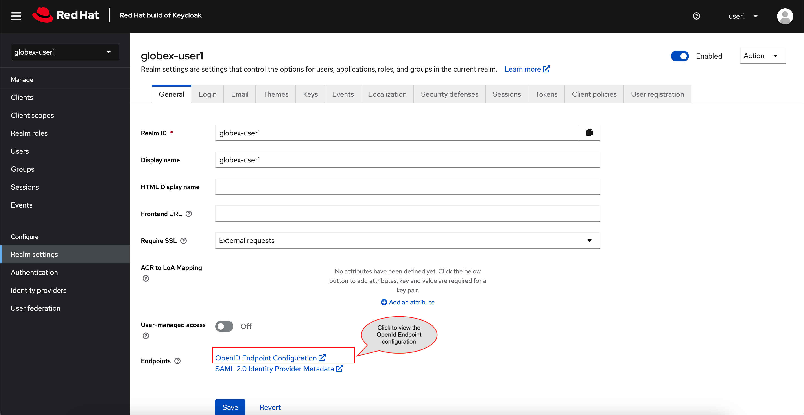
* Here is how the *OpenID Provider Configuration* looks like
+
.Red Hat SSO - OpenID Provider Configuration
image::images/apim/well-know-openid-configuration.png[]
* We are interested specifically in the following endpoints

[cols="50%,50%"]
|===
|Endpoint | URL

| *OpenID Provider Configuration (well-known config)*: +
This URL provides a mechanism to discover the End-User's OpenID Provider and obtain information needed to interact with it, including OpenID/OAuth endpoint locations. The following endpoints is fetched from this URL |
\https://sso.{openshift_subdomain}/auth/realms/globex-{user_name}/.well-known/openid-configuration 

| *issuer*: +
This value is needed when we need to authorize a user through single sign-on |

\https://sso.{openshift_subdomain}/auth/realms/globex-{user_name} 

| *token_endpoint* : +
clients can obtain access tokens from the server using this token endpoint and use these same tokens to access protected resources (APIs in our case) |
\https://sso.{openshift_subdomain}/auth/realms/globex-{user_name}/protocol/openid-connect/token

|===

{empty} +

== Design and Govern Mobile OpenAPI Specification

//API design refers to the process of developing application programming interfaces (APIs) that expose data and application functionality for use by developers and users. Red Hat API Designer, based on https://www.apicur.io/[Apicurio^], is a lightweight tool that helps you to design APIs. 

In this step you will import the draft OpenAPI specs for *Mobile App* and edit them to include *Security Schemes*. Once the API design phase is complete you will then manage that within the Red Hat Service Registry. The API Designer sessions are stateless and you must save your API definition as a JSON file at the end of each session. 

=== Section Goals

* Import a draft OpenAPI specification for Mobile App into an API Designer
* Edit the draft OpenAPI specification to add *OpenID Security Schemes* and include Red Hat SSO's OpenID Provider Configuration
* Govern the Mobile OpenAPI with Red Hat Service Registry

=== Design Mobile OpenAPI
To import the OpenAPI draft into API designer, you can import as text OR upload as file. To keep things simple in this workshop, you will import the content by simply pasting the draft spec as YAML based text into the API designer.

[NOTE]
====
In a real-world scenario you would do the inverse: start with an empty API specification, and define the different elements of the spec document. You would then export the spec in JSON or YAML format (by copying the contents from the source editor) to your local file system and push it to version control.
====

* Launch API Designer by clicking on this link {api_designer_url}[API Designer^, window=api_designer]
* Click on the *New API* button.
+
.Red Hat API Designer - New API
image::images/apim/api-designer.png[] 
* Click on the *Source Tab* on the *New API* page, and delete the entire content in the window. 
** Note: Keep this tab open. You will be pasting the draft OpenAPI into this window.
+
.API Designer - Open Source Tab
image::images/apim/api-new-api.png[]
+
.API Designer: Clear all content in Source Tab
image::images/apim/api-desginer-clear.png[]

* To get the Mobile OpenAPI draft, navigate to the browser tab with *Dev Spaces* that you have earlier opened. 
** If you don't have a browser tab open to Dev Spaces, click on {devspaces_dashboard}/dashboard/#/ide/devspaces-{user_name}/cloud-architecture-workshop[Dev Spaces IDE^, window="devspaces"]. If needed login with your username and password ({user_name}/{user_password}).
* In Dev Spaces, navigate to the folder `workshop -> module-apim -> mobile -> activedoc`, and open the file `mobile-activedoc-draft.yaml`
** Or type [Ctrl+P] and type the file name as `mobile-activedoc-draft.yaml`
* Copy the entire contents from this file `(Ctrl+A and Ctrl+C)` 
+
.Copy Mobile OpenAPI draft from Dev spaces
image::images/apim/mobile-draft-spec-devspace.png[]
* Now paste the copied content (draft OpenAPI) from the above step into the API designer's *Source Tab* replacing all of the existing content. Click on *Save* button as highlighted in the screenshot below.
+
.API Designer: Paste Mobile Draft OpenAPI
image::images/apim/mobile-draft-imported.png[]
* Navigate back to the *Design Tab*
+
.API Designer: Design Tab
image::images/apim/api-design-tab.png[]
* You will now need to update the security scheme. Under the *SECURITY SCHEMES* section, click on *Add a security scheme* link
+
.API Designer: Add a security scheme
image::images/apim/api-designer-sec-scheme.png[]
* You are presented with the *Define the Security Scheme* page. Provide the following values in the form, and click on *Save*

** Name (textbox)
+
[source,bash,role=copy,subs="attributes"]
----
openid-connect
----

** Description (textarea)
+
[source,bash,role=copy,subs="attributes"]
----
OpenID Connect security scheme
----

** Security Type (dropdown)
+
[source,bash,role=copy,subs="attributes"]
----
OpenID Connect
----

** OpenID Connect URL (textbox)
+
[source,bash,role=copy,subs="attributes"]
----
https://sso.{openshift_subdomain}/auth/realms/globex-{user_name}/.well-known/openid-configuration
----

.API Designer: Define the Security Scheme wizard
image::images/apim/define-security-scheme.png[width=90%]

* You are navigated back to the homepage. Verify that you can see the *SECURITY SCHEMES* has been updated with your configuration
+
.API Designer: Verify openid-connect Security Scheme added
image::images/apim/security-scheme-complete.png[]
* The OpenAPI specification is now ready to be downloaded. Click on the _down arrow_ button adjacent to *Save As..* and then choose *Save as YAML* button found on top-right of the page. The file gets saved automatically in the *Downloads folder* of your computer.
+
.API Designer: Save API as YAML in your computer
image::images/apim/api-download-as-yaml.png[]
* You can now close this browser tab. 
* The Mobile OpenAPI spec is ready to be governed with a Service Registry.

{empty} +

=== Manage the Mobile OpenAPI with Service Registry

* Launch *Service Registry* by accessing {service_registry_url}[Service Registry^, window="service_registry_url"]
+
.Service Registry: Landing Page
image::images/apim/service-registry-landing.png[]
* Click on the *Upload artifact* button as shown in the above screenshot. You will be presented with a *Upload Artifact* wizard 
+
.Service Registry: *Upload Artifact* wizard 
image::images/apim/sr-upload-artifact.png[]

* In the wizard, enter the following details, and click on the *Upload* button. 
** Use the exact same values as instructed below to avoid errors in the other sections of this labs.

[cols="20%,50%"]
|====
| *Group* | `globex`
| *ID of the artifact* | `mobileapi`
| *Artifact textarea* | Click on *Browse..* button to upload the Mobile OpenAPI downloaded in the previous step, or `Drag & drop` the file into the textarea.

|====

.Service Registry: Provide information needed by *Upload Artifact* wizard and *Upload*
image::images/apim/sr-spec-setting.png[]

* Note that the *Globex Mobile API Gateway* artifact has been uploaded and stored within *Service Registry*
+
.Service Registry: *Globex Mobile API Gateway* artifact has been uploaded
image::images/apim/sr-uploaded.png[]

* You can share this OpenAPI schema with others via this OpenAPI Schema's endpoint : {service_registry_url}/apis/registry/v2/groups/globex/artifacts/mobileapi
* You can now close the Service Registry's browser tab.
* This schema can be used for generating Quarkus code for both Clients and Server-side using maven plugins. (Note that the https://github.com/rh-cloud-architecture-workshop/globex-mobile[Globex Mobile App^, window="code-samples"] is NodeJS + Angular in this module)

=== Section Outcome

* Added Security Scheme to Mobile OpenAPI with API Desginers
* Imported the Mobile OpenAPI into Service Registry to govern the API spec.
* A shareable link is available to the Mobile OpenAPI specification to be used by other teams and systems.

=== Cleanup
Please close the API Designer and Service Registry browser tabs (\^‿^) to avoid too many browser tabs

{empty} +

== Configure 3scale API Management to secure and manage Mobile Gateway API

The Mobile API has now been designed by API Designer, and is governed by Red Hat Service Registry. 

Let us fast forward a bit in time, and the backend developers team has built the Mobile Gateway server-side https://github.com/rh-cloud-architecture-workshop/globex-mobile-gateway[code^, window="code-samples"] built using Quarkus. This service has been pre-deployed under the `module-apim-{user_name}` namespace on OpenShift. 

In this section you will manage and secure the Mobile Gateway API endpoints so that the Mobile App can access them securely. To create these API endpoints, and secure and manage them, we will need to configure them on 3scale API management. 

=== Section Goals 

* setup Red Hat SSO to provide single sign-on (SSO) capabilities for users signing into Mobile App 
* setup Red Hat SSO to secure Mobile Gateway API endpoints using OpenID Connect
* manage Mobile Gateway APIs with Red Hat 3scale API Management
* access Red Hat 3scale API Management's Developer Portal as a Mobile Developer to sign up for access of API

=== Red Hat SSO
3scale integrates with Red Hat SSO for authenticating the API requests using the OpenID Connect specification. On signing-up, External/Mobile developers  will be provided with client credentialsto access to the APIs securely. This client credentials is synced between 3scale and the Red Hat Single Sign-On server using a component know an *Zync*

In order to setup OpenID Connect, you will now create a special *client id* meant for *Client Credentials Management*

* Click to launch {sso_tenant_console}[Red Hat SSO^, window="sso"] and login using username and password ({user_name}/{user_password}).
* Click on *Clients* from the left-hand navigation. And, then click on the *Create* button on the right side as shown below

+
.Red Hat SSO: Clients listing
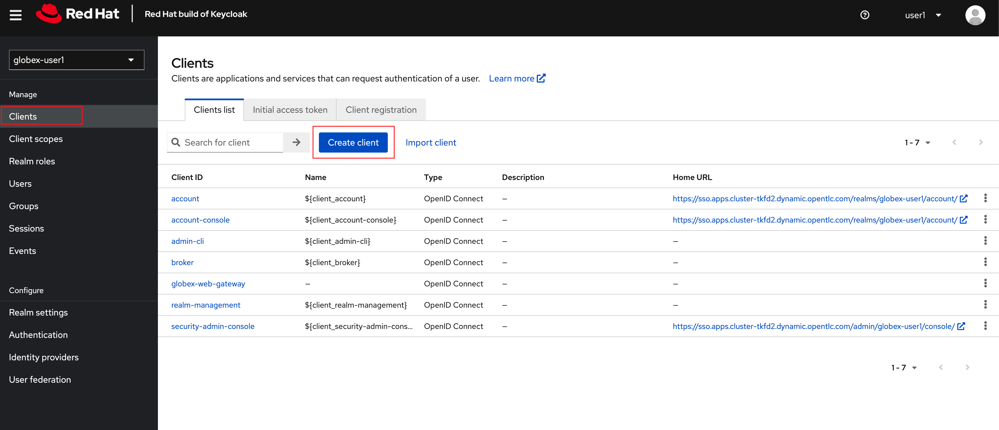

* In the *Add Client* wizard, enter the following details, and click on the *Save* button.

[width=60%]
|====
| Name | Value

|Client Id | `client-manager`
|Client Protocol (dropdown) | `openid-connect`
|====

.Red Hat SSO: Add Client wizard
image::images/apim/client-manager.png[]

*  You will be shown the *Settings* tab of `client-manager` client.
+
.Red Hat SSO: View *client-manager* Settings
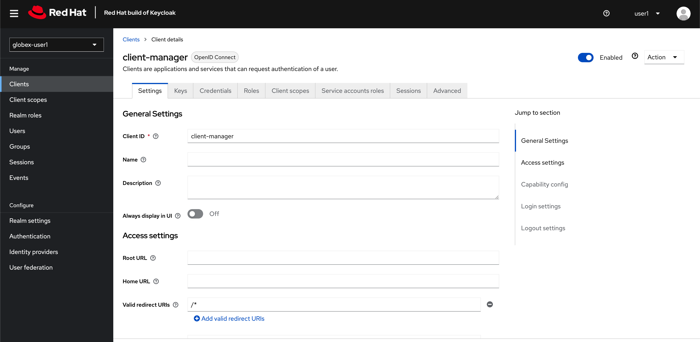

* Configure this `client-manager` as follows (refer to screenshot below) so that 3scale can synchronize with Red Hat SSO 
** Change *Access Type* to `Confidential`
** Once the Access Types is Confidential you will see a new toggle button *Service Accounts Enabled*
** Keep *Service Accounts Enabled* as ON, and turn all other Grants and Flow OFF to match the following screenshot.
+
This configuration allows only Services based access using Service Accounts, and will be used by 3scale API Management system in the next steps, when mobile users sign up for access. Service accounts provide a flexible way to control API access without sharing a regular user's credentials.
+
.Red Hat SSO: Configure client-manager
image::images/apim/client-manager-setting.png[]

* Click on *Save* button at the bottom of the page. You will be notified that the changes are saved successfully. +

.Red Hat SSO: Save client-manager settings
image::images/apim/client-manager-save.png[]

* Now you will need to setup *Client Roles* for this client id, so that it can manage other clients (create, amend and delete) on behalf of 3scale API Management
** Click on the *Service Account Roles* tab from the top tab navigation.
** From the *Client Roles* dropdown, choose `realm-management`
+
.Red Hat SSO: setup Service Account Roles for *client-manager* in Service Account Roles tab
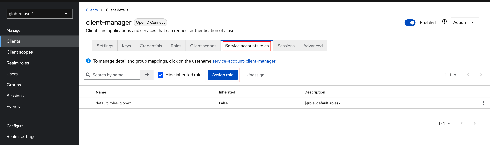
* From the *Available Roles* multichoice field, choose `manage-clients`, and click on *Add selected >>* button
** The mappings will get auto-saved.
+
.Red Hat SSO: Add manage-clients roles
image::images/apim/client-realm-management.png[]

* You can view the credentials of this client-id from the *Credentials* tab. You will need this when setting up the 3scale products +
** Now is a good time to save this in your Dev Spaces Scratchpad. (Ctrl+P > scratchpad.txt to open the file from within Dev Spaces tab)

.Red Hat SSO: Client Credentials of client-manager
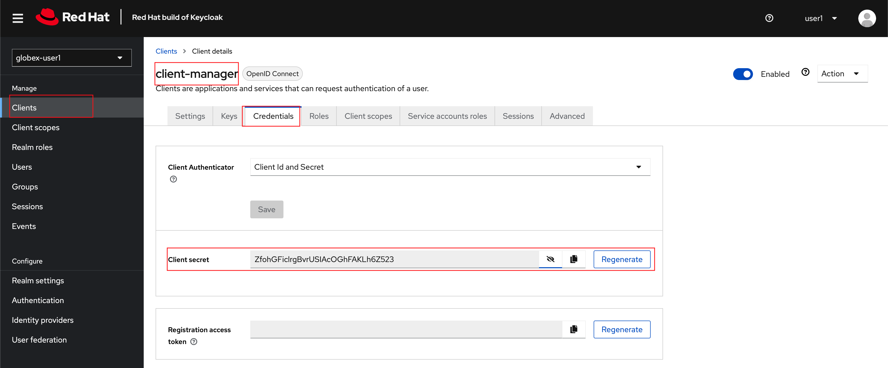

=== Create Mobile Gateway Backend, Product and ActiveDoc on 3scale

To integrate and manage the Mobile Gateway API in 3scale, you need to create Products and Backend

.[.underline]#*[Click to know] What are Backend, Product, ActiveDocs and CRDs?*#
[%collapsible]
====

* *Backends* are Internal APIs which are then bundled into a 3scale Product. 
** it contains at least the URL of the API
** It can optionally be configured with mapping rules, methods and metrics to facilitate reusability.
* *Products* are the Customer-facing APIs. 
** It defines the application plans, and configure APIcast
** You can create API documentation by attaching the Mobile OpenAPI schema as a *3scale ActiveDoc*
* *ActiveDocs* are interactive documentation for your API offered as a framework by 3scale. 
** With Swagger 2.0 (based on the Swagger Spec) this provides a functional, attractive documentation for the API, which will help developers to explore, to test and integrate with the APIs.
* A CRD file allows you to define your own object kinds (Backend, API, ActiveDoc etc) and lets the API Server handle the entire lifecycle of the objects.
====

In this workshop you will be using the *3scale Operator* that creates and maintains 3scale on OpenShift with custom resource definitions (CRDs).  

==== Create 3scale Backend for Mobile Gateway service
To create the Backend for Mobile Gateway, you will need the Service URL of Mobile Gateway deployment running on OpenShift.

.[.underline]#*[Click to know] What is a Service?*#
[%collapsible]
====
In OpenShift, a Kubernetes Service serves as an internal load balancer and identifies pods which in turn have the applications. If the application needs to be accessed from outside of OpenShift, you will need OpenShift routes. +
In this workshop, since both 3scale and the Mobile Gateway run on OpenShift, 3scale will proxy requests to the backend using Services. This also means the backend cannot be accessed directly from outside OpenShift.
====

* Navigate to the *Dev Spaces browser tab* you have launched at the beginning of this module
** If this browser tab is not open, click on {devspaces_dashboard}/dashboard/#/ide/devspaces-{user_name}/cloud-architecture-workshop[Dev Spaces IDE^, window="devspaces"] and login with ({user_name}/{user_password}).
* Navigate to the folder `workshop -> module-apim -> mobile -> gateway` and open the `mobile-gateway-backend.yaml` file. (Shortcut: `Ctrl+P > mobile-gateway-backend.yaml`)
* In the file `mobile-gateway-backend.yaml`, update the `<replace-me>` placeholder with the Service endpoint of the Globex Mobile gateway service appended with the port `:8080`. +
+
[source,bash,role=copy,subs="attributes"]
.Service hostname of the Mobile Gateway API
----
http://globex-mobile-gateway.globex-apim-{user_name}.svc.cluster.local:8080
----

.Update mobile-gateway-backend.yaml with Service endpoint of Globex Mobile gateway
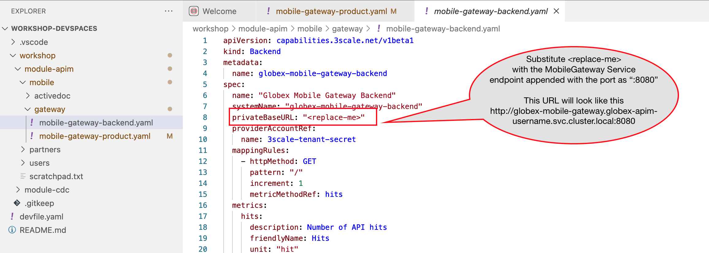

* The *privateBaseURL* in the *mobile-gateway-backend.yaml* file should read like this:
+
[source,bash,role=copy,subs="attributes"]
----
privateBaseURL: "http://globex-mobile-gateway.globex-apim-{user_name}.svc.cluster.local:8080"
----
+
.[.underline]#*[Click to know] How to fetch Service URL from OpenShift console?*#
[%collapsible]
====

* Navigate to the `globex-apim-{user_name}` namespace on the OpenShift console by clicking here {openshift_cluster_console}/topology/ns/globex-apim-{user_name}[APIM module on OpenShift^] and login with ({user_name}/{user_password}).
* In the *Find by name* filter enter the value `mobile-gateway`. The `globex-mobile-gateway` deployment is highlighted. Clicking on this deployment opens the context menu for this deployment
+
.Locate globex-mobile-gateway deployment
image::images/apim/globex-mobile-gateway-deplpyment.png[]
* Under *Services* section you can see the name of the services assocated with this deployment. Click on the `globex-mobile-gateway` link and you will be taken to the Services page. 
* Under *Service routing -> Hostname*, you can find the service's hostname. Make a note of this URL and you will need this to create the Backend on 3scale.
+
.Mobile Gateway Service in OpenShift
image::images/apim/mobile-gateway-services.png[]

====

* From the Terminal of Dev Space,s that should be open already, run the following command `oc whoami` to check if you are still logged in as *{user_name}* and `oc project` to see if you are in the project `globex-apim-{user_name}`
+
[source,bash , subs="attributes"]
.Check logged-in username and project
----
$ oc whoami
{user_name}
$ oc project
Using project "globex-apim-{user_name}" on server...
----
* Run the following command to create a Mobile Gateway Backend in 3scale.
+
[source,bash,role=copy, subs="attributes"]
.Create Mobile Gateway Backend in 3scale
----
oc apply -f /projects/workshop-devspaces/workshop/module-apim/mobile/gateway/mobile-gateway-backend.yaml -n globex-apim-{user_name}
----

* You should see the output as 
+
.Output of Mobile Gateway Backend creation
----
backend.capabilities.3scale.net/globex-mobile-gateway-backend configured
----

==== Create 3scale Product for MobileGateway API

* In Dev Spaces in the folder `workshop -> module-apim -> mobile -> gateway`, open the file `mobile-gateway-product.yaml`. [Shortcut: `Ctr+P > mobile-gateway-product.yaml`]
** This file creates a 3scale Product, and also attaches the Backend we created in the previous step to the Product.
* Update the following 2 values as directed below.
+
image::images/apim/mobile-gateway-product.png[] 

** *<client-credentials>* : Value of Client Credentials of the *client-manager* client you created in Red Hat SSO in the previous step.
+
[NOTE]
====
If you don't have this value, click on Red Hat  {sso_tenant_console}/#/realms/globex-{user_name}/clients[SSO Clients List^, window="sso"]. Login if needed with *({user_name}/{user_password})*. Click on the Client ID *client-manager*. You can copy the credentials from the *Credentials tab*
====
+

** *<issuer-endpoint>* : Value as below

[source,bash,role=copy, subs="attributes"]
----
sso.{openshift_subdomain}/auth/realms/globex-{user_name}
----
[NOTE]
====
This URL is from Red Hat SSO's *Issuer endpoint* from https://sso.{openshift_subdomain}/auth/realms/globex-{user_name}/.well-known/openid-configuration[well-known configurations endpoint^]. 

.Red Hat SSO Issuer URL

image::images/apim/sso-issuer-endpoint.png[] 

====
* The `mobile-gateway-product.yaml` file should looks like this now +
+
.mobile-gateway-product.yaml updated with the correct values
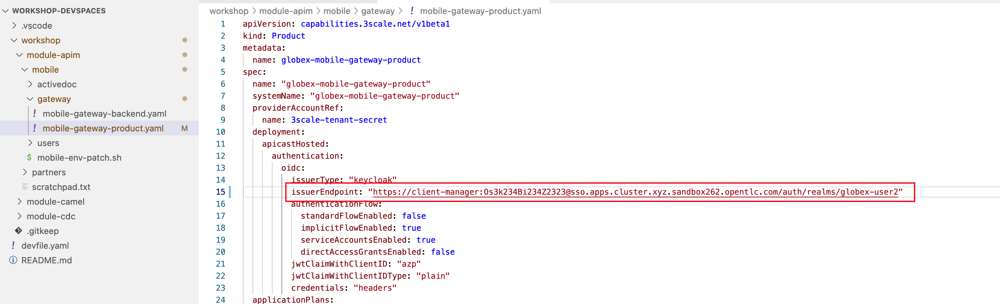
* Execute the following command in the Terminal to create this Product for Mobile Gateway 
+
[source,bash,role=copy, subs="attributes"]
.Execute command in Terminal to create Mobile Gateway on 3scale
----
oc apply -f /projects/workshop-devspaces/workshop/module-apim/mobile/gateway/mobile-gateway-product.yaml -n globex-apim-{user_name}
----

* You will the see the following output confirming creation of 3scale Product for Mobile Gateway: 
+
.Output
----
product.capabilities.3scale.net/globex-partner-gateway-product created
----

==== Create Active Doc for Mobile Gateway

* In Dev Spaces, navigate to the folder `workshop -> module-apim -> mobile -> activedoc`, open the file `create-mobile-activedoc.yaml`
+
image::images/apim/mobile-activedoc-yaml.png[width=70%]
* Replace the `<replace-me>` placeholder with the Service Registry OpenAPI endpoint. This is the same OpenAPI spec that you setup on Service Registry.
+
[source,bash,role=copy,subs="attributes"]
.Service Registry OpenAPI Spec endpoint for Mobile Gateway
----
{service_registry_url}/apis/registry/v2/groups/globex/artifacts/mobileapi
----
+
.ActiveDoc updated with OpenAPI Service Registry endpoint 

image::images/apim/mobile-activedoc-create-file.png[]

* Create this Active Doc by running the following command in the Dev Spaces Terminal
+
[source,bash,role=copy,subs="attributes"]
.Create Activedoc command
----
oc apply -f /projects/workshop-devspaces/workshop/module-apim/mobile/activedoc/create-mobile-activedoc.yaml -n globex-apim-{user_name}
----
+
.Output
----
activedoc.capabilities.3scale.net/mobile-gateway-activedoc created
----

=== Setup Mobile users
The Mobile developers of Globex will need access to the Developer Portal to signup for the APIs exposed to them. Typically they would access the developer portal and signup for an account which may as needed go through an approval process

For the purpose of this workshop let us run a few commands to setup these users as defined in the file `mobile-dev-setup.yaml`.

* In the *Dev Spaces Terminal* run the following command
+
[source,bash,role=copy,subs="attributes"]
.Create users command
----
oc apply -f /projects/workshop-devspaces/workshop/module-apim/mobile/users/mobile-dev-setup.yaml -n globex-apim-{user_name}
----

* You will see the output as 
+
.Output of user creation
----
secret/mobileuser.secret created
developeraccount.capabilities.3scale.net/mobile-developeraccount created
developeruser.capabilities.3scale.net/admin.mobile created
developeruser.capabilities.3scale.net/dev.mobile created
----
//* You can view these users on the 3scale admin portal as well at {3scale_tenant}[3scale admin portal^, window="3scale"]

=== View the newly created Backend, Product, ActiveDoc and Users
==== View on 3scale admin console

* Navigate to the {3scale_tenant}[3scale admin portal^, window="3scale"] and login using your username and password ({user_name}/{user_password}).
+
.Launch 3scale 
image::images/apim/apim-mobile-3scale-login.png[]
* You will notice that the Mobile Product and Backend have been created.
* Click on *globex-mobile-gateway-product* under *APIs -> Products* section. 
* You are presented with the Product overview page for the Mobile API Product you created. Note the following elements
** Published Application Plans 
+
[NOTE]
====
Application Plans define the different sets of access rights you might want to allow for consumers of your API. These can determine anything from rate limits, which methods or resources are accessible and which features are enabled
====

** Backend that has been attached to the Mobile Gateway Product
+
.Mobile Gateway Product: Overview
image::images/apim/mobile-product-overview.png[]

* Navigate to *Integration -> Settings* page from the Product overview page. You will notice that the Product has been setup with 
** OpenID Connect as Authentication mechanism
** *client_manager* client details that you had created in the previous steps.
** OIDC Authorization Flow includes *Implicit Flow* because we would be authenticating the users SSO as well access to the backend services
+
.Mobile Gateway Product: Settings
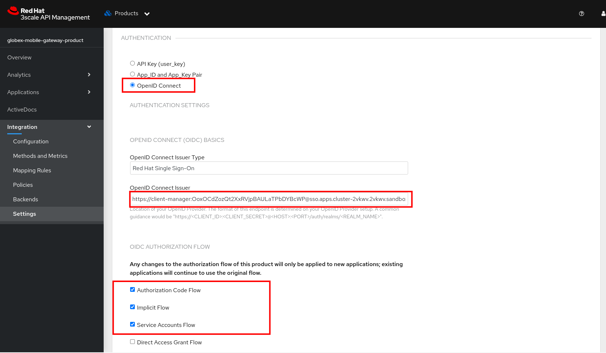

* The ActiveDoc is visible from the 3scale portal as well under Products. Click on the ActiveDoc to preview the OpenAPI specifications.
+
.Mobile Gateway Product: ActiveDoc
image::images/apim/apim_3scale_activedoc.png[]
* Navigate to `Integration -> Configuration` and click on the *Promote to v.x Staging APICast* and then *Promote to v.x Production APICast* to promote all the config changes
//TBC find ways to overcome this step//
** APIcast is an NGINX based API gateway used to integrate internal and external API services with the 3scale. APIcast can be hosted or self-managed. In this workshop we use the default `self-managed` option.
+
.Promote Staging and Production APICast
image::images/apim/mobile-promote-apicast.png[]

====  Viewing on OpenShift console
You can also view these objects on OpenShift console as follows

.[.underline]#*[Click to View] View on 3scale Operator page in OpenShift console*#
[%collapsible]
====
* You can now see that the Backend, Product, ActiveDoc and Users from the 3scale OpenShift operators on {openshift_cluster_console}/k8s/ns/globex-apim-user1/clusterserviceversions[Installed Operators^, window="console"]
** Navigate to `Red Hat Integration - 3scale -> All Instances` and click on `Current namespace only`. You will see that the Product and Backend have been created.
+
.View Product, Backend, ActiveDoc and Users 
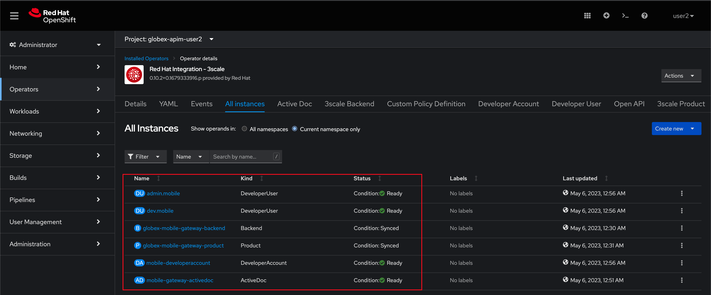 
====

=== Setup Globex Dev Portal
A good developer portal is a must have to assure adoption of your API. In this section we will setup the Dev Portal so that it is ready to be used by Mobile Developers.

* Navigate to `3scale's Audience ->Developer Portal -> Settings` by clicking on {3scale_tenant}/site/dns[Settings -> Domains & Access section^, window="3scale"]
* The *Developer Portal Access Code* hides the site from the world till you are ready.
* Remove the value in the textfield below the label *Developer Portal Access Code* as shown below. Click on the *Update Account* button. This opens up the Developer Portal to public access without the need for an Access Code.
+
.Remove Developer Portal Access Code
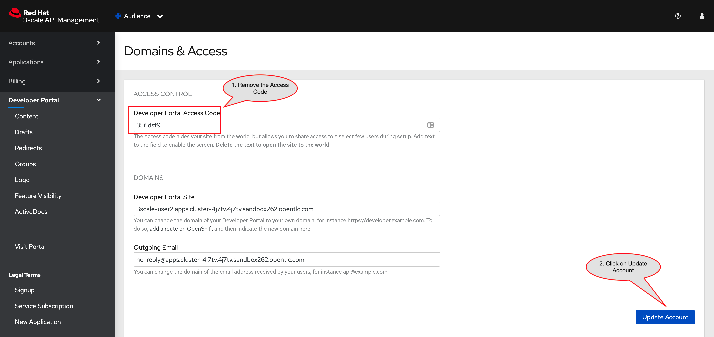

* The next step is to allow a Developer to access *Multiple APIs (Services)* and signup for *Multiple Applications*
* Navigate to {3scale_tenant}/p/admin/cms/switches[Developer Portal -> Feature Visibility section, window="3scale"]
* Click on the *Show* button against the features *Multiple Services* and *Multiple Applications*. The changes are auto-saved.
+
.Feature Visibility section
image::images/apim/apim_feature_visbility_init.png[]
* After updating the settings, this page should be seen as per the screenshot below. 
+
.Feature Visibility settings altered
image::images/apim/apim_feature_visibility.png[]

* The Globex Developer Portal is fully setup now for Mobile developers to signup.

=== Sign up as a Mobile Developer
In this section you will login as a Mobile Developer (as the user you created in the previous section), and signup for API access

* Launch the Globex Developer Portal by clicking on {globex_developer_portal}[Developer Portal^, window="devportal"]
+
.Developer Portal
image::images/apim/3scale_dev_portal.png[]

* Click on the *SIGN IN* link found on top-right. 
* Sign in as one of the user you created in the previous section with
** username: `dev.mobile`
** password: `openshift`
+
.Developer Portal
image::images/apim/3scale_dev_portal_signin.png[width=70%]
* Navigate to Applications Listing by choosing the *APPLICATIONS* menu on the top of the page.

+
.Developer Portal Landing Page
image::images/apim/3scale_dev_portal_loggedin.png[width=80%]
* In the Applications page you are invited to *Create Application*. Click on the *Create new application* button seen against `globex-mobile-gateway-product`
+
.Developer Portal: Create new application
image::images/apim/3scale_dev_portal_applications.png[width=70%]
* Click on *Subscribe to globex-mobile-gateway-product* link
+
.Subscribe to globex-mobile-gateway-product
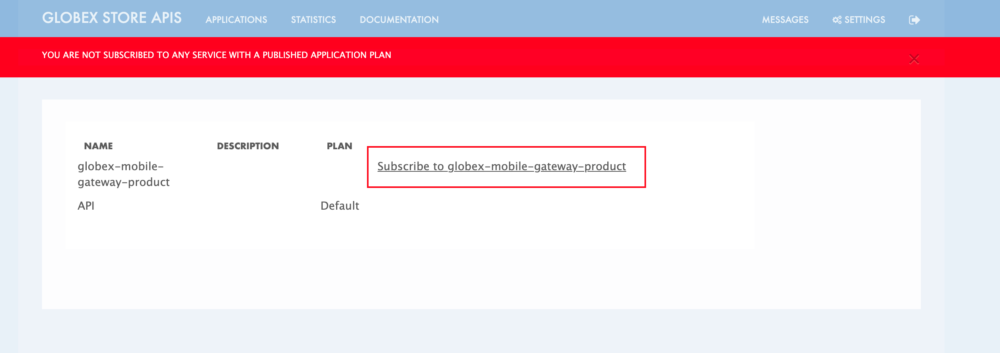
* You are successfully subscribed to the service
+
.Successfully subscribed to the service
image::images/apim/apim-devportal-mobile-subscribe-success.png[width=70%]

* Navigate back to the *APPLICATIONS tab* found on the top menu and click *globex-mobile-gateway-product's* > *Create new application* link +
+
.Developer Portal: Create new application (again)
image::images/apim/3scale_dev_portal_applications.png[width=70%]

* Give the plan a *Name* and a *Description* and click on *Create Application* 
+
.Developer Portal: New application 
image::images/apim/apim-devportal-mobile-create-new-app-2.png[width=70%]
* An application is created successfully. Make a note of the *Client ID* and *Client Secret*. You will be using this in the Mobile App setup. Scratchpad can be used for this as well.
* Enter the value asterisk (*) in the **REDIRECT URL** field and click on the **Submit** button. This is to setup the right Redirect URL for OAuth using Red Hat SSO.
+
.Update REDIRECT URL in the Application creates successfully for Mobile User
image::images/apim/apim-devportal-mobile-app-success.png[width=90%]
* Copy the *Client ID* from this page which will be used to setup Mobile App
* In Dev Spaces open the file: *Dev Spaces -> workshop -> module-apim -> mobile -> mobile-env-patch.sh*
** Substitute `<replace-me>` found against the `API_CLIENT_ID` variable with the *Client ID* in the previous step
+
.Update client_id into mobile-env-patch file
image::images/apim/mobile-clientid-env-patch.png[width=70%]
* Back in the Developer Portal Click on *DOCUMENTATION* navigation on the top of the page. 
* The *Documentation* page displays all the available APIs including the default API as well as *globex-mobile-gateway-product*
+
.Dev Portal: Documentation Page
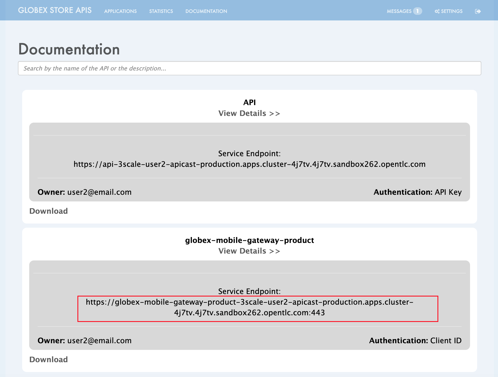
** Copy the URL displayed under "Service Endpoint" in *globex-mobile-gateway-product* box
** In Dev Spaces navigate back to the open file: *Dev Spaces -> workshop -> module-apim -> module -> mobile-env-patch.sh*
** Substitute `<replace-me>` found against the `GLOBEX_MOBILE_GATEWAY` variable with the *Service Endpoint* in the previous step
+
.Update GLOBEX_MOBILE_GATEWAY into mobile-env-patch file
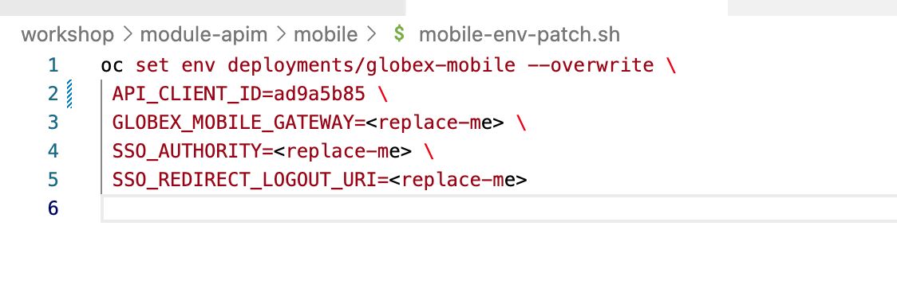
* In the same file update the *<replace-me>* tags for the *SSO_AUTHORITY* and *SSO_REDIRECT_LOGOUT_URI* fields with the following variables
+
[cols="30%,60%"]

|===
|Field | Value

| SSO_AUTHORITY | \https://sso.{openshift_subdomain}/auth/realms/globex-{user_name}
| SSO_REDIRECT_LOGOUT_URI | \https://globex-mobile-globex-apim-user1.{openshift_subdomain}/home
|===
+
.Update SSO details into mobile-env-patch file
image::images/apim/mobile-sso-env-patch.png[]
* Finally the `mobile-env-patch.sh file should look like this. Save the file by `Ctrl+S`
+
.Fully updated mobile-env-patch file
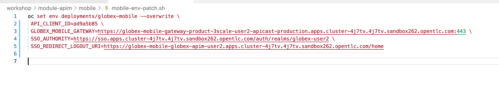
* Execute this script in the Terminal by running the following command in Dev spaces' Terminal
+
[source,bash,role=copy,subs="attributes"]
.Run mobile-env-patch.sh script
----
sh /projects/workshop-devspaces/workshop/module-apim/mobile/mobile-env-patch.sh
----
+
[source,subs="attributes"]
.Output of running mobile-env-patch.sh script
----
deployment.apps/globex-mobile updated
----
* The Mobile App Deployment is patched with the necessary variables. You can view this navigating to {openshift_cluster_console}/k8s/ns/globex-apim-{user_name}/deployments/globex-mobile/environment[globex-mobile deployment, window="console"]
+
.globex-mobile deployment on OpenShift
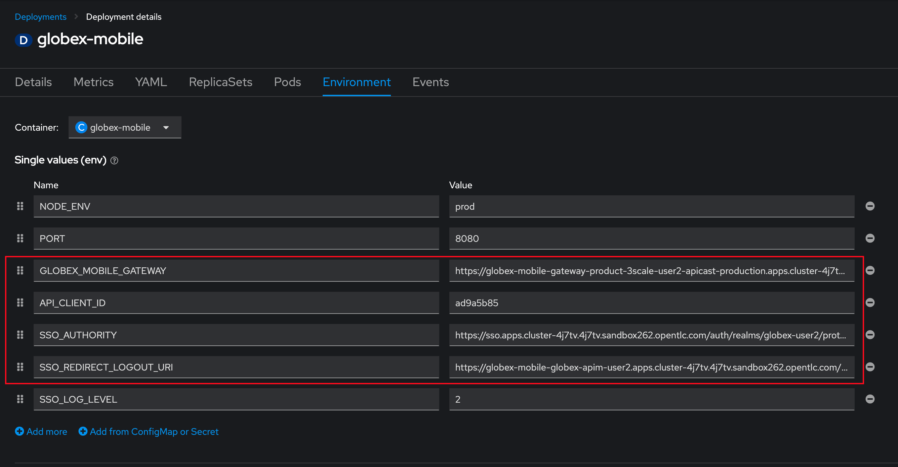

==== Update Red Hat SSO's Web Origin to match Mobile App
There is one last step that you need to do before trying out the Mobile App. You need to update the *Web Origin*

* Navigate to click on {sso_tenant_console}/#/realms/globex-{user_name}/clients[Red Hat SSO Clients List^,window="sso"]. Login if needed with *({user_name}/{user_password})*.
+
.Red Hat SSO Clients List for Mobile client
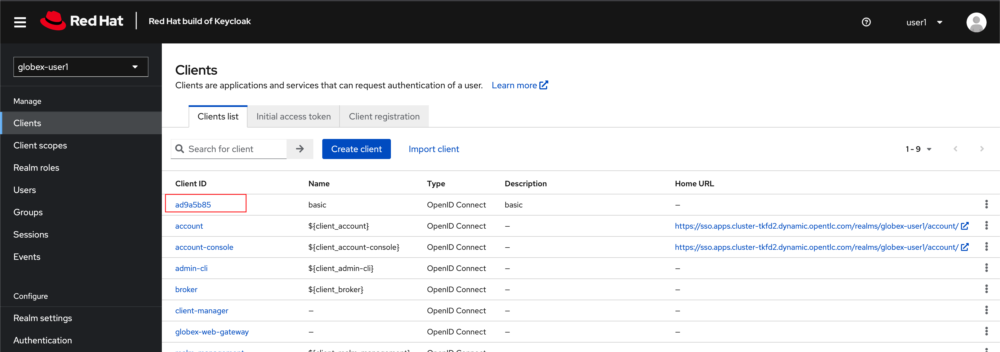

* Click on the new Client ID that was created when you signed up for Mobile Gateway Application
+
.[.underline]#*Where do I find this Client ID?*#
[%collapsible]
====
* Navigate to the {globex_developer_portal}/admin/applications[Globex Developer Portal Applications^, window="devportal"] 
* The client ID is displayed against the `globex-mobile-gateway-product` product.
+
.globex-mobile deployment on OpenShift
image::images/apim/mobile-dev-portal-clientid.png[]

====

* Close to the bottom of this page, you would see the *Web Origins* field. 
* Update this field with the following value and click on *Save*
+
[source,bash,role=copy, subs="attributes"]
.Value for Web Origin
----
https://globex-mobile-globex-apim-{user_name}.{openshift_subdomain}
----
+
.Update Web Origin in Red Hat SSO's new Client ID, and click on Save.
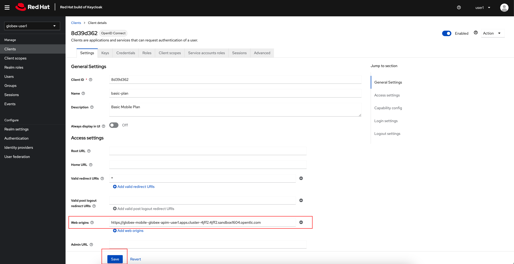

=== Section Outcome
* 3scale Backend, Product, ActiveDocs and Users were created
* Developer Portal was setup for public access without Access Code
* Signed for an Application as a Mobile Developer
* Patched Red Hat SSO Web Origin so that the calls from Globex Mobile App will not cause errors

== Test Mobile Application 

In the previous section, you signed up for access as a Mobile Developer and gained credentials to access the Globex Mobile Gateway API. In this section you will complete Mobile App configuration and test this out

[NOTE]
====
As part of this workshop, you will use a mobile-friendly Angular App and not a mobile-native app. So no mobile app installation is necessary. This Mobile App is work in progress and at present shows only categories and products within each category.
====

The Mobile Application can be access via this QR Code as well as via browser

* Scan the following QR Code with your mobile phone
+
.Scan to view Mobile App
image::https://chart.googleapis.com/chart?chs=300x300&amp;cht=qr&amp;chl=https://globex-mobile-globex-apim-{user_name}.{openshift_subdomain}[Globex Mobile,200,300]
 
* Alternatively, launch https://globex-mobile-globex-apim-{user_name}.{openshift_subdomain}[Globex Mobile^] and login using (asilva/openshift)
* The login process may take a few seconds. Please wait for bit :)
+
.User is logged in
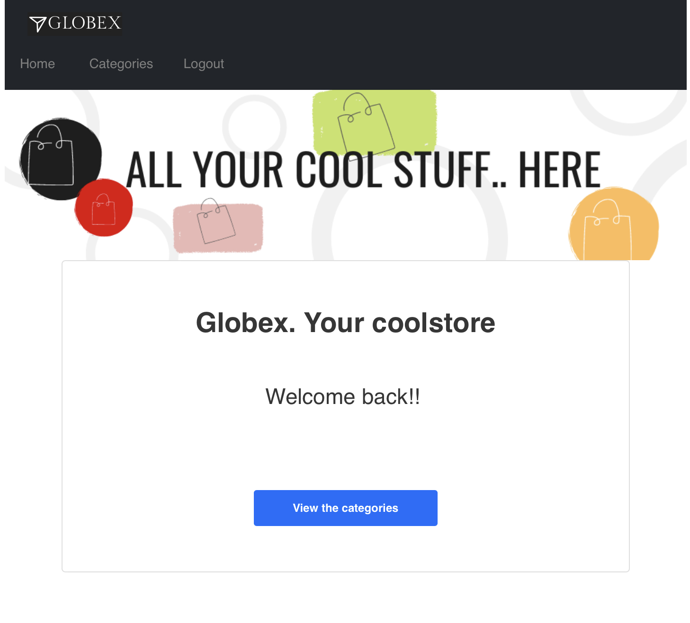
* After logging in, click on the *View the categories* button. You will view on a list of Categories available
+
.Categories view
image::images/apim/mobile-categories.png[width=40%]
* Click on the 'Clothing' category to view the Product Listing.
* Try out a few more categories too which will help us to generate some traffic to view in the Analytics section.

=== Analytics
* Navigate to the {globex_developer_portal}/buyer/stats[Globex Developer Portal Statistics^, window="devportal"] 
* From the dropdown indicated in this screenshot, choose the Mobile Gateway API's application plan (which is  `basic-plan` in this case).
* You will be presented with the statistics graph of the calls made to this gateway by the Partner Developer's access.
+
image::images/apim/apim-mobile-analytics.png[]

=== Under the hood
As part of this Section you tried out the Mobile App. 

* The user *asilva* you logged into the Mobile App as, is authenticated using Red Hat SSO.
* Once the user logs in, a token is generated by Red Hat SSO using the Client ID, SSO Authority details that you passed to the Mobile App to setup the configuration
* This token is authenticated by 3scale to ensure the Client ID indeed has access to that particular API
* The token is also passed onto the backend service running on OpenShift, which checks for validity of the token. 
* The https://github.com/rh-cloud-architecture-workshop/globex-mobile-gateway/blob/main/src/main/java/org/globex/gateway/mobile/rest/MobileCatalogResource.java[REST endpoints^, window="code-samples"] is supplied with the SSO URL information as part of the https://github.com/rh-cloud-architecture-workshop/globex-mobile-gateway/blob/main/src/main/resources/application.properties[application.properties, window="code-samples"]
* The endpoints are protected with @Authenticated which in this case looks for a valid token being present.
+
.REST endpoint is annotated with @Authenticated
image::images/apim/mobile_rest_java.png[width=80%]

With that we wrap up the activities *Design, Govern, Manage, Secure* Globex Mobile Gateway APIs for access from the Mobile Application securely.

Coming up next: We will setup the Globex Partner APIs for access by external Partner portals.

[NOTE] 
=====
If you are running out time, now is a good time to switch to a different module. 

The Partner Portal section is quite similar to the Mobile App but for the fact that the Partner Users are not managed by Red Hat SSO. Therefore Partner Portal authenticates itself using the *Client Credentials* method using a client ID and secret. The authentication is only through the backend services of the Partner Portal without users getting into the picture.
=====

{empty} +

=== Cleanup
You can now close all the tabs except for this Instructions and Dev Spaces browser tabs. Close all files open within Dev Spaces as well.

If you choose to proceed to another module, close all but this *Instructions* browser before starting the next module. Go back to the link:workshop-goals[*Overview Page*] to choose your next module.

== Setup Partner Gateway and Partner Web App (Optional)

Before we start this section, close all the browser tabs except for this *Instructions tab* and *Dev Spaces* tab. This will help you navigate this section more easily.

Since we've gone through the Design and Governance sections of the Mobile API, in this section we will skip the design section. We'll also keep discussions to only essentials :)

=== Publish Partner API to Service Registry

* If you don't have a browser tab open with OpenShift Dev Spaces, click on {devspaces_dashboard}/dashboard/#/ide/devspaces-{user_name}/cloud-architecture-workshop[Dev Spaces IDE^, window="devspaces"]. If needed login with your username and password ({user_name}/{user_password}).
* In Dev Spaces, navigate to the folder `workshop -> module-apim -> partner -> activedoc`, and open the file `partner-activedoc-draft.json`. 
** Or type [Ctrl+P] and type the file name as `partner-activedoc-draft.json`
* Scroll to the bottom of the page where you can see the *securitySchemes* section
+
.Partner OpenAPI Security Schemes section
image::images/apim/partner-api-securty-scheme.png[] 
* Substitute *<replace-me>* with the Red Hat SSO's OpenID Provider Configuration shown below
+
[source,bash,role=copy, subs="attributes"]
----
https://sso.{openshift_subdomain}/auth/realms/globex-{user_name}/.well-known/openid-configuration 
----
+
.Updated Security Scheme
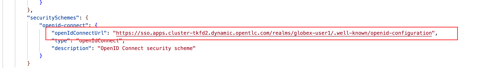
* Execute the following command from the Dev Spaces' Terminal. 
** This command makes a POST to the Service Registry API to create an OpenAPI schema for Partner Gateway API.
+
[source,bash,role=copy, subs="attributes"]
.POST call to create new OpenAPI on Service Registry
----
curl -X POST -H "Content-type: application/json; artifactType=OPENAPI" -H "X-Registry-ArtifactId: partnerapi" -d @/projects/workshop-devspaces/workshop/module-apim/partners/activedoc/partner-activedoc-draft.json {service_registry_url}/apis/registry/v2/groups/globex/artifacts
----
* The following JSON is returned back by Service Registry confirming creation
+
.Output response from Service Registry
----
{"name":"Globex Partners API Gateway","description":"Globex APIs made accessible to global partners to view Globex's catalog and products","createdBy":"","createdOn":"2023-05-05T22:51:01+0000","modifiedBy":"","modifiedOn":"2023-05-05T22:51:01+0000","id":"partnerapi","version":"1","type":"OPENAPI","globalId":2,"state":"ENABLED","groupId":"globex","contentId":2,"references":[]}workshop-devspaces (main)
----
* You can view the newly created OpenAPI specification {service_registry_url}/ui/artifacts/globex/partnerapi/versions/latest[here^, window="serviceregistry"]
** You can close the Service Registry browser tab.

=== Create Backend, Products, ActiveDoc and Users for Partner Gateway

==== Create Backend
* In Dev Spaces , under the folder `workshop -> module-apim -> partners -> gateway`, open the file `partner-gateway-backend.yaml`
* Substitute *"<replace-me>"* with the Service endpoint of the Globex Partner gateway service appended with the port as `:8080`. This URL is given below 
+
[source,bash,role=copy,subs="attributes"]
.Service hostname of the Mobile Gateway API
----
http://globex-partner-gateway.globex-apim-{user_name}.svc.cluster.local:8080
----
* After substitution the *partner-gateway-backend.yaml* file should looks like 
+
.partner-gateway-backend file
image::images/apim/partner-gateway-backend.png[width=80%]
* Run the following command which will create a Partner Gateway Backend in 3scale.
+
[source,bash,role=copy, subs="attributes"]
.create Partner Gateway Backend in 3scale
----
oc apply -f /projects/workshop-devspaces/workshop/module-apim/partners/gateway/partner-gateway-backend.yaml -n globex-apim-{user_name}
----
.Output
----
backend.capabilities.3scale.net/globex-partner-gateway-backend created
----

==== Create Products
* In Dev Spaces , under the folder `workshop -> module-apim -> partners -> gateway`, open the file `partner-gateway-product.yaml`

+
.partner-gateway-product.yaml file
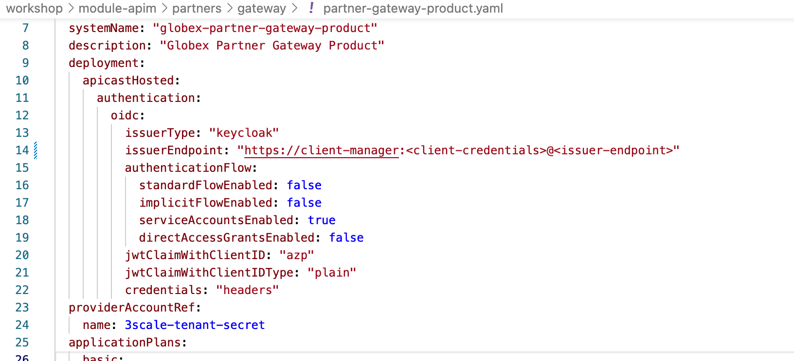

* Get the value for *<client-credentials>* placeholder as described below. Or if you have copied this into Scratchpad you can use that instead.
** Open the {sso_tenant_console}/#/realms/globex-{user_name}/clients[SSO Clients List^, window="sso"] from Red Hat SSO.
** Login if needed with *({user_name}/{user_password})*. 

[WARNING]
====
In case you see an error stating *You don't have access to the requested resource*, you may notice that you are logged in as a user other than *{user_name}* 

* Click on *Sign Out* and close the browser
* Reopen the {sso_tenant_console}/#/realms/globex-{user_name}/clients[Red Hat SSO Clients List^, window="sso"]. 
* Login as *({user_name}/{user_password})*. 

.Red Hat SSO Login error

image::images/apim/sso-login-error.png[]

====

* Click on the Client ID *client-manager*. You can copy the credentials from the *Credentials tab*
+
.client_manager credentials

+
* In the *partner-gateway-product.yaml* file, in Dev Spaces, substitute the following values
** Substitute *<client-credentials>*  with the Secret from the Client ID *client-manager* from the previous step
** Substitute *<issuerEndpoint>* with the following value
+
[source,bash,role=copy, subs="attributes"]
----
sso.{openshift_subdomain}/auth/realms/globex-{user_name}
----

* The file `partner-gateway-product.yaml` looks like this now.

+
image::images/apim/product-gateway-product-issuerendpoint.png[]
* Run the following command in the Dev Spaces Terminal to create the product
+
[source,bash,role=copy, subs="attributes"]
.Create partner product
----
oc apply -f /projects/workshop-devspaces/workshop/module-apim/partners/gateway/partner-gateway-product.yaml -n globex-apim-{user_name}
----

.Output
----
product.capabilities.3scale.net/globex-partner-gateway-product created
----

=== Create Active Doc for Partner Gateway
* In Dev Spaces, navigate to the folder `workshop -> module-apim -> partners -> activedoc`, open the file `create-partner-activedoc.yaml`
+
image::images/apim/mobile-activedoc-yaml.png[width=70%]
* Replace the `<replace-me>` placeholder with the Service Registry OpenAPI endpoint for Partner API show below
+
[source,bash,role=copy,subs="attributes"]
.Service Registry Mobile OpenAPI endpoint
----
{service_registry_url}/apis/registry/v2/groups/globex/artifacts/partnerapi
----

* Create this Active Doc by running the following command in the Dev Spaces Terminal
+
[source,bash,role=copy,subs="attributes"]
.Create Activedoc command
----
oc apply -f /projects/workshop-devspaces/workshop/module-apim/partners/activedoc/create-partner-activedoc.yaml -n globex-apim-{user_name}
----
+
.Output
----
activedoc.capabilities.3scale.net/partner-gateway-activedoc created
----

=== Setup Partner users
* Create this Active Doc by running the following command in the Dev Spaces Terminal
+
[source,bash,role=copy,subs="attributes"]
.Create Activedoc command
----
oc apply -f /projects/workshop-devspaces/workshop/module-apim/partners/users/partner-dev-setup.yaml -n globex-apim-{user_name}
----
+
.Output
----
secret/partner.secret created
developeraccount.capabilities.3scale.net/partner-developeraccount created
developeruser.capabilities.3scale.net/admin.partner created
developeruser.capabilities.3scale.net/user.partner created
----

=== Configurations on 3scale admin console

* Navigate to the {3scale_tenant}[3scale admin portal^, window="3scale"] and login using your username and password ({user_name}/{user_password}).
+
.Launch 3scale 
image::images/apim/apim-partner-3scale-login.png[]
* You will notice that the Partner Product and Backend have been created.
* Click on *globex-partner-gateway-product* under *APIs -> Products* section. 
* You are presented with the Product overview page for the Partner API Product you created. 
* Navigate to `Integration -> Configuration` and click on the *Promote to v.x Staging APICast* and then *Promote to v.x Production APICast* to promote all the config changes
//TBC find ways to overcome this step//
+
.Promote Staging and Production APICast
image::images/apim/partner-promote-apicast.png[]

=== Signup for an application as a Partner
* Navigate to the Developer Portal {globex_developer_portal}[Globex Developer Portal^, window="devportal"]
* If you are already signed in, clicking on the Exit option on top-right of the page.
+
.Logout if already signed in
image::images/apim/logout.png[width=80%]
* Click on *SIGN IN* on top right of the page and login using username and password as *(user.partner/openshift)*
* Navigate to Applications Listing by choosing the *APPLICATIONS* menu on the top of the page.

+
.Developer Portal Landing Page
image::images/apim/3scale_dev_portal_loggedin.png[width=80%]
* In the Applications page you are invited to *Create Application*. Click on the *Create new application* button seen against `globex-partner-gateway-product`
+
.Developer Portal: Create new application
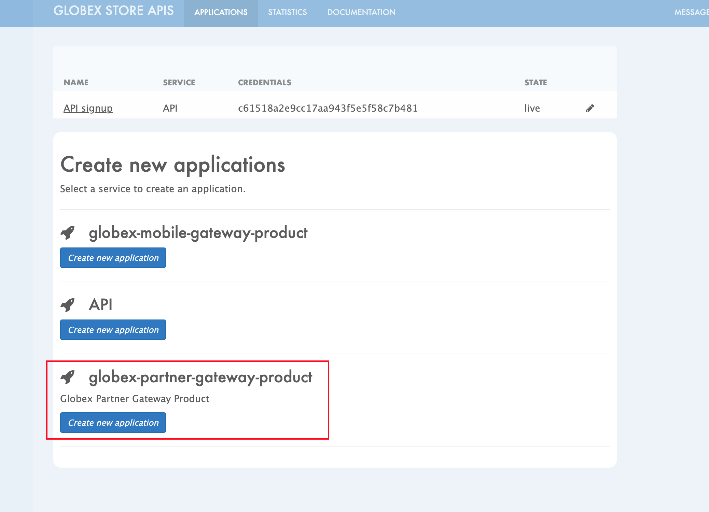
* Click on *Subscribe to globex-partner-gateway-product* link
+
.Subscribe to globex-mobile-gateway-product
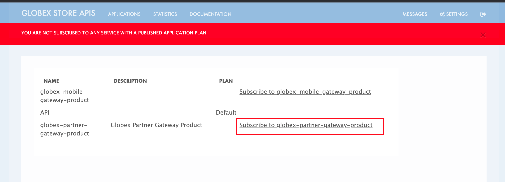
* You are successfully subscribed to the service
+
.Successfully subscribed to the service
image::images/apim/apim-devportal-partner-subscribe-success.png[width=70%]

* Navigate back to the *APPLICATIONS tab* via the top menu. 
* Under *globex-partner-gateway-product's*, click on the *Create new application* button +
+
.Developer Portal: Create new application (again)
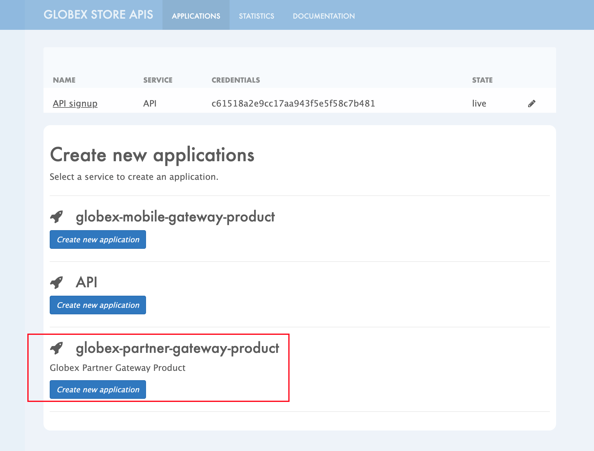

* In the NEW APPLICATION page, give the plan a *Name* and a *Description* and click on *Create Application*.
+
.Developer Portal: New application 
image::images/apim/apim-devportal-partner-create-new-app-2.png[width=70%]
* An application is created successfully. Make a note of the *Client ID* and *Client Secret*. You will be using this in the Partner Web Portal setup.
* Enter the value asterisk (*) in the **REDIRECT URL** field and click on the **Submit** button. This is to setup the right Redirect URL for OAuth using Red Hat SSO
+
.Update REDIRECT URL in the Application creates successfully for Partner User
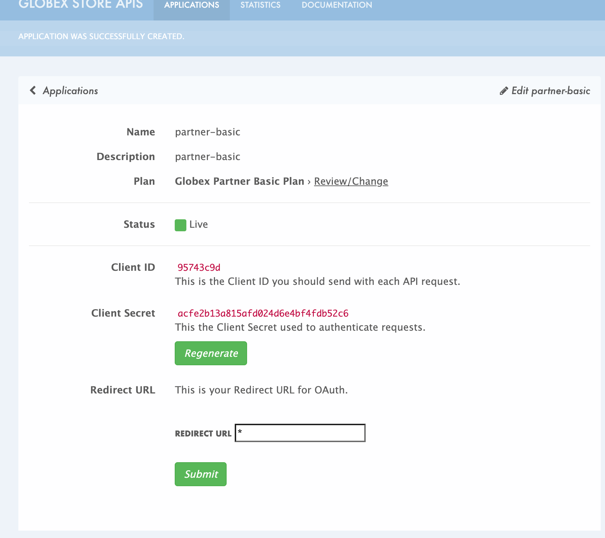

=== Setup Partner Web Portal
* In the previous section, you signed up for access as a Partner Developer and gained credentials to access the APIs Globex exposes.
* To update the Partner Web application you need these values
** *Client ID & Client Secret* - Needs to be fetched from Red Hat SSO
** *Token URL* - From Red Hat SSO - But available here in the instructions
** *Globex API Endpoint* - From Red Hat 3scale - But available here in the instructions
* These values are part of {openshift_cluster_console}/k8s/ns/globex-apim-{user_name}/deployments/globex-partner-web/environment[globex-partner-web deployment, window="console"] and are highlighted in the screenshot below
+
.globex-partner-web Deployment
image::images/apim/partner-web-deployment-env.png[]

* The *Client ID* and *Client Secret* with values as placeholders are predeployed as a Kubernetes Secret called *secret.yaml*.
** In the Dev workspace, under the folder `/projects/workshop-devspaces/workshop/module-apim/partners/partner-web`  open the file *secret.yaml*
+
.secret.yaml
image::images/apim/partner_secret_yaml.png[width=60%]

** Update the *Client ID* and *Client Secret* from the previous step on 3scale Developer Portal
+
.Client ID and Client Secret from 3scale Developer Portal
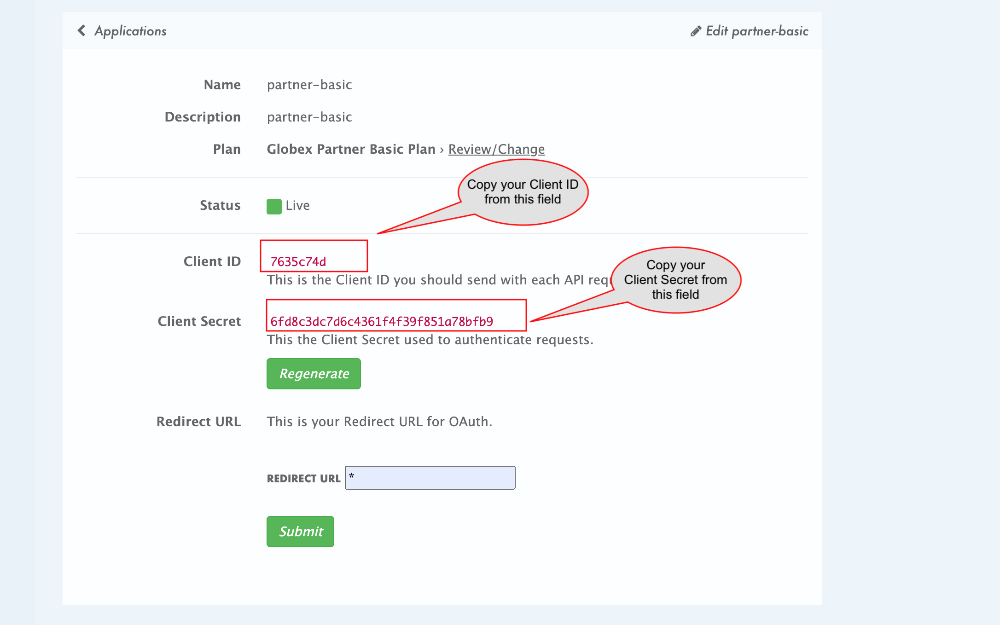

* Update *Token URL* with the following value
+
[source,bash,role=copy,subs="attributes"]
.update TokenURL
----
https://sso.{openshift_subdomain}/auth/realms/globex-{user_name}/protocol/openid-connect/token
----

* In the *Dev Spaces Terminal* apply changes made to the *secret.yaml* by running the following command
+
[source,bash,role=copy,subs="attributes"]
.Apply secret.yaml changes
----
oc apply -f /projects/workshop-devspaces/workshop/module-apim/partners/partner-web/secret.yaml -n globex-apim-{user_name}
----
+
.Output
----
secret/globex-partner-web configured
----
* The final step is to patch the Partner Web portal with the *Partner Gateway API's endpoint*. 
** You would ideally get this from 3scale. But since you have learnt how to do this with Mobile API, we will skip navigating to 3scale to save some time.
** Execute this script in the Dev Spaces Terminal
+
[source,bash,role=copy,subs="attributes"]
.Run script to update GLOBEX_PARTNER_GATEWAY
----
oc set env deployments/globex-partner-web --overwrite GLOBEX_PARTNER_GATEWAY=https://globex-partner-gateway-product-3scale-{user_name}-apicast-production.{openshift_subdomain}
----
+
[source,subs="attributes"]
.Output 
----
deployment.apps/globex-partner-web updated
----
+
.[.underline]#*[Click to know] How do I verify what I just did?*#
[%collapsible]
====

* Ensure the {openshift_cluster_console}/k8s/ns/globex-apim-{user_name}/deployments/globex-partner-web/environment[globex-partner-web deployment, window="console"] looks like this now
+
.Partner Web Portal Deployment Values
image::images/apim/globex-partner-web-filled.png[]
* To check the Secret that you updated, you can navigate to {openshift_cluster_console}/k8s/ns/globex-apim-{user_name}/secrets/globex-partner-web[globex-partner-web secret^, window="console"]. Scroll down to the *Data* section, and click on *Reveal values*
+
.Partner Web Portal Secret with SSO details
image::images/apim/partner-web-secret.png[]
====

== Test Partner Web Application 

In the previous section, you signed up for access as a Partner Developer and gained credentials to access the Globex PArtner Gateway API. You also setup the necessary configurations for the Partner Web Application.

* Launch the https://globex-partner-web-globex-apim-{user_name}.{openshift_subdomain}[Globex Partner Web^]
+
.Partner Web Portal
image::images/apim/partner_web_portal.png[]
* Login using username/password as *(partner/openshift)*. 
** It is notable that the partner users are not managed using Red Hat SSO. 
* After logging in, the entire product list is shown in a paginated format.
** Allow a few seconds for the catalogue to load
* Reload this page by hitting the Browser Refresh a few times which will help us to generate some analytics.
+
.User logged in and can view paginated products
image::images/apim/apim-partner-loggedin.png[width=80%]

=== Analytics
* Navigate to the {globex_developer_portal}/buyer/stats[Globex Developer Portal Statistics^, window="devportal"] 
* From the dropdown indicated in this screenshot, choose the Partner Gateway API's application plan (which is  `partner-basic` in this case).
* You will be presented with the statistics graph of the calls made to this gateway by the Partner Developer's access.
+
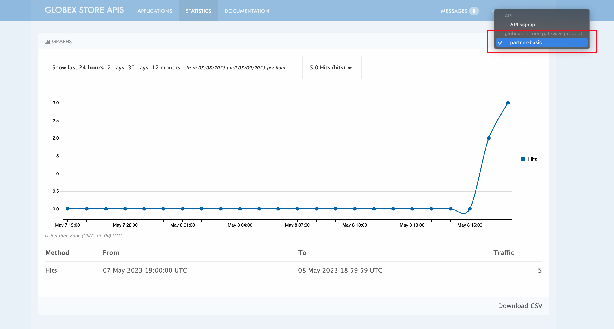

=== Under the hood
As part of this Section you setup and tested the Partner Web App. 

* The user *partner* that you logged into the Partner App as, is not authenticated using Red Hat SSO. In fact it is not authenticated at all. 
** This is because the way partners handle user authentication is not something that Globex is concerned about at all.
* In this scenario we use Client Credentials authentication, because the backend NodeJS server authenticates itself with Client ID and Credentials obtained by the Partner Developer while signing up for an Application via 3scale Developer Portal
* The token generated by NodeJS is then exchanged with 3scale to ensure the Client ID indeed has access to that particular API

== Congratulations
With this you have completed the *Contract First API* module! 

Please close all but this *Instructions browser tab* to avoid proliferation of tabs which can make working on other modules difficult. 

Choose your next module by accessing link:workshop-goals[*Overview Page*] to choose your next module.
