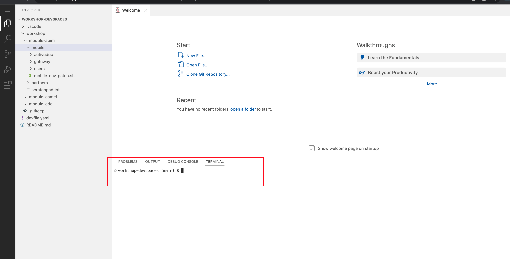

:icons: font 

:toc: 

:sectnums:

== Quick overview of the lab exercises


== Prepare your Development environment

You are going to use OpenShift Dev Spaces for a number of activities. OpenShift Dev Spaces uses Kubernetes and containers to provide a consistent, secure, and zero-configuration development environment, accessible from a browser window.

* In a browser window, navigate to the browser tab pointing to the Developer perspective of the OpenShift cluster. If you don't have a browser tab open on the console, navigate to %openshift_cluster_console%[OpenShift Console^, window=_console]. If needed login with your username and password (%user_name%/%user_password%).

* On the top menu of the console, click on the image:images/openshift-application-menu.png[] icon, and in the drop-down box, select *Red Hat OpenShift Dev Spaces*.
+
image::images/openshift-application-menu-2.png[]

* Login in with your OpenShift credentials (%user_name%/%user_password%). If this is the first time you access Dev Spaces, you have to authorize Dev Spaces to access your account. In the _Authorize Access_ window click on *Allow selected permissions*. 
+
image::images/devspace-auth-access.png[width=70%]

* You are directed to the Dev Spaces overview page, which shows the workspaces you have access to. You should see a single workspace, called *cloud-architecture-workshop*. The workspace needs a couple of seconds to start up.
+
image::images/devspaces-workspace-starting.png[]

* Click on the *Open* link of the workspace.
+
image::images/devspaces-workspace-started-1.png[]

* This opens the workspace, which will look pretty familiar if you are used to work with VS Code. Before opening the workspace, a pop-up might appear asking if you trust the contents of the workspace. Click *Yes, I trust the authors* to continue.
+
image::images/devspaces-trust-contents.png[]

* The workspace contains all the resources you are going to use during the workshop. In the project explorer on the left of the workspace, navigate to the *workshop/module-apim* folder
+
image::images/apim/apim-devspaces.png[] 

* You can deploy various resources needed in this workshop to the OpenShift cluster directly from Dev Spaces. To do so, you will need accessto the built-in Terminal. Click on the image:images/devspaces-menu.png[] icon on the top of the left menu, and select *Terminal/New Terminal* from the drop-down menu.
+
image::images/apim/apim-devspaces-menu-new-terminal.png[]

* This opens a terminal in the bottom half of the workspace.
+


* The OpenShift Dev Spaces environment has access to a plethora of command line tools, including *oc*, the OpenShift  command line interface. Through OpenShift Dev Spaces you are automatically logged in into the OpenShift cluster. You can verify this with the command *oc whoami*.
+

[source,bash,role=copy]
----
oc whoami
----
+
.Output
----
%user_name%
----
+
[IMPORTANT]
====
If the the output of the `oc whoami` command does not correspond to your username (%user_name%), you need to logout and login again with the correct username.

[source,bash,role=copy]
----
oc logout
oc login -u %user_name% -p %user_password% 
----

====

* You will be working in the `globex-apim-%user_name%` namespace. So run this following command to start using that particular project

+
[source,bash,role=copy]
----
oc project `globex-apim-%user_name%`
----
+
.Output
----
%user_name%
----

+
image::images/apim/apim-terminal-setup.png[]

=== Scratchpad
As you work through this Contract First APIs module, there are a few variables and URLs that are needed throughout this activity. To make things easier and manageable we've setup a scratchpad within Devspaces. You can fill this scrachpad up with information needed as you are guided below so that you can progress through this activity faster.

{empty} +

== Enable the Slack to Discord interaction

As previously described, the Slack integration is already in place and users can already post questions on the GlobexSupport app which are channeled and available in the AMQ Broker.

In this first implementation activity you need to close the end-to-end data flow between Slack and Discord. Events can already travel half the way up to the broker (AMQ), but the second stage, from the Broker to Discord, is still pending.

{line}

=== How Customers interact with Agents

Customers will choose Slack or Globex's chat widget to communicate with agents. They will do so in a private one-to-one manner.

From Slack, an app (bot) called `GlobexSupport` will be available. This app looks and feels like any other Slack user you can interact with. You can send direct messages and get responses. The user can enter his question/concern, which is channelled to the agent, and wait for a response.

On Discord, where the agents operate, each new customer request will initiate a new conversation in a new dynamically created channel. The private channel will remain open during the life of the conversation, until the customer has been attended and the conversation can be considered closed. At that moment, the agent manually deletes the channel in Discord, and the customer is notified in Slack.

{empty} +


=== The role of Caching

Conversations are synchronous by nature, when you ask a question, you wait for a response. In systems architectures, synchronous interactions are easier to implement, but are more resource costly. Synchronous calls may be thread-blocking, and under utilise the infrastructure during heavy traffic loads, possibly causing bottlenecks.

Because event-driven architectures are asynchronous (no waiting to do), they optimise performance, but has to be said, at the cost of higher complexity. Caching is a strategy (among others) to assist the event-driven approach and offer an elegant implementation.

In our use case, we need to propagate Slack messages to Discord, and vice-versa. However, we're dealing here with private interactions between customers and agents, and we need to maintain separate conversations in parallel and prevent interferences between users. In contrast, when a single room is used for all participants, all messages depart and land in static channels.

Caching allows us to keep the context of a one-to-one conversation between the customer and the agent. The context data will include information about the private chanel in Slack and the private channel in Discord.

{empty} +

=== Implement the caching logic

Which integration lessons will you learn in this section?

 - How to define reusable Camel routes.
 - How to manipulate JSON payloads for easier access and updates.
 - How to integrate with DataGrid to perform caching operations.
 - How to define conditional regions of code.

{empty} +

Our cache technology is _Red Hat Datagrid_, which is based on the open source project _Infinispan_. Your environment should contain a dedicated instance of _DataGrid_ in the `globex-camel-userX` namespace.

Your Discord integration, implemented with Camel, requires access to DataGrid to push, fetch, and remove cache entries, in order to work out Slack/Discord users pairings while delivering messages back and forth.

Your first task is to define the Camel routes responsible to interact with DataGrid.

. Run in your terminal the snippet below to find your working directory:
+
[source, subs=]
----
cd workshop/module-camel/lab/discord/<br>
----
+
NOTE: The working folder contains a `code` folder to support you on this exercise, as well as a `deploy` script to help you run it in OpenShift.
+
{empty} +

. In your terminal, use the `kamel` (Camel K client) command below to create a new Camel source file where to define your Camel routes for the caching logic:
+
[source, subs=]
----
kamel init routes-cache.yaml<br>
----
+
NOTE: Camel supports various DSLs (Domain Specific Language). The main ones are YAML, XML and Java. With the command above, Camel K automatically generates a code example using the DSL chosen.
+
{empty} +

. Open the `routes-cache.yaml` file in your editor.
+
Select from your project tree:
+
* workshop -> module-camel -> lab -> discord -> routes-cache.yaml
+
image::images/crw-open-yaml.png[align="left", width=50%]
+
{empty} +
+
. Delete the code in `routes-cache` and replace with the following snippet:
+
```yaml
- from:
    uri: "direct:cache-put"
    steps:
      - marshal:
          json: {}
      - remove-headers:
          exclude-pattern: '*'
      - set-header:
          name: ${{{cache.operation}}}
          simple: ${{{cache.put}}}
      - set-header:
          name: ${{{cache.value}}}
          simple: ${body}
      - set-header:
          name: ${{{cache.key}}}
          simple: ${exchangeProperty.key}
      - to:
           uri: "infinispan://default"
```
+
You could consider the _Camel_ route above equivalent to a subroutine in any programming language. It executes the action of pushing a new entry in cache:

- The `from` element uses the `direct` _Camel_ component, which is a special component that allows other _Camel_ routes in the code to make internal invocations to this one.
- Next, a JSON marshaller renders the payload in JSON format. This implies the route expects the payload (`body` in _Camel_ terms) to contain a Java data structure (Map). This one liner automatically converts the Java Map into JSON by using a _Camel_ DataFormat.
- In preparation for the PUT operation, the `removeHeaders` instruction ensures all (star symbol) residual headers are erased beforehand.
- Next, the route sets the 3 headers required to invoke the cache system. These are: the type of operation (PUT), the value (the payload/body), and the key (unique key to access the data).
+
[NOTE]
====
You'll observe the setters are using a `${{{...}}}` syntax to resolve the name and value from configuration parameters. The double bracket finds the parameter, the dollar/bracket belongs to the `simple` syntax in Camel.
====
- Finally, the route defines the `infinispan` component to connect and push the information to _DataGrid_ using the key/value/operation headers provided.
+
[NOTE]
====
The `infinispan` component requires no extra parameters because it has been pre-configured for you, it's secured with TLS and Scram, and points to your DataGrid instance.
====
+
---
+
{empty} +
+
. The route above implemented the `PUT` operation. Let's define the `GET`` operation with the definition below.
+
Add in your code (copy and paste) the snippet below:
+
```yaml
- from:
    uri: "direct:cache-get"
    steps:
      - removeHeaders:
          pattern: '*'
      - set-header:
          name: ${{{cache.operation}}}
          simple: ${{{cache.get}}}
      - set-header:
          name: ${{{cache.key}}}
          simple: ${exchangeProperty.key}
      - to:
           uri: "infinispan://default"
      - when:
          simple: ${body} != null
          steps:
          - unmarshal:
              json: {}
```
+
In a very similar fashion, the `GET` route definition:

- The `from` element is defined with the `direct` component to allow other _Camel_ routes invoke it.
- Removes residual headers.
- Sets the operation (`GET`) and key to obtain the cache entry.
+
[NOTE]
====
You can consider the `${exchangeProperty.key}` as a parameter the calling route needs to preset. Exchange properties are like variables you can define during the lifetime of a _Camel_ transaction.
====
+
- Uses the `infinispan` component to request the cache entry.
- The `when` element checks if a value is returned (it might not exist), and if so, it un-marshals the JSON body into a Java Map.
+
[NOTE]
====
Un-marshalling the payload into a Java structure allows for an easier handling of the JSON data in other parts of the Camel implementation.
====
+
---
+
{empty} +
+
. The last of the cache interactions to define is a `REMOVE` operation. Let's define it with the definition below.
+
Copy and paste the snippet below:
+
```yaml
- from:
    uri: "direct:cache-remove"
    steps:
      - removeHeaders:
          pattern: '*'
      - set-header:
          name: ${{{cache.operation}}}
          simple: ${{{cache.remove}}}
      - set-header:
          name: ${{{cache.key}}}
          simple: ${exchangeProperty.key}
      - to:
           uri: "infinispan://default"
```
+
In a very similar fashion, the `REMOVE` route definition:

- The `from` element is defined with the `direct` component to allow other _Camel_ routes invoke it.
- Removes residual headers.
- Sets the operation (REMOVE) and key to target.
+
[NOTE]
====
You can consider the `${exchangeProperty.key}` as a parameter the calling route needs to preset. Exchange properties are like variables you can define during the lifetime of a _Camel_ transaction.
====
+
- Uses the `infinispan` component to perform the operation.
+
---
+
{empty} +

If you have included in your code the 3 route definitions above, your work is done here and you can resume with the tasks that follow.

{empty} +

=== Implement the Client to Agent flow

The interaction between customers and agents flows in two directions. The instructions that follow will help you to complete the logic that delivers events from clients to agents. Later, you will work on the reverse (agents to clients) processing direction.

As indicated in the module's introduction, the integration with Slack (where clients live) is already deployed and running in the environment. Customers posting messages in the _GlobexSupport_ app in Slack will translate into events delivered to the AMQ Broker.

The starting point of this task is to subscribe to the relevant address in the AMQ Broker to collect the customer messages. From that point, we will complete the implementation to connect Slack and Discord end-to-end.

{empty} +

==== Create the AMQ listener

Which integration lessons will you learn in this section?

 - How to integrate with AMQP Brokers.
 - How to invoke other Camel routes.
 - How to organise the code allow a pluggable architecture.

{empty} +

. In your terminal, execute the `kamel` command below to create a new source file to process AMQP events:
+
[source, subs=]
----
kamel init routes-from-amq.yaml<br>
----
+
NOTE: The new file has a YAML extension. Camel K automatically generates for you a skeleton using the YAML DSL (Domain Specific Language).
+
{empty} +

. Open the `routes-from-amq.yaml` file in your editor.

. Copy and paste the following snippet:
+
```yaml
- from:
    uri: "amqp:topic:{{broker.amqp.topic.clients.slack}}{{slack.globex.channel.id}}"
    parameters:
      connectionFactory: "#myFactory"
    steps:
      - to:
           uri: "direct:support-request"
```
+
The route above subscribes to an AMQ address and directs all events to a different Camel route. This route does not perform any processing because our goal is to maintain a pluggable architecture. It means that we can define additional Camel routes fetching events from other sources and direct them to the main processing logic.
+
[NOTE]
====
Later, a second channel will also plug in to this logic to consume events from the Globex Web portal via its chat widget.
====
+
The section that follows helps you implement the route `direct:support-request` where all AMQP events are directed
+
{empty} +

==== Create the main processing route


The main route will process events originating in Slack (and also coming from other sources, later in the lab).

Which integration lessons will you learn in this section?

 - How to organise the code by delegating work to other _Camel_ routes.
 - How to define and use processing variables (known in _Camel_ as _Exchange_ properties).
 - How to use _Camel_'s simple language expression to set values.

{empty} +

In the same YAML file, copy and paste the following snippet:

```yaml
- from:
    uri: "direct:support-request"
    steps:
      - unmarshal:
          json: {}
      - set-property:
          name: in
          simple: ${body}
      - to:
           uri: "direct:get-cache-entry"
      - set-property:
          name: discord-channel
          simple: ${exchangeProperty.cache.get(target).get(room)}

      - set-body:
          simple: ${exchangeProperty.in.get(text)}
      - to:
           uri: "direct:discord-push-message"
```

The route above:

1. Un-marshals the payload into a Java Map (for easier access)
2. Defines a property `in` to keep the original incoming data.
3. Obtains the cache entry from invoking the `get-cache-entry` route.
+
[NOTE]
====
Cache entries are created, used and deleted during the lifetime of a support session. The logic to manage the lifecycle of cache entries is delegated to other parts of the code.
====
4. Defines the target Discord channel where to send the message
+
[NOTE]
====
the `setProperty` tag tells Camel to create a placeholder that can be used down the processing line.
====
5. Sets the text message to be sent to Discord
6. Delegates the message delivery to the route `discord-push-message`

{empty} +

==== Overview of the `get-cache-entry` route

This route needs to perform a series of actions. Among those, it crucially needs to interact with the Cache system, and invoke some of the Camel routes you've completed earlier (PUT, GET and remove operations).

To speed up with the lab, this Camel route is already provided. Here we're just doing an overview of the logic implementation.

PENDING SEQUENCE DIAGRAM

In the sequence diagram above you'll see that:

1. It attempts to obtain a cache entry
1. If it doesn't exist +
    .. It creates a new channel in Discord (new customer/agent interaction.
    .. It creates new cache entries to keep Slack and Discord context data.
1. It returns the cache entry data 

{empty} +


==== Implement the route pushing messages to Discord

All the pieces are in place, you have the cache interaction resolved, you have the logic to create new support channels in Discord. The final step is to send the actual customer message to Discord so that an agent can respond.

Which integration lessons will you learn in this section?

 - How to easily prepare and call APIs using Camel.
 - How to push events to Kafka using Camel.

{empty} +

Apache Camel has many connectors (components in _Camel_ terms) available out-of-the-box, but one for Discord doesn't exist (yet). This gap however does not stop you in any way from integrating with Discord, and in fact, you have many options for adopting an approach.

To give you a few ideas, Apache Camel is an open framework, meaning its API allows you to extend its functionality with your own components, data-formats, transformers, etc. You could develop a new Discord component, and if feeling generous donate it to the Camel community. Another strategy is to create _Kamelets_ which are in effect components with additional intelligence, and typically address specific use cases.

In our lab, our choice is tp simply invoke the API calls documented in Discord to cover our needs. Let's move ahead.

Still in the same YAML file, copy and paste the following snippet:

```yaml
- from:
    uri: "direct:discord-push-message"
    steps:
      - removeHeaders:
          pattern: '*'
      - set-header:
          name: Authorization
          simple: Bot {{discord.token}}
      - set-header:
          name: Content-Type
          simple: application/json
      - set-property:
          name: kafka-body
          simple: ${body}
      - setBody:
          simple: '{"content":"${body}"}'
      - toD:
          uri: "https://discordapp.com/api/channels/${exchangeProperty.discord-channel}/messages?connectionClose=true"
          parameters:
            connectionClose: true
      - setBody:
          simple: 'you: ${exchangeProperty.kafka-body}'
      - toD:
          uri: "kafka:support.${env.NAMESPACE}.${exchangeProperty.discord-channel}"
```

The route above:

- Defines the `from` element with the `direct` component to allow other _Camel_ routes invoke it.
- Keeps a copy of the customer message (used later).
- Removes residual headers.
- Sets the HTTP headers `authorisation` and `content-type` needed for the API call.
+
[NOTE]
====
You can read Discord's API documentation here.
====
+
- Defines the JSON payload to be sent containing the customer's text.
- Performs the API call using Camel's HTTP component.
- Prepares a payload message to be sent to Kafka.
+
[NOTE]
====
Every customer/agent interaction is streamed to Kafka. Later in the lab you'll understand the purpose of replaying the Kafka streams.
====
- pushes the message to Kafka.
+
[NOTE]
====
The `kafka` component requires no extra parameters because it has been pre-configured for you, it's secured with TLS and Scram, and points to the shared environment's Kafka cluster.
====

{empty} +

=== Deploy and test your code

PENDING

{empty} +

== Enable the Discord to Slack interaction

You've completed one directional flow to deliver customer messages from Slack to agents in Discord. Now, you need to transfer agent responses in Discord, back to customers in Slack.

As previously pointed out, Camel's collection of components does not include one for Discord. There are various ways in which messages can be fetched from Discord, but to preserve our loyalty to our event-driven principles, the true way forward is to follow Discord's documented protocol using a Websocket integration.

{empty} +

=== Overview of the websocket connection with Discord

By establishing a websocket connection, we enable Discord to push data to our listener in an event-driven manner. The guidelines documented by Discord are not trivial. For simplicity, we've provided the necessary logic using Camel to open the websocket. Here we simply summarise how opening the connection works.

Using the websocket component in Camel, we can configure it to point to the Discord server. Then, a series of interactions need to occur between Discord and Camel before the connection is considered fully established. The diagram below illustrates the initiation sequence.

PENDING IMAGE

In summary, Discord will send a series of signals, but all in all, Camel needs to send an identification message and run a periodic routine to send regular heartbeats that allows Discord to know our system is alive.

When Discord identifies our client (Camel), it'll start pushing events containing relevant information about the activity occurring in our Discord space.

{empty} +

=== Implement the Agent to Client flow

The websocket listener described above is responsible to pick up agent messages posted in Discord and direct then to Camel route you need to implement to process the event.

In essence, our route needs to obtain from cache the context for this particular customer/agent conversation, prepare the JSON data containing the agent's answer, and send it to the AMQ broker. The Slack integration will consume the event and deliver it to the customer.

Which new integration lessons will you learn in this section?

 - How to perform simple changes on JSON data.
 - How to push events via AMQP to the Broker.

{empty} +

. From your terminal, execute the `kamel` command below to create a new source file to process Discord events:
+
[source, subs=]
----
kamel init routes-from-discord-main.yaml<br>
----
+
NOTE: The new file has a YAML extension. Camel K automatically generates for you a skeleton using the YAML DSL (Domain Specific Language).
+
{empty} +

. Open the `routes-from-discord-main.yaml` file in your editor.

. Copy and paste the following snippet:
+
```yaml
- from:
    uri: "process-agent-message"
    steps:
    - set-property:
        name: text
        simple: ${body.get(d).get(content)}
    - set-property:
        name: agent
        simple: ${body.get(d).get(author).get(username)}
    - set-property:
        name: key
        simple: ${body.get(d).get(channel_id)}
    - to:
         uri: "direct:cache-get"
    - choice:
        when:
        - simple: ${body} != null
          steps:
          - to:
              uri: "language:simple:${body.replace(text,${exchangeProperty.text})}"
              parameters:
                transform: false
          - to:
              uri: "language:simple:${body.put(agent,${exchangeProperty.agent})}"
              parameters:
                transform: false
          - set-property:
              name: source
              simple: ${body.get(source).get(uname)}
          - marshal:
              json: {}
          - toD:
              uri: "amqp:topic:support.${exchangeProperty.source}"
              parameters:
                connectionFactory: "#myFactory"
          - set-body:
              simple: '${exchangeProperty.agent}: ${exchangeProperty.text}'
          - toD:
              uri: "kafka:support.${env.NAMESPACE}.${exchangeProperty.key}"
        otherwise:
          steps:
          - log: "no cache entry, ignoring message from user: ${exchangeProperty.agent}"
```
+
The route above:

- Defines the `from` element with the `direct` component to allow other _Camel_ routes invoke it.
- Keeps necessary values (as properties) from Discord's event.
+
[NOTE]
====
- The Discord JSON event has already been un-marshalled for you.
====
+
- Fetches from the cache system the customer/agent context
+
[NOTE]
====
- We use _Discord_'s `channel_id` as our key to fetch the cache entry.
====
+
- When the cache entry exists:
* The cache payload is recycled, it updates the text field to contain the agent's answer and injects the agent's name.
+
[NOTE]
====
There are many strategies in Camel to manipulate data. For minor changes on payloads the `language` component is very handy.
====
+
* Obtains from the cache entry the `uname` (customer's unique name) which is necessary to route the event to the right destination.
* Marshals the Java Map in JSON.
* Sends the event over the wire to the AMQ Broker using the AMQP component.
+
[NOTE]
====
The `amqp` component requires no extra parameters because it has been pre-configured for you, it's secured with TLS and Scram, and points to the shared environment's AMQ Broker.
====
+
* Finally, the interaction is recorded and streamed to Kafka
** a payload in the format `agent: text` is prepared using Camel's `simple` expression
** pushes the message to Kafka.
+
[NOTE]
====
- Note the Kafka topic defined uses your `NAMESPACE`, again to prevent clashes with other students since you all share the same Kafka cluster.
- The `kafka` component requires no extra parameters because it has been pre-configured for you, it's secured with TLS and Scram, and points to the shared environment's Kafka cluster.
====

- Lastly, when a cache entry does not exist, we ignore it.
+
[NOTE]
====
This is necessary in our lab to prevent other students from interfering with your tests. In a real-world implementation, you would perform the check anyway for robust error handling.
====
+

{empty} +

=== Implement the channel closure.

A crucial phase of the customer/agent interaction is when both parts agree on closing the conversation. At that point the expected sequence of actions is the following:

- The agent manually deletes the channel in Discord
- The customer receives a notification indicating the conversation has been closed.

When the agent deletes the channel, Discord fires an event notifying its closure, which our websocket picks up and directs to a route called `process-channel-closure`

Let's implement the logic required which is very similar to our previously defined route

Include in the same YAML file (copy and paste) the snippet below:

```yaml
- from:
    uri: "process-channel-closure"
    steps:
    - set-property:
        name: key
        simple: ${body.get(d).get(id)}
    - to:
         uri: "direct:cache-get"
    - choice:
        when:
        - simple: ${body} != null
          steps:
          - to:
              uri: "language:simple:${body.replace(text, 'your session ended, conversation is now closed.')}"
              parameters:
                transform: false
          - to:
              uri: "language:simple:${body.put(agent,'support')}"
              parameters:
                transform: false
          - set-property:
              name: source
              simple: ${body.get(source).get(uname)}
          - set-property:
              name: key-slack
              simple: ${body.get(source).get(room)}
          - marshal:
              json: {}
          - set-property:
              name: context
              simple: ${body}
          - toD:
              uri: "amqp:topic:support.${exchangeProperty.source}"
              parameters:
                connectionFactory: "#myFactory"
          - to:
              uri: "direct:cache-remove"
          - set-property:
              name: kafka-client
              simple: ${exchangeProperty.key}
          - set-property:
              name: key
              simple: ${exchangeProperty.key-slack}
          - to:
              uri: "direct:cache-remove"
          - set-body:
              simple: done
          - set-header:
              name: context
              simple: ${exchangeProperty.context}
          - toD:
              uri: "kafka:support.${env.NAMESPACE}.${exchangeProperty.kafka-client}"
          - set-body:
              simple: ${exchangeProperty.kafka-client}
          - toD:
              uri: "kafka:support.${env.NAMESPACE}.closed"
        otherwise:
          steps:
          - log: no cache entry, ignoring message
```

You will observe the route above is almost identical to the previous one. Let's simply summarize below the differences.

- It also fetches from the cache system the customer/agent context. Only this time the channel identifier sits in a different field (`.d.id`) in the Discord JSON event.
- It recycles the cache payload, only this time using an automated closing message.
- After sending the closing event via AMQP, it deletes the two cache entries relevant to this conversation:
+
[NOTE]
====
Reminder: each customer/agent session owns 2 cache entries. One uses the source key, handy on customer-to-agent processing, and the second uses Discord's channel ID, handy for agent-to-customer processing.
====
+
* it deletes the cache entry with source identifier (Slack or other).
* it deletes the cache entry with target identifier (Discord).
+
- Finally, it prepares and sends two closure Kafka events.
* the first contains the context information, sent to the conversation topic.
* the second is signal event, a notification that allows other applications to react.

{empty} +

=== Deploy and test your code

PENDING

{empty} +

== Plug the Globex Web console

All the work done so far has enabled bi-directional communication between customers and agents between Slack and Discord. Our open architecture approach allows us to easily plug in new communication channels.

Your next task will be to complete and deploy a Camel K integration that connects our Globex Web portal with the support service. The Globex Web portal has a chat widget from where customers can also contact support agents for assistance.

One approach to be consistent with our event-driven approach, is to decouple both flow directions as follows:

- Camel will expose an API to accept customer messages to agents
- Globex will define a callback entrypoint to listen for agent response.

Both processing flows should be fully detached, but will coexist in the Camel K definition and deployed together.

{empty} +


=== Understand the decoupled architecture

One fundamental architecture consideration is that if we want an easy to plugin platform where other communication systems or services need to plugin with ease, a standard data model as a common interface is needed.

This implies that instead of applying platform specific data transformations (eg. Slack data model to Discord data model), we apply the following data transformations:

- System specific to standard data model (e.g. Slack/Globex to AMQ Broker)

- Standard data model to system specific (e.g. AMQ Broker to Slack/Globex)

The illustration below describes data exchanges via AMQ:

PENDING ILLUSTRATION

In the diagram above we can see how Slack is already integrated, via AMQ, to Discord. The common data model easily helps us integrate Globex with the platform.


=== Implement the customer to agent flow

Your first task in this section is to define the Camel route that will expose an API that Globex will use as an entrypoint to push messages from customers.

The flow is relatively simple, all is required is listen for HTTP requests, process them, and push AMQP events the shared AMQ Broker, left to right in the diagram below:

PENDING IMAGE.

{empty} +

==== Code the Camel route

. Run in your terminal the snippet below to set the working directory for this task:
+
[source, subs=]
----
cd ../globex-support/<br>
----
+
NOTE: The working folder contains a `code` folder to support you on this exercise, as well as a `deploy` script to help you run it in OpenShift.
+
{empty} +

. In your terminal, use the `kamel` (Camel K client) command below to create a new Camel source file where to define your Camel routes for the caching logic:
+
[source, subs=]
----
kamel init routes-globex.java<br>
----
+
NOTE: This time we're choosing the Java language to showcase how all DSLs follow the same structure when defining Camel routes.
+
{empty} +

. Open the `routes-globex.java` file in your editor.
+
Select from your project tree:
+
* workshop -> module-camel -> lab -> globex-support -> routes-globex.java
+
{empty} +
+
. Delete the sample Camel route in `routes-globex` and replace with the following one:
+
```java
from("platform-http:/support/message")
    .setProperty("clientid", simple("${env.NAMESPACE}"))
    .convertBodyTo(String.class)
    .to("jslt:request.jslt?allowContextMapAll=true")
    .toD("amqp:topic:{{broker.amqp.topic.clients}}${env.NAMESPACE}?disableReplyTo=true&amp;connectionFactory=#myFactory");
```
+
[NOTE]
====
Observe how the route above is defined with a Java based DSL using the fluent builder style. With some minor differences, the structure is almost identical to other DSLs (XML/YAML). 
====
+
In the route above:

- The `from` element uses the _Camel_ component `platform-http`, which wires the runtime's HTTP listener to capture all the incoming requests to the given `support/message` path.
+
[NOTE]
====
This is a simple code-first approach to define APIs. This type of definition is handy for rapid development and convenient for this workshop. For production systems a better approach is 'api-first' where an API contract (OpenApi) specifies the interface between client and server, and Camel provides its implementation. 
====
+
- Next, a property (processing variable) is set to define the client identifier integrating with the communication hub. As we have many distinct students in this workshop, we use the namespace that uniquely identifies your system from others.
- In preparation for the transformation that follows we convert the incoming payload into a `String`.
+
[NOTE]
====
The JSLT transformer (next step) requires a `String` input, however the `platform-http` component may encapsulate the payload in a different _Java_ object. 
====
+
- The JSON input is transformed using a JSLT stylesheet (`request.jslt`), to map its values to the Hub's common data model.
+
[NOTE]
====
The JSLT transformer is a powerful JSON to JSON data mapping tool. JSLT is inspired in XSLT (XML transformer), the most powerful transformation tool for XML.
====
+
- Finally, the adapted JSON payload is sent using the `amqp` Camel component to the AMQ Broker. From the broker, the Discord Camel K instance consumes the events and forwards them to the team of agents.

{empty} +

The route definition above includes a `jslt` action. The section that follows will help you to define its transformation definition.

{empty} +

==== Define the flow's JSON data mapping

As previously described, it is now the time to transform the JSON payload from Globex (source), to the platform's unified data model (target). We need to create the JSLT stylesheet that defines the data mapping.

. From your terminal, execute the command below to create a new source file that will contain the JSLT definition:
+
[source, subs=]
----
touch request.jslt<br>
----

. Open the `request.jslt` file in your editor.

. Copy and paste the following snippet:
+
```json
{
    "user": .user,
    "text": .text,
    "source": {
    	"name" : "globex",
    	"uname": "globex."+$exchange.properties.clientid,
    	"room" : .sessionid
    }
}
```
+
NOTE: You'll notice the JSLT feels like natural JSON, except it includes expressions that assign a value to the fields. Expressions use a syntax similar to `jq`. 
+
--
The JSLT definition above:

- Directly maps the fields `user` and `text` (as is).
- Defines a `source` node with:
* the field `name` set to a static value `globex`.
* the field `uname` (unique name) as a concatenation of the string `globex.` with the dynamic value obtained from the property `clientid`, previously evaluated in the Camel route.
* the field `room` mapped with the incoming `sessionid` field.
--
+
{empty} +
+
[NOTE]
====
Look at JSLT definition and notice how it fully describes a complete JSON to JSON data mapping. It is very visual, intuitive and easy to work with. You see the inputs in use, and the output data shape that will be generated. +
Other transformation methods generally involve more complex code, very difficult to follow and maintain.
====

You have now the processing flow ready to move events from Globex (customers) to agents. Now you need to complete the reverse flow to bring agent responses to customers texting from Globex.


=== Implement the agent to customer flow

Again, the flow is very straightforward, it just needs to consume AMQP events from the shared AMQ Broker in the environment and push them via HTTP to our local Globex instance, right to left in the diagram below:

PENDING IMAGE

Because the AMQ Broker in this workshop, used to exchange events between customers/agents, is shared with other students, we just need to ensure isolation is preserved between all the AMQ consumers/producers (from all students). 

[NOTE]
====
For simplicity, this exercise provides a Camel AMQ listener that dynamically subscribes to your dedicated address and directs all messages to the `support-response` route.
====

[NOTE]
====
If you feel curious on how this Camel AMQP consumer is implemented, open in your editor the `code/gbxlistener.java` 
====

Include in the same Java file (copy and paste) the snippet below:

```java
from("direct:support-response")
    .convertBodyTo(String.class)
    .to("jslt:response.jslt?allowContextMapAll=true")
    .to("{{client.callback.url}}");
```

In the route above:

- The `from` element uses the _Camel_ component `direct` to allow the AMQP listener (provided) to handover events consumed from the AMQ broker.
- In preparation for the transformation that follows we convert the incoming payload into a `String`.
+
[NOTE]
====
The JSLT transformer (next step) requires a `String` input, however the `amqp` component may encapsulate the payload in a different _Java_ object.
====
+
- The JSON input is transformed using a JSLT stylesheet (`response.jslt`), to map its values from the common data model to Globex's specific model.
+
- Finally, the mapped JSON payload is sent via HTTP to Globex's callback URL, configured in the properties file.

{empty} +

The route definition above includes a `jslt` action. The section that follows will help you to define its transformation definition.

{empty} +

==== Define the flow's JSON data mapping

Let's transform the JSON payload from the common data model (source) to Globex's (target). Create as described the JSLT stylesheet that defines the data mapping.

. From your terminal, execute the command below to create a new source file that will contain the JSLT definition:
+
[source, subs=]
----
touch response.jslt<br>
----

. Open the `response.jslt` file in your editor.

. Copy and paste the following snippet:
+
```json
{
    "agent": .agent,
    "text": .text,
    "sessionid" : .source.room,
    "pdf":  .pdf
}
```
+
The JSLT definition above:

- Directly maps the fields `agent` and `text` (as is).
- Sets the `sessionid` with the source `room`.
+
[NOTE]
====
the `sessionid` is part of the context the caching system keeps during the lifetime of the customer/agent interaction.
====
+
[NOTE]
====
the `sessionid` represents the internal Globex customer session identifier. Globex needs to get the session back to push the agent's message over the right websocket open by the customer's chat session.
====
+
- Maps a `pdf` field (when available)
+
[NOTE]
====
Later in the lab, you'll work to generate the value mapped in this definition.
====

{empty} +


=== Deploy and test your code

PENDING

{empty} +


---

=== section
sdfsdf

=== section
fsfds

=== section
fsdfsdf

=== section
fsdfsdf

=== section
