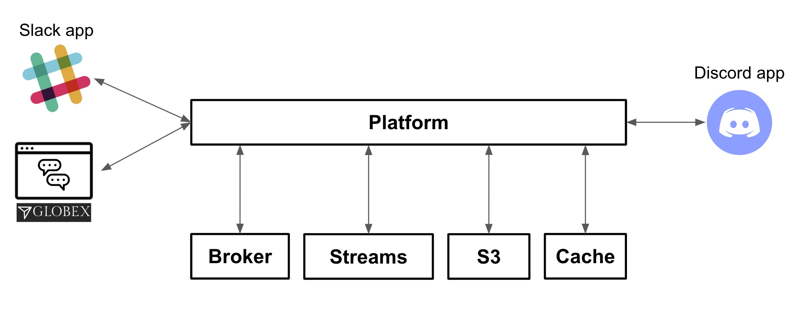
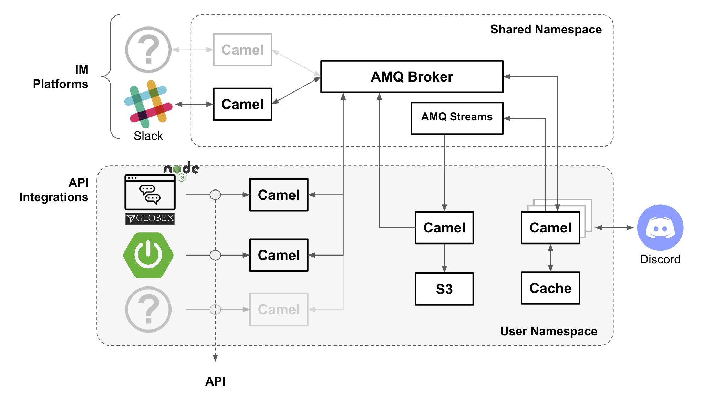

:icons: font 

In this module you will participate to complete the implementation of a multi-channel support service for Globex customers that will enable clients to chat in real time with a team of agents.

== Business and Technical Context

As an added initiative to the digital transformation, Globex wants to implement a new, all digital, support service where customers can get instant help from a team of support agents. The goal is to build a pluggable event-driven architecture that allows multiple communication channels and services to integrate with ease to the platform.

You will be involved in the new hub's first implementation iteration (by completing all the module steps). You will integrate two distinct customer facing platforms (left in the diagram) with the agent's channel (right in the diagram).

Customers (left) will choose contacting Globex via its Web portal or via its public space in Slack, available on-line (using a browser), or by installing the app on their devices. Slack is a very popular and widely adopted messaging platform for businesses.

At the other end of the line, the team of agents (right) providing support services for Globex will use Discord as their communication platform. Discord is a well known chat platform, very popular among gamers, but increasingly embraced by enterprises to connect internal teams but also for external interactions with customers as a way to maintain close contact.

[pending] image here

This module showcases how to integrate the service with some of the most popular messaging platforms (Slack & Discord), including Globex's in-house customer communication interface (Web chat widget), using a collection of capabilities all included in Red Hat Application Foundation.

== Technical Capabilities

The key capabilities you will use in this module are:

 - Camel K, the integration tool to create all the processing flows.
 - AMQ Broker, the messaging broker enabling event-based interactions.
 - AMQ Streams (Kafka), to store and replay customer/agent interactions.
 - DataGrid (Cache), to keep the context of interactions alive.
 - S3 storage, to store conversations.
+
[NOTE]
====
S3 in this workshop is served using Minio for simplicity. Full featured on-premise storage capabilities are provided by OpenShift Data Foundation.
====

== Module exercises

As per the picture below, this module is divided in 3 main activities:

image::./images/camel/intro-lab-overview.jpg[align="center", width=100%]

. The first one integrates Slack with Discord. +
Because the traffic is bidirectional, you'll need to

- Move messages from customers (in Slack) to agents (in Discord)
- Move messages from agents (in Discord) to customers (in Slack)

. The second activity, that showcases the platform's open architecture, plugs in the Globex portal (chat), thus automatically enabling the Globex/Discord message flow. 

. The third activity collects the conversation history (transcript), persists it in storage (S3 buckets) and shares access with customers.

{empty} +

== What is Red Hat build of Apache Camel K?

TODO

[NOTE]
====
A random note
====

== What is Red Hat AMQ Broker?

== What is Red Hat AMQ Streams?

== What is Red Hat AMQ DataGrid?

== What is Red Hat OpenShift Data Foundation?

== Full architecture overview

