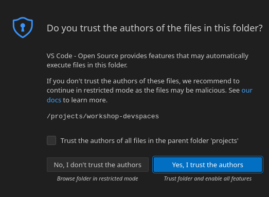

== Deploy the Cashback service

TODO: deploy the solution through BackStage

== Deployment Overview

TODO: describe the deployment topology

== Deploy the Debezium Connector

Let's start with deploying the Debezium Connector. With AMQ Streams, a Kafka Connect connector can be deployed as a Kubernetes Custom Resource, which is picked up and processed by the AMQ Streams operator.

To deploy the connector, you are going to use OpenShift Dev Spaces. OpenShift Dev Spaces uses Kubernetes and containers to provide a consistent, secure, and zero-configuration development environment, accessible from a browser window.

* In a browser window, navigate to the browser tab pointing to the Developer perspective of the OpenShift cluster. If you don't have a browser tab open on the console, open a new tab and navigate %openshift_cluster_console%. If needed login with your username and password (%user_name%/%user_password%).

* On the top menu of the console, click on the image:images/openshift-application-menu.png[] icon, and in the drop-down box, select *Red Hat OpenShift Dev Spaces*.
+
image::images/openshift-application-menu-2.png[]

* Login in with your OpenShift credentials (%user_name%/%user_password%). If this is the first time you access Dev Spaces, you have to authorize Dev Spaces access your account. In the _Authorize Access_ window click on *Allow selected permissions*.

* You are directed to the Dev Spaces overview page, which shows the workspaces you have access to. You shoulod see a single workspace, called *cloud-architecture-workshop*. The workspace needs a couple of seconds to start up.
+
image::images/devspaces-workspace-starting.png[]

* Click on the *Open* link of the workspace.
+
image::images/devspaces-workspace-started-1.png[]

* This opens the workspace, which will look pretty familiar if you are used to work with VS Code. Before opening the workspace, a pop-up might appear asking if you trust the contents of the workspace. Click *Yes, I trust the authors* to continue.
+

* The workspace contains all the resources you are going to use during the workshop, including the Debezium connector. In the project explorer on the left of the workspaces, navigate to the *workshop/module-cdc* folder and open the *debezium-connector.yaml* file.
+
image::images/devspaces-workspace-debezium-connector.png[]

* The *debezium-connector.yaml* file describes the Debezium Connector. It contains all the details the connector needs to know in order to start capturing changes in the target database tables. Some important configuration details:
** *class*: the Debezium connector implementation class. We're using PostgreSQL as source database, so we use *io.debezium.connector.postgresql.PostgresConnector*.
** *plugin.name*: The Debezium connector supports different mechanisms to read from the PostgreSQL transaction logs.  *pgoutput* is the standard logical decoding output plug-in since PostgreSQL 10.
** *+database.*+*: the connection details for the database. Note that PostgreSQL is setup with a specific user (*debezium*) which has the required privileges to read from the transaction logs.
** *topic.prefix*: the prefix of the Kafka topics which will receive the Debezium change events. The full name of the topics is *<prefix>.<schema>.<table>*.
** *schema.include.list*: the schema's to include in the change data capture process.
** *table.include.list*: the name of the tables to include. For our use case we are interested in the *customer*, *orders* and *line_item* tables.

* Before deploying the connector, you need to substitute the placeholder with the database hostname with the actual value. On line 14, replace *<REPLACE WITH DATABASE HOSTNAME>* with *globex-db.globex-%user_name%.svc.cluster.local*, which is the internal DNS name of the Globex retail application database.

* You can deploy the connector to the OpenShift cluster directly from Dev Spaces. To do so, click on the image:images/devspaces-menu.png[] icon on the top of the left menu, and select *Terminal/New Terminal* from the drop-down menu.
+
image::images/devspaces-menu-new-terminal.png[]

* This opens a terminal in the bottom half of the workspace.
+
image::images/devspaces-menu-terminal.png[]

* The OpenShift Dev Spaces environment has access to a plethora of command line tools, including *oc*, the OpenShift  command line interface. Through OpenShift Dev Spaces you are automatically logged in into the OpenShift cluster. You can verify this with the command *oc whoami*.
+
----
workshop-devspaces (main) $ oc whoami
%user_name%
----
+
[IMPORTANT]
====
If the the output of the `oc whoami` command does not correspond to your username (%user_name%), you need to logout and login again with the correct username.

----
workshop-devspaces (main) $ oc logout
workshop-devspaces (main) $ oc login -u %user_name% -p %user_password% 
----
====

* Deploy the Debezium connector by copying the following command to the terminal:
+
----
oc apply -f workshop/module-cdc/debezium-connector.yaml -n globex-cdc-%user_name%
----

* After a few seconds, the Debezium connector will start monitoring the PostgreSQL database for changes in the *customer*, *orders* and *line_item* table, and will produce a change event to the corresponding Kafka topic for each change detected.

* One way to verify that the connector is working as expected is to check the kafka topics that receive the change events. 
If you still have a browser tab pointing to Kafdrop, open the tab. If not, open a new browser tab and navigate to %kafdrop_url%. +
At the bottom of the topic list in the kafdrop overview page, you will see the three topics that will receive the change events.
+
image::images/kafdrop-debezium-topics.png[]

* The Globex application database contains records for a couple of hundred customers in the *customer* table, so we can expect a change event for each of these records. In the Kafdrop UI, click on the *globex.updates.public.customer* topic. This opens a view with details on the topic. Notice that the size of the topic is _200_, which corresponds to the number of records in the *customer* table.
+
image::images/kafdrop-debezium-topic-customers.png[]

* Click on the link representing the only partition of the topic to see the contents of the partition.
+
image::images/kafdrop-debezium-topic-customers-partition.png[]
+
This opens a view to the individual events in the topic. You can expand every event to inspect its content. In this case, the body of each message consists of a Debezium change event in JSON format.
+
image::images/kafdrop-debezium-topic-customers-1.png[]

* A Debezium change event has a particular structure. Take particular note of the following elements:
** *before*: the state of the record before the transaction. As the change events correspond to newly read records, there is no previous state. 
** *after*: the state of the record after the transaction. This is a JSON representation of the current state of the record in the database, in JSON format (every column in the table becomes a JSON field).
** *op*: The operation that lead to the change event. Possible values are '*c*' for _create_, '*u*' for _update_, '*d*' for _delete_ and '*r*' for _read_. As the records in the *customer* already existed when the Debezium connector was deployed, the operation is '*r*'.

* The Globex application database does not contain any order information at the moment, so the *globex.updates.public.orders* and *globex.updates.public.line_item* topics are empty. You can verify this through the Kafdrop UI. +
In the next section of the workshop, you will create some orders, and verify that the corresponding change events are picked up by Debezium.  

== Create an Order in the Globex Retail Application

* If you still have a browser tab open pointing to the Globex retail web application, open the tab. If not, open a new tab and navigate to %globex_web_url%.

* In order to place an order, you need to login into the Globex application. Click on the *Login* link on the right of the top menu.
+
image::images/globex-login.png[]

* The Globex web application uses OpenId Connect powered By Red Hat Single Sign-On to authenticate users. After clicking the *Login* link you are redirected to the login page of the SSO server, where you need to enter your credentials. +
The SSO server is set up with a number of users corresponding to customers in the Globex application. Login with one of the following users: `asilva`,`mmiller`,`asanders`,`cjones` or `pwong`. The password for all the users is %globex_user_password%.
+
image::images/globex-login-sso.png[]

* Once logged in, you can browse through the catalog and add items to the shopping cart. To check out the cart and place an order, click on the *Cart* link in the top menu.
+
image::images/globex-goto-cart.png[]

* This brings you to the cart view. From there you can proceed to checkout by clicking *Proceed to Checkout*.
+
image::images/globex-cart-checkout.png[]

* In the checkout page, click the *Autofill form* to populate the form with the details of the logged in user.
+
image::images/globex-checkout-1.png[]

* Finally, click *Submit order* to submit your order.
+
image::images/globex-checkout-3.png[]

* If the order is submitted successfully, you will be redirected to a success page:
+
image::images/globex-order-placed.png[]

* At this point, an order has been added in the Globex application database. The records added to the *orders* and *line_item* tables have been detected by Debezium and produced as change events to Kafka topics. +
We can easily check this with Kafdrop.

* Open the browser tab pointing to the Kafdrop UI. If you did close the tab, open a new tab and navigate to %kafdrop_url%. +
Open the *globex.updates.public.orders* topic, and verify that the topic contains 1 message.
+
image::images/kafdrop-debezium-topic-orders.png[]
+
Drill down into the partition and expand the contents of the message. You should see a change event structure very similar to the ones for customers. Notice however that the operation is '*c*', for _create_. This is expected as the change event corresponds to a new record in the *order* table.
+
Go back to the Kafdrop homepage by clicking on the *Kafdrop* link on the top of the page, and this time open the *globex.updates.public.liner_item* topic. You should see one message per item in the order you created previously.
+
image::images/kafdrop-debezium-topic-orders-2.png[]

* If you want to simulate a larger number of orders, you can use the _Order simulator_ application deployed in the globex-%user_name% OpenShift namespace.
** In the browser window, open the tab pointing to the OpenShift console. If you don't have a tab open to the console, open a new tab and navigate to %openshift_cluster_console%. If needed login with your username and password (%user_name%/%user_password%).
** Select the *Topology* view in the Developer perspective. If needed, switch to the *globex-%user_name%* namespace by selecting the namespace from the namespace selection drop-down menu in the top left.
+
image::images/openshift-console-developer-select-namespace.png[]
** In the Topology view, click on the image:images/openshift-console-open-url.png[] symbol next to the *order-simulator* deployment.
+
image::images/openshift-console-open-url-4.png[]
** This opens a Swagger UI page showing the REST API of the simulator. +
Click on the *POST* link, and then on the *Try it out* link on the right. From the *Examples* drop down, select *random customers* to create orders for random customers. Feel free to change the numbers of orders you want to simulate (the default is 5).
+
image::images/order-simulator-random-customer.png[]
** Click *Execute* to execute the REST call to the simulator.
** Check in Kafdrop that new messages are produced to the *globex.updates.public.orders* and *globex.updates.public.line_item* topics.

== Streaming processing of events with Kafka Streams

== Deploy the connectors with Camel-K

TODO: deploy the connectors

== Watch the solution end-to-end

TODO: walkthrough

== Conclusion

TODO: conclusion
