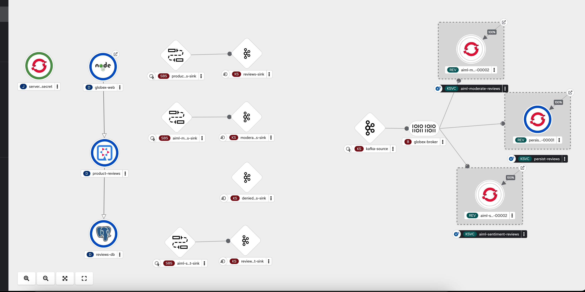
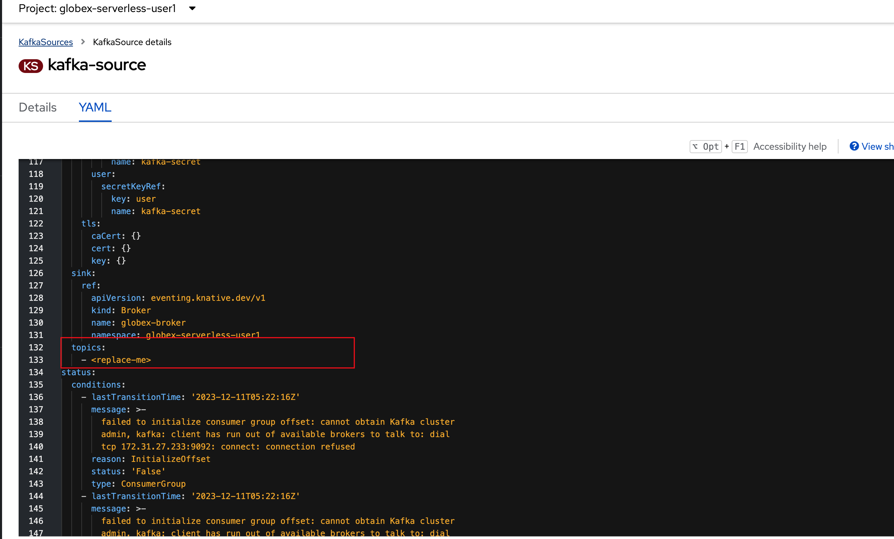
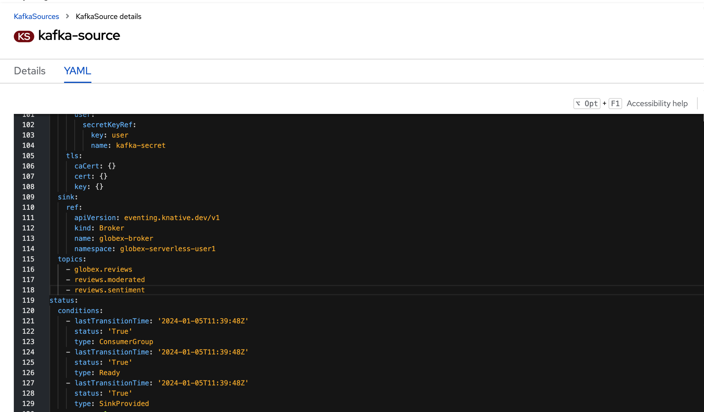

:toclevels: 2
:icons: font 
:sectanchors:
:sectnums:
:toc: 

:openshift_cluster_console: %openshift_cluster_console%
:user_name: %user_name%
:user_password: %user_password%
:devspaces_dashboard: %devspaces_dashboard%
:globex_user_password: %globex_user_password%
:openshift_subdomain: %openshift_subdomain%
:openshift_api_internal: %openshift_api_internal%

//:openshift_cluster_console: https://console-openshift-console.apps.cluster-jb86t.jb86t.sandbox3028.opentlc.com
//:user_name: user1
//:user_password: openshift
//:devspaces_dashboard: https://devspaces.apps.cluster-jb86t.jb86t.sandbox3028.opentlc.com
//:globex_user_password: openshift
//:openshift_subdomain: apps.cluster-jb86t.jb86t.sandbox3028.opentlc.com
//:openshift_api_internal: https://172.30.0.1:443" 

== Objectives

Here is an outline of the activities you will achieve as part of this module.

//.Activities overview

== Instructions 

The topology

=== Create Sink binding and Knative Sink from Product Reviews to Kafka 

* Create Knative Sink which connects to topic: `globex.reviews`. When a Product Reviews is submitted, the immedtiate destination is the `globex.reviews` Kafka 

+
[source,bash,role=copy,subs="attributes"]
----
apiVersion: eventing.knative.dev/v1alpha1
kind: KafkaSink
metadata:
  name: reviews-sink
  annotations:
    argocd.argoproj.io/sync-options: SkipDryRunOnMissingResource=true
    argocd.argoproj.io/sync-wave: '-1'
spec:
  bootstrapServers:
    - kafka-kafka-bootstrap.globex-mw-#user_name#.svc.cluster.local:9092
  topic: globex.reviews
  numPartitions: 1
  contentMode: binary
  auth:
     secret:
       ref:
         name: kafka-secret

----
* Review the other sinks which have been already created. 
+
[cols="50%,50%"]
|===
|*Sink name* | *Function*
|reviews-sink | TBC
|moderated-reviews-sink | TBC
|denied-reviews | TBC
|reviews-sentiment-sink | TBC
|denied-reviews | TBC
|===

* Create Sink binding to Knative Sink from Product Reviews to Kafka 
+
[source,bash,role=copy,subs="attributes"]
----
apiVersion: sources.knative.dev/v1
kind: SinkBinding
metadata:
  name: product-reviews-to-reviews-sink
spec:
  sink:
    ref:
      apiVersion: eventing.knative.dev/v1alpha1
      kind: KafkaSink
      name: reviews-sink
      namespace: globex-serverless-%user_name%
  subject:
    apiVersion: apps/v1
    kind: Deployment
    name: product-reviews
    namespace: globex-serverless-%user_name%
----

=== Review Knative Broker, Knative Source

* Review knative broker
Brokers are Kubernetes custom resources that define an event mesh for collecting a pool of events. Brokers provide a discoverable endpoint for event ingress, and use Triggers for event delivery. Event producers can send events to a broker by POSTing the event.

+
[source,bash,role=copy,subs="attributes"]
----
apiVersion: eventing.knative.dev/v1
kind: Broker
metadata:
  name: globex-broker
  namespace: globex-serverless-user1

----
* Review Knative source 

The KafkaSource reads messages stored in existing Apache Kafka topics, and sends those messages as CloudEvents through HTTP to its configured sink. The KafkaSource preserves the order of the messages stored in the topic partitions. It does this by waiting for a successful response from the sink before it delivers the next message in the same partition.

** The sink section if the YAML seen below is the section which connects this source to the broker that you reviewed in the previous section.

==== Knative source: Add topics to listen to from kafka
* Let us add the topics that the Knative source should listen to - 
+
[source,bash,role=copy,subs="attributes"]
----
    - globex.reviews
    - reviews.moderated
    - reviews.denied
    - reviews.sentiment
----

* add the topics

* View Broker

=== Create Knative triggers

=== Create Sink binding and Knative Sink from Product Reviews to Kafka 

