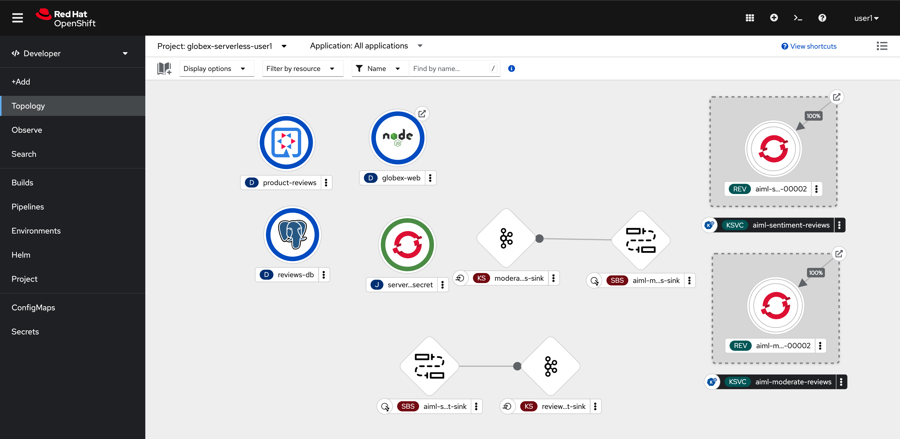
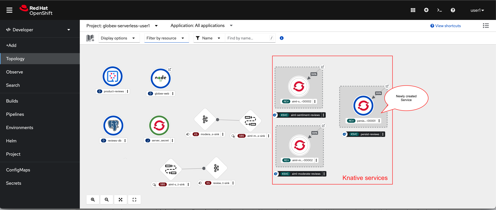
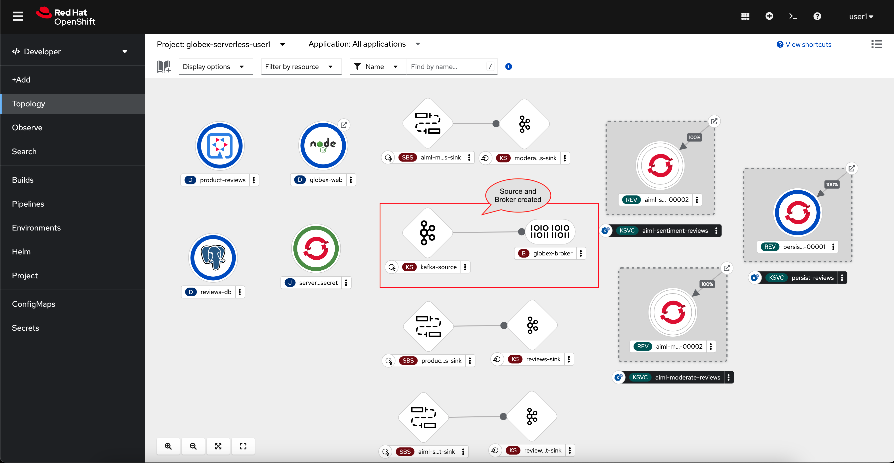

:toclevels: 2
:icons: font 
:sectanchors:
:sectnums:
:toc: 

:openshift_cluster_console: %openshift_cluster_console%
:user_name: %user_name%
:user_password: %user_password%
:devspaces_dashboard: %devspaces_dashboard%
:globex_user_password: %globex_user_password%
:openshift_subdomain: %openshift_subdomain%
:openshift_api_internal: %openshift_api_internal%

:openshift_cluster_console: https://console-openshift-console.apps.cluster-tkfd2.dynamic.opentlc.com
:user_name: user1
:user_password: openshift
:devspaces_dashboard: https://devspaces.apps.cluster-tkfd2.dynamic.opentlc.com
:globex_user_password: openshift
:openshift_subdomain: apps.cluster-tkfd2.dynamic.opentlc.com
:openshift_api_internal: https://172.30.0.1:443" 

== Objectives

Here is an outline of the activities you will achieve as part of this module.

== Instructions 

* The initial topology will look like this:
+

* Let us look at the a few of the deployments here. The rest are discussed in the next sections
+
[cols="30%,80%"]
|===
|*Service name* | *Function*
| globex-web        | This is a NodeJS+Angular web application which serves as the front end website. This app relies on the core services deployed in the globex-%user_name% namespace and the `product-reviews` services described below
| product-reviews   | This Quarkus service serves as a backed to the `globex-web` web application. 
| reviews-db        | Postgresql DB to store the reviews once they are moderated. 
| serverless-kafka-secret | For the purpose of this workshop, this job copies the Kafka credentials (`kafka-secret` Secret)  into the current globex-serverless-%user_name% namesace.
|===

== Introducing OpenShift Serverless for event-driven architecture

When a user submits a *product review* from the Globex website, the destination for the review is Red Hat AMQ Streams (Apache Kafka). Similarly there are a number of other services which are involved in this solution which produce and consume Kafka messages to moderate and analyse these reviews in real-time. To make it easier to build out such an event-driven architecture we introduce OpenShift Serverless (based on Knative Eventing). 

Knative Eventing uses standard HTTP POST requests to send and receive events between event producers and sinks. These events conform to the CloudEvents specifications, which enables creating, parsing, sending, and receiving events in any programming language.

.[.underline]#*[Click to know]  What is CloudEvent?*#
[%collapsible]
====
https://cloudevents.io[CloudEvent^] is a specification for describing event data in a common way. An event includes context and data about an occurrence. Each occurrence is uniquely identified by the data of the event. Each occurrence is uniquely identified by the data of the event.
====

== Deploy Knative Services

As a first step, let us get ensure all the services are created. A few of the services are already predeployed in your OpenShift cluster. These services are built using the Knative Serving framework

.[.underline]#*[Click to know]  What are OpenShift Serverless wit Knative Serving?*#
[%collapsible]
====
OpenShift Serverless, with Knative Serving, makes it easy to define and control how serverless workload behaves on the Kubernetes cluster. With just one Kubernetes Custom Resource Definitions (CRDs) all the primary resources (Services, Routes, Configurations, and Revisions) are created and managed. Knative Serving supports rapid deployment of serverless containers, autoscaling, including scaling pods down to zero.
====

* There are 3  Knative Services that are used in this solution
+
[cols="30%,80%"]
|===
|*Service name* | *Function*
| aiml-moderate-reviews   | Moderates the product reviews; Moderated reviews are sent to `reviews.moderated` topic, and all other reviews which may contain foul language are sent to `reviews.denied` topic. This services is predeployed.
| aiml-sentiment-reviews  | Analyses the product reviews and creates a new message with a sentiment score; The sentiment score are sent to `reviews.sentiment` topic. This services is predeployed.
| persist-reviews         | Persists all moderated reviews to a Postgresql database. You will deploy this service in the next steps.
|===

* In Administrator view go to Serverless > Serving.  You will see two services (aiml-moderate-reviews and aiml-sentiment-reviews) already deployed

image::images/serverless/serverless-2knative-services.png[]

* Click on *Create* button, choose *Service* and paste the following YAML file, and click on *Save*
+
[source,bash,role=copy,subs="attributes"]
----
apiVersion: serving.knative.dev/v1
kind: Service
metadata:
  name: persist-reviews
  namespace: globex-serverless-%user_name%
spec:
  template:
    metadata:
      annotations:
        autoscaling.knative.dev/min-scale: "1"
    spec:
      containers:
        - image: quay.io/globex-sentiment-analysis/persist-reviews:latest
          volumeMounts:
            - mountPath: /deployments/config
              name: config
              readOnly: true
      volumes:
        - name: config
          secret:
            secretName: persist-reviews

----
* Navigate back to the Developer > Topology view and you will notice all 3 knative services
* Note that the newly created `persist-reviews` shows up with a dark blue colour becasuse of the annotation `autoscaling.knative.dev/min-scale: "1"` added while creation of this service. This means a minimum of one pod is running all the time, instead of it scaling down to zero (0) like the other two services.

== Connect Services to Kafka using Knative Sinks and SinkBinding

In this section we will connect the Services (refer to previous section) to Kafka using *Knative Sink* and *SinkBinding*. 

.[.underline]#*[Click to know]  What is Knative Sink and SinkBinding ?*#
[%collapsible]
====
* A https://docs.openshift.com/serverless/1.30/eventing/event-sinks/serverless-kafka-developer-sink.html[Kafka Sink for Apache Kafka^] helps in persisting the incoming Kafka message (CloudEvent) to a configurable Apache Kafka.Topic. 
* https://docs.openshift.com/serverless/1.30/eventing/event-sources/serverless-custom-event-sources.html[SinkBinding^] supports decoupling the source (service which produces events) from the actual sink. The SinkBinding object injects environment variables (such as sink URL) into the services there by decoupling the source from the sink.
====

This solution needs a number of Sinks and SinkBinding for the various Kafka topics. You will create one of them here, while the others have been preconfigured for you.

=== Create Sink and ServiceBinding for globex.reviews topic

* Use the following CRD to create a Kafka Sink to the Apache Kafka Topic (`globex.reviews`).

+
[source,bash,role=copy,subs="attributes"]
----
apiVersion: eventing.knative.dev/v1alpha1
kind: KafkaSink
metadata:
  name: reviews-sink
spec:
  bootstrapServers:
    - kafka-kafka-bootstrap.globex-mw-%user_name%.svc.cluster.local:9092
  topic: globex.reviews
  numPartitions: 1
  contentMode: binary
  auth:
     secret:
       ref:
         name: kafka-secret

----

* Create Sink binding to Knative Sink from Product Reviews to Kafka 
+
[source,bash,role=copy,subs="attributes"]
----
apiVersion: sources.knative.dev/v1
kind: SinkBinding
metadata:
  name: product-reviews-to-reviews-sink
spec:
  sink:
    ref:
      apiVersion: eventing.knative.dev/v1alpha1
      kind: KafkaSink
      name: reviews-sink
      namespace: globex-serverless-%user_name%
  subject:
    apiVersion: apps/v1
    kind: Deployment
    name: product-reviews
    namespace: globex-serverless-%user_name%
----

* Here is the list of all the Sinks.
+
[cols="50%,50%"]
|===
|*Sink name* | *Function*
| reviews-sink            | Sends product reviews submitted by customer via the `product-reviews` service to topic `globex.reviews`
| moderated-reviews-sink  | Sends product reviews moderated by the `aiml-moderate-reviews` service to topic `reviews.moderated`
| denied-reviews-sink     | Sends product reviews denied as inappropriate by the `aiml-moderate-reviews` service to topic `reviews.denied`. There is no ServiceBinding configured for this yet.
| reviews-sentiment-sink  | Sends sentiment score of reviews by the `aiml-sentiment-reviews` service to topic `reviews.sentiment`
|===

=== Build an event mesh with Knative Broker and Triggers

The next step is to trigger the Knative services (aiml-moderate-reviews, aiml-sentiment-reviews & persist-reviews) whenever a new event occurs due to a product review being submitted. This is performed by using a Knative Source, Knative Broker and Triggers. +

.[.underline]#*[Click to know]  What is Knative Source, Broker and Triggers?*# (TBC edit this language)
[%collapsible]
[INFO]
====
* KafkaSource reads messages in existing Apache Kafka topics, and sends those messages as CloudEvents through HTTP to its configured sink. In this solution it connects to a Knative Broker for Kafka.
* Brokers provide a discoverable endpoint for incoming event, and use Triggers for event delivery. 
* A trigger subscribe to events from a specific broker, and delivers them to the Knative Serving service
====

==== Create Knative Broker

* Use the following CRD to create a  Knative broker. There is just one broker for the entire solution, which will use triggers to route them to the right services thereby building a realtime event mesh.

+
[source,bash,role=copy,subs="attributes"]
----
apiVersion: eventing.knative.dev/v1
kind: Broker
metadata:
  name: globex-broker
  namespace: globex-serverless-%user_name%
----

==== Create Knative source
* Create a Knative source with the following CRD
* Notice that there are 4 topics that the Knative source would listen to. Review what each of these do:
// +
// [cols="25%,75%",]
// |===
// |*Sink name* | *Function*
// |globex.reviews | TBC
// |reviews.moderated | TBC
// |reviews.denied | TBC
// |reviews.sentiment | TBC
// |===
+
[source,bash,role=copy,subs="attributes"]
----
apiVersion: sources.knative.dev/v1beta1
kind: KafkaSource
metadata:
  name: kafka-source
  namespace: globex-serverless-%user_name%
spec:
  bootstrapServers:
    - 'kafka-kafka-bootstrap.globex-mw-%user_name%.svc.cluster.local:9092'
  topics:
    - globex.reviews
    - reviews.moderated
    - reviews.denied
    - reviews.sentiment
  net:
    sasl:
      enable: true
      password:
        secretKeyRef:
          key: password
          name: kafka-secret
      type:
        secretKeyRef:
          key: sasl.mechanism
          name: kafka-secret
      user:
        secretKeyRef:
          key: user
          name: kafka-secret
    tls:
      caCert: {}
      cert: {}
      key: {}
  sink:
    ref:
      apiVersion: eventing.knative.dev/v1
      kind: Broker
      name: globex-broker
      namespace: globex-serverless-%user_name%
----

* Note that kafka-source is created and the Conditions are all true denoting that the creation is a success.
+

* The Source and Broker can be see the Developer > Topology view
+

==== Create Knative triggers
* We'll now create triggers for the the three knative services  which will be invoked whenever events (reviews) are submitted.
* The triggers also have *trigger filtering* which helps to deliver the right CloudEvent to the right service. This  matching is based on the `source` and `type` attributes of the filter. Each event must have `source` and `type` as part of the CloudEvent header which is used to route them correctly.
* Use the following CRD to create the 3 Triggers matching the 3 Knative services
+
[source,bash,role=copy,subs="attributes"]
----
apiVersion: eventing.knative.dev/v1
kind: Trigger
metadata:
  name: persist-reviews-trigger
  namespace: globex-serverless-%user_name%
spec:
  broker: globex-broker
  filter:
    attributes:
      source: review-moderated
      type: review-moderated-event
  subscriber:
    ref:
      apiVersion: serving.knative.dev/v1
      kind: Service
      name: persist-reviews
    uri: /review/submit

---
apiVersion: eventing.knative.dev/v1
kind: Trigger
metadata:
  name: moderate-reviews-trigger
  namespace: globex-serverless-%user_name%
spec:
  broker: globex-broker
  filter:
    attributes:
      source: submit-review
      type: submit-review-event
  subscriber:
    ref:
      apiVersion: serving.knative.dev/v1
      kind: Service
      name: aiml-moderate-reviews
    uri: /analyze
---
apiVersion: eventing.knative.dev/v1
kind: Trigger
metadata:
  name: sentiment-reviews-trigger
  namespace: globex-serverless-%user_name%
spec:
  broker: globex-broker
  filter:
    attributes:
      source: submit-review
      type: submit-review-event
  subscriber:
    ref:
      apiVersion: serving.knative.dev/v1
      kind: Service
      name: aiml-sentiment-reviews
    uri: /analyze

----

The final topology will look like this:

image::images/serverless/serverless-namespace-toplogy.png[]
