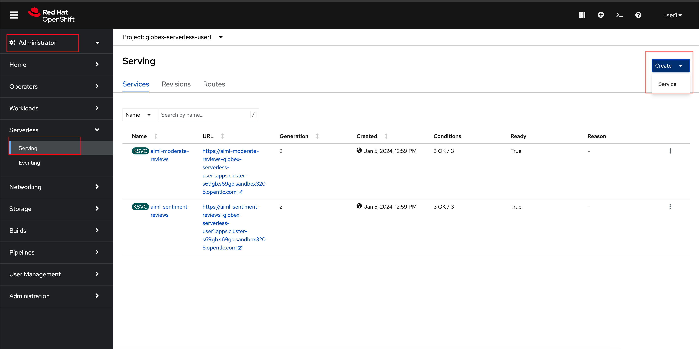

:toclevels: 2
:icons: font 
:sectanchors:
:sectnums:
:toc: 

:openshift_cluster_console: %openshift_cluster_console%
:user_name: %user_name%
:user_password: %user_password%
:devspaces_dashboard: %devspaces_dashboard%
:globex_user_password: %globex_user_password%
:openshift_subdomain: %openshift_subdomain%
:openshift_api_internal: %openshift_api_internal%

:openshift_cluster_console: https://console-openshift-console.apps.cluster-tkfd2.dynamic.opentlc.com
:user_name: user1
:user_password: openshift
:devspaces_dashboard: https://devspaces.apps.cluster-tkfd2.dynamic.opentlc.com
:globex_user_password: openshift
:openshift_subdomain: apps.cluster-tkfd2.dynamic.opentlc.com
:openshift_api_internal: https://172.30.0.1:443" 

== Objectives

Here is an outline of the activities you will achieve as part of this module.

//.Activities overview

== Instructions 

The topology

image::images/serverless/serverless-namespace-toplogy.png[]

=== Step 1: Product Reviews to be sent to Kafka topic

* Create a Knative Sink which connects to topic: `globex.reviews`. 
* When a Product Review is submitted from the website, the message is passed onto Kafka as a CloudEvent by a Knative Sink for Apache Kafka. The review is then products into  the `globex.reviews` Kafka topic.

.[.underline]#*[Click to know]  What is a knative sink and CloudEvent?*#
[%collapsible]
====
* A sink is a resource that can receive incoming events from other resources. In this case we use Knative Sink for Apache Kafka which can persist incoming CloudEvent from the `produt-reviews` Service to  a configurable Apache Kafka Topic (`globex.reviews`).
* https://cloudevents.io[CloudEvent^] is a specification for describing event data in a common way
====

* Copy the following CRD which to create a Kafka Sink to the Apache Kafka Topic (`globex.reviews`).

[source,bash,role=copy,subs="attributes"]
----
apiVersion: eventing.knative.dev/v1alpha1
kind: KafkaSink
metadata:
  name: reviews-sink
spec:
  bootstrapServers:
    - kafka-kafka-bootstrap.globex-mw-%user_name%.svc.cluster.local:9092
  topic: globex.reviews
  numPartitions: 1
  contentMode: binary
  auth:
     secret:
       ref:
         name: kafka-secret

----

* Create Sink binding to Knative Sink from Product Reviews to Kafka 
+
[source,bash,role=copy,subs="attributes"]
----
apiVersion: sources.knative.dev/v1
kind: SinkBinding
metadata:
  name: product-reviews-to-reviews-sink
spec:
  sink:
    ref:
      apiVersion: eventing.knative.dev/v1alpha1
      kind: KafkaSink
      name: reviews-sink
      namespace: globex-serverless-%user_name%
  subject:
    apiVersion: apps/v1
    kind: Deployment
    name: product-reviews
    namespace: globex-serverless-%user_name%
----

* There are other sinks which have been already created. Review what each of these do:
+
[cols="50%,50%"]
|===
|*Sink name* | *Function*
|reviews-sink | TBC
|moderated-reviews-sink | TBC
|denied-reviews-sink | TBC
|reviews-sentiment-sink | TBC
|===

=== Review Knative Broker, Knative Source

* Create a  Knative broker
** Brokers are Kubernetes custom resources that define an event mesh for collecting a pool of events. Brokers provide a discoverable endpoint for event ingress, and use Triggers for event delivery. Event producers can send events to a broker by POSTing the event.

+
[source,bash,role=copy,subs="attributes"]
----
apiVersion: eventing.knative.dev/v1
kind: Broker
metadata:
  name: globex-broker
  namespace: globex-serverless-%user_name%
----
* Create a Knative source 
** The KafkaSource reads messages stored in existing Apache Kafka topics, and sends those messages as CloudEvents through HTTP to its configured sink. The KafkaSource preserves the order of the messages stored in the topic partitions. It does this by waiting for a successful response from the sink before it delivers the next message in the same partition.

+
[source,bash,role=copy,subs="attributes"]
----
apiVersion: sources.knative.dev/v1beta1
kind: KafkaSource
metadata:
  name: kafka-source
  namespace: globex-serverless-%user_name%
spec:
  bootstrapServers:
    - 'kafka-kafka-bootstrap.globex-mw-%user_name%.svc.cluster.local:9092'
  topics:
    - globex.reviews
    - reviews.moderated
    - reviews.denied
    - reviews.sentiment
  net:
    sasl:
      enable: true
      password:
        secretKeyRef:
          key: password
          name: kafka-secret
      type:
        secretKeyRef:
          key: sasl.mechanism
          name: kafka-secret
      user:
        secretKeyRef:
          key: user
          name: kafka-secret
    tls:
      caCert: {}
      cert: {}
      key: {}
  sink:
    ref:
      apiVersion: eventing.knative.dev/v1
      kind: Broker
      name: globex-broker
      namespace: globex-serverless-%user_name%
----

* Notice that there are 4 topics that the Knative source would listen to.Review what each of these do:
+
[cols="50%,50%"]
|===
|*Sink name* | *Function*
|globex.reviews | TBC
|reviews.moderated | TBC
|reviews.denied | TBC
|reviews.sentiment | TBC
|===

=== Create Knative services
* What are Knative services TBC
* There are 3 differe knative services
+
[cols="50%,50%"]
|===
|*Sink name* | *Function*
|persist-reviews | TBC
|aiml-sentiment-reviews | TBC
|aiml-moderate-reviews | TBC
|===
* You will now create one of these services `persist-reviews` while the others have been already created for you.
* In Administrator view go to Serverless > Serving.  You will see two services already deployed

* Click on *Create* button, choose *Service* and paste the following YAML file, and click on *Save*
+
[source,bash,role=copy,subs="attributes"]
----
apiVersion: serving.knative.dev/v1
kind: Service
metadata:
  name: persist-reviews
  namespace: globex-serverless-user
spec:
  template:
    metadata:
      annotations:
        autoscaling.knative.dev/min-scale: "1"
    spec:
      containers:
        - image: quay.io/globex-sentiment-analysis/persist-reviews:latest
          volumeMounts:
            - mountPath: /deployments/config
              name: config
              readOnly: true
      volumes:
        - name: config
          secret:
            secretName: persist-reviews

----
* Navigate back to the Topology and notice all 3 knative services

image::images/serverless/3knative-service.png[]

=== Create Knative triggers
.[.underline]#*[Click to know] What is a knative trigger?*#
[%collapsible]
====
* A trigger represents a desire to subscribe to events from a specific broker.
* A trigger receives events from the broker and delivers them to a service.
====

* In the topology view, Hover the mouse over `globex-broker`, grab and pull the arrow toards the persist-reviews services as show below. A popup appears to capture details about the trigger.
+
.[.underline]#*[Click to know] See how to do perform this*#
[%collapsible]
====

image::images/serverless/trigger.gif[width=60%]
====

* Enter the following details in the popup, and click *Save* +

|===
|*Attribute* | *Value*
|source | review-moderated
|type | review-moderated-event
|===

image::images/serverless/persist-review-trigger.png[width=60%]

* We'll now create triggers for the other two knative services 
+
[source,bash,role=copy,subs="attributes"]
----
apiVersion: eventing.knative.dev/v1
kind: Trigger
metadata:
  name: aiml-moderate-reviews-trigger
  namespace: globex-serverless-%user_name%
spec:
  broker: globex-broker
  filter:
    attributes:
      source: submit-review
      type: submit-review-event
  subscriber:
    ref:
      apiVersion: serving.knative.dev/v1
      kind: Service
      name: aiml-moderate-reviews

---

apiVersion: eventing.knative.dev/v1
kind: Trigger
metadata:
  name: aiml-sentiment-trigger
  namespace: globex-serverless-%user_name%
spec:
  broker: globex-broker
  filter:
    attributes:
      source: submit-review
      type: submit-review-event
  subscriber:
    ref:
      apiVersion: serving.knative.dev/v1
      kind: Service
      name: aiml-sentiment-reviews

----

=== Create Sink binding and Knative Sink from Product Reviews to Kafka 

