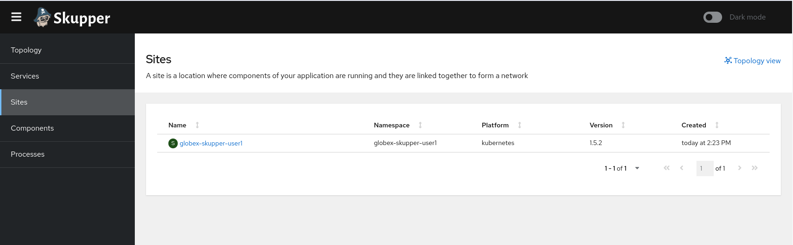
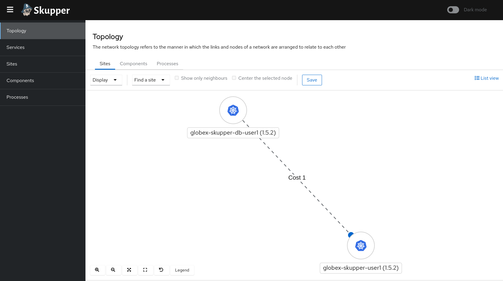
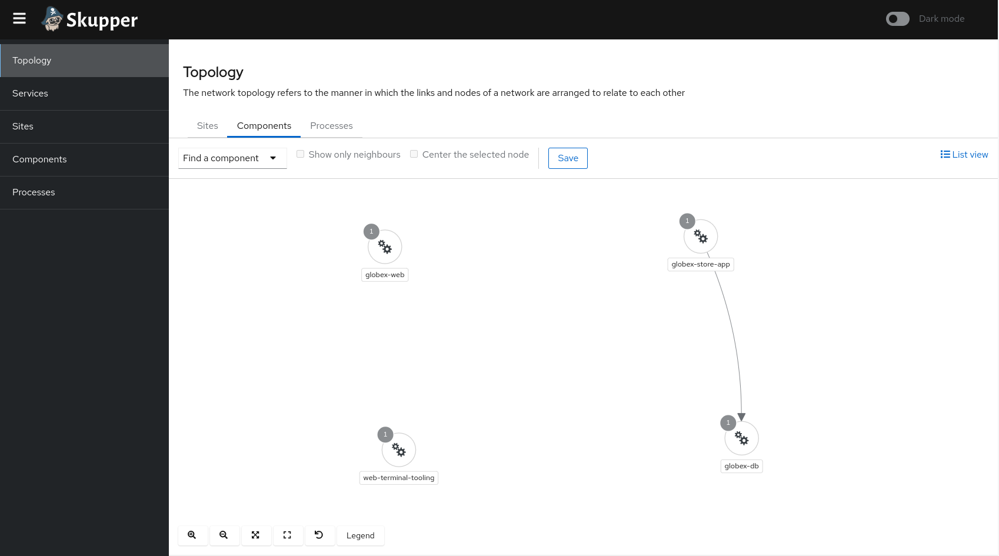

:icons: font 

In this lab, you will use two OpenShift clusters. One cluster is running on AWS. On this cluster the Globex application is deployed. The other cluster is running on Azure, and that is where the Globex retail database is deployed. In the lab, you will create a service network between these two clusters, so that the Globex application on the AWS OpenShift can connect and use the database on the Azure OpenShift cluster. *Note that the database is not exposed to the outside world.*

== Deployment overview: AWS cluster

* In a browser window, navigate to the OpenShift console of the OpenShift cluster running on AWS at %openshift_cluster_console%. If needed, login with your username and password (%user_name%/%user_password%). +
If this is the first time you open the console, you will be directed to the Developer Perspective of the console, which shows you the different namespaces you have access to. 
+
image::images/openshift-console-namespaces.png[]
+
Click on the `globex-skupper-%user_name%` link to select the namespace you are going to use in this lab, and select `Topology` from the left menu.
+
image::images/openshift-console-topology-skupper-aws.png[]

* Expect to see two deployments: The Globex retail application frontend (called *globex-web*, and running on Node.js) and the Globex retail application itself, called *globex-store-app*. Note that the Globex retail application is scaled down to zero pods. As the database is missing, the application would start up correctly if scaled up. You will scale it up once the connection with the database running on the Azure OpenShift cluster is established.

* You can check the state of the application by clicking on the image:images/openshift-console-open-url.png[] icon next to the Node.js deployment.
+
image::images/openshift-console-open-url-5.png[]
+
This opens a new browser tab pointing to the home page of the Globex retail application.
+
image::images/globex-home-page-skupper.png[]

* Click on the *Cool Stuff Store* link in the top menu. This opens a view of the Globex store catalog. If the application would run as expected, you should see a paginated listing of products. However in this case, you will see an empty list:
+
image::images/globex-catalog-empty.png[]

== Deployment overview: Azure cluster

* Open a second browser window (as you will be navigating between the consoles of the two clusters during this lab, it is probably better to have two browser windows open to avoid confusion). Navigate to the Openshift console at %openshift_cluster_console_azure%. Login with your username and password (%user_name%/%user_password%). +
You are redirected to the Developer Perspective, where you should see one namespace, `globex-%user_name%`.
+
image::images/openshift-console-namespaces_azure.png[]
+
Click on the *globex-%user_name%* link to select the namespace, and select *Topology* from the left menu.
+
image::images/openshift-console-topology-skupper-azure.png[]

* Expect to see the deployment for the Globex retail app database.

== Connect the Services with Red Hat Service Interconnect

Building a Service network between the two OpenShift clusters (more precisely between namespaces of the two OpenShift clusters) takes several steps:

* Install Service Interconnect in the namespaces of both clusters.
* Create a connection token on one of the clusters.
* Use the token on the other cluster to create a link between the namespaces of the two clusters.
* Expose services of one cluster on the other cluster. In this case, you will expose the Globex database on the AWS cluster, so that the Globex retail app can connect to it as if it were a local service.

=== Install Red Hat Service Interconnect: AWS cluster

The easiest way to install Red Hat Service Interconnect in a namespace on OpenShift is through the `skupper` CLI (_Skupper_ is the name of the open-source upstream project of Red Hat Service Interconnect). In this lab, the `skupper` cli is available through the OpenShift Command Line terminal, so that you don't have to install it locally on your workstation.

* Open the browser window pointing to the OpenShift Console of the AWS OpenShift cluster. Click on the image:images/openshift-command-line-terminal-icon.png[] icon on the top menu to open a terminal window. +
Make sure to select the correct namespace from the drop-down box (*globex-skupper-%user_name%*)
+
image::images/openshift-command-line-terminal.png[]
+
Click *Start* to start and open the terminal.

* After a couple of seconds, the terminal is up and running. Also note the terminal deployment in the topology view.
+
image::images/openshift-command-line-terminal-2.png[]
+
If you prefer, you can maximize the terminal in a new browser tab by clicking on the image:images/openshift-command-line-terminal-icon-maximize.png[] icon.

* In the terminal, check that you are logged in into the OpenShift cluster.
+
[source,bash,role=copy]
----
oc whoami
----
+
.Output
----
%user_name%
----

* Check that the `skupper` CLI is available in the terminal:
+
[source,bash,role=copy]
----
skupper version
----
+
.Output
----
client version                 1.3.0
transport version              not-found
controller version             not-found
config-sync version            not-found
flow-collector version         not-found
----

* Install the Red Hat Service Interconnect resources in the *globex-skupper-%user_name%* namespace:
+
[source,bash,role=copy]
----
skupper init --enable-console --enable-flow-collector --console-auth unsecured
----
+
.Output
----
Skupper is now installed in namespace 'globex-skupper-%user_name%'.  Use 'skupper status' to get more information.
----

* This installs 2 new components in the namespace: `skupper-service-controller` and `skupper-router`, as you can see in the Topology view:
+
image::images/openshift-console-topology-skupper-aws-2.png[]

* Service Interconnect also comes with its own console, which you can access by opening a new browser tab and navigating to %skupper_console_aws%. At the moment there is not a lot to see as we have only installed one side of the service network.
+

=== Install Red Hat Service Interconnect: Azure cluster

The steps to install Service Interconnect on the OpenShift cluster on Azure are very equivalent to the ones you just performed on the AWS OpenShift cluster.

* Open the browser window pointing to the OpenShift Console of the AWS OpenShift cluster. Click on the image:images/openshift-command-line-terminal-icon.png[] icon on the top menu to open a terminal window. +
Make sure to select the correct namespace from the drop-down box (*globex-%user_name%*) +
Click *Start* to start and open the terminal.

* In the terminal, check that you are logged in into the OpenShift cluster.
+
[source,bash,role=copy]
----
oc whoami
----
+
.Output
----
%user_name%
----

* Check that the `skupper` CLI is available in the terminal:
+
[source,bash,role=copy]
----
skupper version
----
+
.Output
----
client version                 1.3.0
transport version              not-found
controller version             not-found
config-sync version            not-found
flow-collector version         not-found
----

* Install the Red Hat Service Interconnect resources in the *globex-%user_name%* namespace:
+
[source,bash,role=copy]
----
skupper init
----
+
.Output
----
Skupper is now installed in namespace 'globex-%user_name%'.  Use 'skupper status' to get more information.
----
+
[NOTE]
====
You might see some warnings about PodSecurity violations in the console output. These can safely be ignored.
====

* To see the status of the skupper network:
+
[source,bash,role=copy]
----
skupper status
----
+
.Output
----
Skupper is enabled for namespace "globex-%user_name%" in interior mode. It is not connected to any other sites. It has no exposed services.
----

=== Create a link between the namespaces on the two clusters

To create a link between the two clusters, you create a token on one of the clusters, and then use the token to create the link on the other cluster.

* Navigate to the browser tab pointing to the OpenShift Web terminal on the AWS cluster. +
Issue the following command:
+
[source,bash,role=copy]
----
skupper token create /tmp/skupper.token
----
+
.Output
----
Token written to /tmp/skupper.token
----

* If you want to have a look at the token that was created:
+
[source,bash,role=copy]
----
cat /tmp/skupper.token 
----
+
.Output
----
apiVersion: v1
data:
  ca.crt: LS0tLS1CRUdJTiBDRVJUSUZJQ0FURS0tLS0tCk1JSURMVENDQWhXZ0F3SUJBZ0lSQUxuRSsrMmNiYmlUMFZESWdyb2dXdm93RFFZSktvWklodmNOQVFFTEJRQXcKR2pFWU1CWUdBMVVFQXhNUGMydDFjSEJsY2kxemFYUmxMV05oTUI0WERUSXpNRFF5TlRFME1ETTFObG9YRFRJNApNRFF5TXpFME1ETTFObG93R2pFWU1CWUdBMVVFQXhNUGMydDFjSEJsY2kxemFYUmxMV05oTUlJQklqQU5CZ2txCmhraUc5dzBCQVFFRkFBT0NBUThBTUlJQkNnS0NBUUVBclRjOVNBOEtPRlh2RWpWN2JYWWVRUytKRXFZRU52ZmgKblA5NHV0SGxVZWwvWEpyeW1lK3V2YzhjK21yRjBhVEdLZ2licGVab1JFcXdVWW9CR3ZMTXhOMEJXenlVNWlseQovcFRYMmthSGtJbDlVUzdYbDRaQ09hNHB4bDE2WnhVNDYxbU9uMDJQUDEwVVdUVFg2Vk9NQ2VEZEdOYlRTZ3BuCkdTMlEzS0JMMXRBa201cDdRRGYrMTRIdEl1ZGUvdzBySnFJc1RPbkJnSHlGVy9ZTlZKdlUyZ2I5WjRzRWEyUWsKY2E3MEF6Mkw2bnJkV1BiMVFnem1QQXBrSWc5K0hQSDVqYkZSNzNVYUpNbDR3ZVhzdTdNQmFUNDRJeG1FVCtBTApxS3BkTjlMaFFSb21wQ3ZETWFsQTdQamU4cWcvNWlkSFd4cEtFdi84VS9yTC9mbEpyNlZycndJREFRQUJvMjR3CmJEQU9CZ05WSFE4QkFmOEVCQU1DQXFRd0hRWURWUjBsQkJZd0ZBWUlLd1lCQlFVSEF3RUdDQ3NHQVFVRkJ3TUMKTUE4R0ExVWRFd0VCL3dRRk1BTUJBZjh3SFFZRFZSME9CQllFRkhITTdoS0JwSVFKK3FtZ2lmNUVld2NLZVE3dgpNQXNHQTFVZEVRUUVNQUtDQURBTkJna3Foa2lHOXcwQkFRc0ZBQU9DQVFFQVdhaEtnVER0N3h3WnJjYTJaQXFYCk1ZZFV4RFk2NzI1anNLZTh0Ym1RbmVnZ21vcURDKzBXM2pGc0tYUnVEMXJJMmZTNFhRZHYxYUhzZnhuenkyOFMKVXdZQVFaRi9oTFFZRTNqYXhybkV0TmlJaE1KWGkyQ3BDN3ZvL2V6MDBWYzVxNmlKbms4eHBOelEyNlZzVk9ELwpBY2x4MG1sMDgyajRUc0tWZzVxemt0Z2xEK1FQRTNRcDViNzl5ZVg3UG80dW13Vm9jK3RlaHduNDY1Qy8remZqCks3ckZqZW1XZE9McFhIZHpPc3E4LzZWR1IzTUJCcnZBTjZ6MC95STdxZ3VJNGdCSDFxUzZ4Sm1rbW9PQXAxWU4Ka21HZXQvbk9ZVldzQW1nQTd4UGlVWTNxRUkrQWdCUGloeS9NR3FOaGpvYkRCS1J0OGVSdU9ESmJDdVNvRjhpcAo0UT09Ci0tLS0tRU5EIENFUlRJRklDQVRFLS0tLS0K
  password: Sko2akMzaDdIZDFyUDlCY0dzSlNSbkUx
kind: Secret
metadata:
  annotations:
    skupper.io/generated-by: be643070-dca3-4ce9-8401-a536ad0fc744
    skupper.io/site-version: 1.3.0
    skupper.io/url: https://claims-globex-skupper-%user_name%.%openshift_subdomain%:443/3407732d-e37c-11ed-92e1-0a580a830063
  creationTimestamp: null
  labels:
    skupper.io/type: token-claim
  name: 3407732d-e37c-11ed-92e1-0a580a830063
----
+
This is actually an OpenShift secret which contains a certificate. This certificate will be used to setup a mTLS (mutual TLS) secured link between the two clusters.

* The next step is creating the link on the other cluster with the token. In a real life situation that probably requires to physically transfer the token to the other site. In this lab, you will login into the Azure cluster from the terminal on the AWS cluster to create the link.

* On the browser tab with the terminal on the AWS cluster, open a second terminal tab by clicking on the image:images/openshift-command-line-terminal-icon-add.png[] icon next to the existing terminal. This opens a second terminal.

* On this second terminal, point to another context for the `oc` CLI:
+
[source,bash,role=copy]
----
export KUBECONFIG=/tmp/config-azure
----

* Login in to the Azure OpenShift cluster as user *%user_name%*:
+
[source,bash,role=copy]
----
oc login -u %user_name% %openshift_api_azure%
----
+
.Output
----
W0425 15:01:25.796538     203 loader.go:223] Config not found: /tmp/config-azure
The server uses a certificate signed by an unknown authority.
You can bypass the certificate check, but any data you send to the server could be intercepted by others.
Use insecure connections? (y/n): 
----
+
Answer `y` to allow insecure connections.
+
.Output
----
Use insecure connections? (y/n): y

WARNING: Using insecure TLS client config. Setting this option is not supported!

Authentication required for %openshift_api_azure% (openshift)
Console URL:%openshift_api_azure%/console
Username: %user_name%
Password: 
----
+
Enter the password for %user_name%: *%user_password%*
+
.Output
----
Login successful.

You have one project on this server: "globex-%user_name%"

Using project "globex-%user_name%".
W0425 15:04:26.533522     221 loader.go:223] Config not found: /tmp/config-azure
W0425 15:04:26.533565     221 loader.go:223] Config not found: /tmp/config-azure
----
+
You are now logged in into the OpenShift cluster on Azure.

* Still on the same terminal, create a link using the token:
+
[source,bash,role=copy]
----
skupper link create /tmp/skupper.token
----
+
.Output
----
Site configured to link to https://claims-globex-skupper-%user_name%.%openshift_subdomain%:443/aecd4692-e378-11ed-811c-0a580a830063 (name=link1)
Check the status of the link using 'skupper link status'.
----

* To check the status of the link:
+
[source,bash,role=copy]
----
skupper link status
----
+
.Output
----
Links created from this site:
-------------------------------
Link link1 is connected

Current links from other sites that are connected:
----------------------------------------
There are no connected links
----

* Finally, you need to expose the database service over the link. This will allow the Globex app on the AWS cluster to connect to the database as if it was a local service, while in reality the service is a proxy for the real service running on the Azure cluster. +
+
[source,bash,role=copy]
----
skupper expose deployment/globex-db --port 5432
----
+
.Output
----
deployment globex-db exposed as globex-db
----

* You can now close the terminal.

You have established a secure link between the two clusters, and exposed the `globex-db` service on Azure as a proxy service in the `globex-skupper-%user_name%` namespace on AWS.

There a couple of ways to verify this:

* In the original terminal on the AWS cluster, use `oc` to get the services deployed in the `globex-skupper-%user_name%` namespace: 
+
[source,bash,role=copy]
----
oc get service
----
+
.Output
----
NAME                                TYPE        CLUSTER-IP       EXTERNAL-IP   PORT(S)                      AGE
globex-db                           ClusterIP   172.30.187.88    <none>        5432/TCP                     114s
globex-store-app                    ClusterIP   172.30.94.78     <none>        8080/TCP                     6h37m
globex-web                          ClusterIP   172.30.172.136   <none>        8080/TCP                     6h37m
skupper                             ClusterIP   172.30.250.157   <none>        8010/TCP,8080/TCP,8081/TCP   81m
skupper-router                      ClusterIP   172.30.252.101   <none>        55671/TCP,45671/TCP          81m
skupper-router-local                ClusterIP   172.30.49.91     <none>        5671/TCP                     81m
workspace207858d3e7d2450b-service   ClusterIP   172.30.2.112     <none>        4444/TCP                     93m
----
+
The `globex-db` service is the proxy service created by exposing the `globex-db` deployment in the Azure cluster over the service network.

* You can also check out the `globex-db` service through the OpenShift console. Navigate to the browser tab pointing to the Developer perspective of the OpenShift console of AWS cluster. +
On the left menu, select *Project*, and in the *Inventory* list click on *Services*.
+
image::images/openshift-console-project-services.png[]

* This opens the list of Service resources in the namespace. Notice the *globex-db* service.
+
image::images/openshift-console-service-skupper-proxy.png[]
+
The _Pod Selector_ indicate that this service is pointing to the Skupper router pod, which forwards the communication over the secure link to the real database service on the Azure cluster.

* Finally, you can check the Service Interconnect console at %skupper_console_aws%. In the *Network* section you'll see a graphical representation of the Service InterConnect network. +
The *Sites* tab shows the connected namespaces, `globex-%user_name%` on Azure and `globex-skupper-%user_name%` on AWS.
+

== Verify the Service Interconnect network

At this point you can verify that the service network is actually working as expected. When scaling up the `globex-store-app` application to 1 pod, it should be able to connect to the database running on the Azure cluster through the service network.

* In the browser tab pointing to the OpenShift console of the AWS cluster, select the *Topology* View. Click in the center of the deployment of the *globex-store-app* application. This opens a side window with details about the deployment. Click on the *Details* tab.
+
image::images/openshift-console-deployment.png[]

* To scale the deployment to a pod, click on the image:images/openshift-console-scale-up-icon.png[] icon next to the empty circle representing the deployment.

* After a while, the circle becomes dark blue, indicating a successful deployment. The `globex-store-app` application has 1 pod which successfully connected to the database over the service network.
+
image::images/openshift-console-deployment-2.png[]

* Click on the image:images/openshift-console-open-url.png[] icon next to the Node.js deployment.
+
image::images/openshift-console-open-url-5.png[]
+
This opens a new browser tab pointing to the home page of the Globex retail application.
+
image::images/globex-home-page-skupper.png[]

* Click on the *Cool Stuff Store* link in the top menu. This opens a view of the Globex store catalog. Expect to see a paginated listing of products from the Globex catalog.
+
image::images/globex-catalog.png[]

* The information on that page is retrieved from the database, demonstrating that the service network is working as expected. Feel free to navigate around the app to cause traffic between the application and the database.

* You can also check the link between the two clusters in the Interconnect console at %skupper_console_aws%. 
In the *Network* section, select the *Components* tab, which  shows the connection between the `globex-store-app` deployment on AWS and the `globex-db` service which is proxied over the service network.
+

Congratulations! You successfully used Red Hat Service Interconnect to build a secure service network between two services on two different OpenShift clusters and allow application to connect and communicate over the secure network.