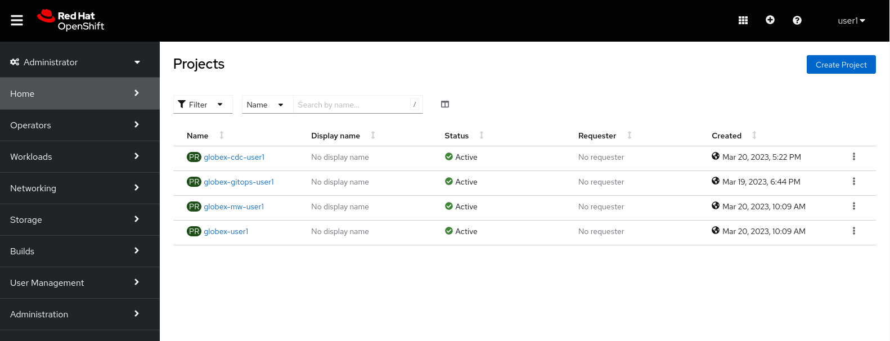
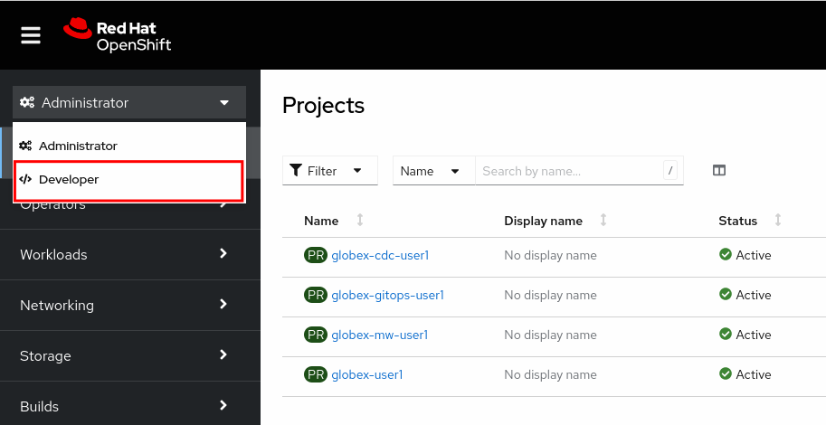

:icons: font

This document explains the technical and functional environment for this workshop. 

Let's first introduce Globex, our fictitious company.

Globex is a fictitious. The company recently started a digital transformation and cloud  adoption journey. 
As part of this initiative, the development teams adopted new ways of working, and started the modernization of the legacy multi-tier monolithic retail e-commerce web application.
As part of this modernization, the retail application was redeveloped using a modular approach on top of Quarkus, a modern cloud-ready Java runtime and a separate UI layer built using a state-of-the-art web development framework.
The security of the application was improved with the introduction of OpenID Connect and Red Hat Single Sign-On (SSO).
The application was containerized and re-hosted to OpenShift.
As part of the modernization effort, the development and operation teams adopted DevOps and GitOps principles for rapid and continuous deployment.

The outcome of this application modernization effort is an increased velocity of application development and deployment, and an overall faster go to market for new functionalities.

A schematic overview of the state of the application after the first phase of the application modernization effort:

.TODO: Globex retail app architecture (before introduction of Kafka)
image::images/todo-sticky.jpg[]

Taking advantage of this new momentum, the business quickly came up with new requirements for the e-commerce application. 
One of these requirements is the ability to track user-activity on the web site of the application, and generate product recommendations based on user activity.
To achieve this, a streaming platform, Apache Kafka, was introduced to the architecture to generate a stream of user activity events from the web application.
User activity events are generated in the web front-end application and forwarded to a new microservice using a REST API. The new service transforms and forwards the events to the streaming platform.
The stream of user activity events is processed in real-time using a stream processing library to generate a list of featured products that can be highlighted on the web site.

The current architecture of the Globex retail web-application:

.TODO: Globex retail app architecture after introduction of Kafka and recommendation engine)
image::images/todo-sticky.jpg[]

== Technical environment.

* OpenShift cluster: all the activities for this workshop will be done on a OpenShift cluster. +
The connection details for the OpenShift cluster:
** OpenShift Console: %openshift_cluster_console%
** Username: *%user_name%*
** Password: *%user_password%*

* etc...

== Walkthrough of the Globex web application

While the Globex web application used in this workshop is a demo app and as such does not pretend to be a real-life retail application, it packs enough functionality to make it feel like a real retail web app.

In this section of the workshop, you will explore the Globex web application, both from a deployment as well as a functional point of view.

* On your workstation, open a browser window and navigate to the console of your OpenShift cluster at %openshift_cluster_console%. Login with your username and password (%user_name%/%user_password%).
* You will be redirected to the *Administrator* view of the console, which lists the different namespaces you have access to.
+

* The Globex web application is deployed in the *globex-%user_name%* namespace. Click on the name of the namespace to navigate to the overview page of the namespace. To have a developer-oriented view of the contents of the namespace, switch to the developer perspective of the namespace by selecting the *Developer* perspective from the drop-down box at the top of the left-side menu.
+

* In the *Topology View* of the Developer Perspective, expect to see something like this(rearrange the topology as you see fit):
+
image::images/openshift-console-topology-view.png[]
+
The Globex web-app deployment consists of:
+
[cols="28m,~"]
[frame=all, grid=all]
|===
|*Service* | *Description*

| globex-web
| The web front-end of the Globex web application. Running on Node.js with a Angular UI.

| globex-store-app
| The backend application of the Globex retail app. Written in Quarkus. Provides catalog, inventory, cart and order services. 

| globex-db
| The PostgreSQL database used by the globex-store-app application. Stores the catalog, inventory, customer and order information.

| activity-tracking 
| TODO

| recommendation-engine
| TODO

|===
