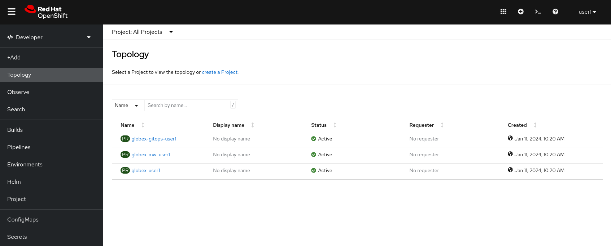
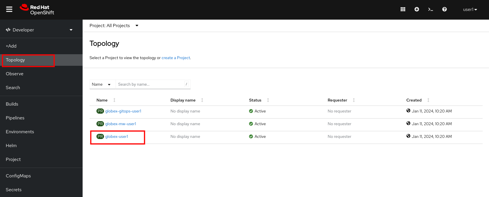

:icons: font

This document explains the technical and functional environment for this workshop. 

Let's first introduce Globex, our fictitious company.

Globex is a fictitious. The company recently started a digital transformation and cloud  adoption journey. 
As part of this initiative, the development teams adopted new ways of working, and started the modernization of the legacy multi-tier monolithic retail e-commerce web application.
As part of this modernization, the retail application was redeveloped using a modular approach on top of Quarkus, a modern cloud-ready Java runtime and a separate UI layer built using a state-of-the-art web development framework.
The security of the application was improved with the introduction of OpenID Connect and Red Hat Single Sign-On (SSO).
The application was containerized and re-hosted to OpenShift.
As part of the modernization effort, the development and operation teams adopted DevOps and GitOps principles for rapid and continuous deployment.

The outcome of this application modernization effort is an increased velocity of application development and deployment, and an overall faster go to market for new functionalities.

A schematic overview of the state of the application after the first phase of the application modernization effort:

.TODO: Globex retail app architecture (before introduction of Kafka)
image::images/todo-sticky.jpg[]

Taking advantage of this new momentum, the business quickly came up with new requirements for the e-commerce application. 
One of these requirements is the ability to track user-activity on the web site of the application, and generate product recommendations based on user activity.
To achieve this, a streaming platform, Apache Kafka, was introduced to the architecture to generate a stream of user activity events from the web application.
User activity events are generated in the web front-end application and forwarded to a new microservice using a REST API. The new service transforms and forwards the events to the streaming platform.
The stream of user activity events is processed in real-time using a stream processing library to generate a list of featured products that can be highlighted on the web site.

The current architecture of the Globex retail web application:

.TODO: Globex retail app architecture after introduction of Kafka and recommendation engine)
image::images/todo-sticky.jpg[]

== Technical environment.

* OpenShift cluster: all the activities for this workshop will be done on a OpenShift cluster. +
The connection details for the OpenShift cluster:
** OpenShift Console: %openshift_cluster_console%
** Username: *%user_name%*
** Password: *%user_password%*

* etc...

== Walkthrough of the Globex web application

While the Globex web application used in this workshop is a demo app and as such does not pretend to be a real-life retail application, it packs enough functionality to make it feel like a real retail web app.

In this section of the workshop, you will explore the Globex web application, both from a deployment as well as a functional point of view.

* On your workstation, open a browser window and navigate to the console of your OpenShift cluster at %openshift_cluster_console%. Login with your username and password (%user_name%/%user_password%).
* You will be redirected to the *Developer* perspective of the console. A welcome popup might appear, which you can dismiss for now (click *Skip Tour*). Also, a popup window might appear with details about the perspective switcher. Feel free to close the popup window (or click *Next* if you want to know more.
Finally, you should be redirected to a view which lists the different OpenShift _projects_ (also known as _namespaces_) you have access to.
+

* The Globex web application is deployed in the *globex-%user_name%* namespace. Click on *Topology* in the menu on the left and then click on the *globex-%user_name%* link to open the topology view of the namespace. The Topology view gives you a graphical representation of the different resources deployed in the namespace.
+

* In the *Topology View* of the Developer Perspective, expect to see something like this(rearrange the topology as you see fit):
+
image::images/openshift-console-topology-view.png[]
+
The Globex web-app deployment consists of:
+
[cols="28m,~"]
[frame=all, grid=all]
|===
|*Service* | *Description*

| globex-web
| The web front-end of the Globex web application. Running on Node.js with an Angular UI.

| globex-store-app
| The backend application of the Globex retail app. Written in Quarkus. Provides catalog, inventory, cart and order services. 

| globex-db
| The PostgreSQL database used by the globex-store-app application. Stores the catalog, inventory, customer and order information.

| activity-tracking 
| This microservice has a REST endpoint for user activity events generated from the UI. These events are produced to a Kafka topic.

| recommendation-engine
| An example of an application which does real-time processing of an event stream. This application uses Kafka Streams, an event-streaming library, to process the stream of events produced by the activity tracking service to build a list of the most popular products on the web site. This list is exposed as a REST endpoint, and called by the front-end to display featured products.

|===

* To open the Globex web application, click on the image:images/openshift-console-open-url.png[] symbol next to the *globex-web* deployment in the topology view.
+
image::images/openshift-console-open-url-2.png[]
+
This opens a new browser tab pointing to the home page of the Globex Web application. Alternatively, open a new browser tab and navigate to %globex_web_url%.

* The featured product list of the Globex web application home page is empty. This is expected as no user activity events have been generated yet.
+
image::images/globex-home-page.png[]

* On the Globex web site, click on the *Cool Stuff Store* link on the top menu. From here you can browse through the product catalog, open product detail pages and add items to the shopping cart.

* To generate user activity events, click on the image:images/globex-product-like.png[] symbol next to a product. You can repeat this for a couple of products.

* Every _like_ action generates a user activity event that is captured by the _activity tracking_ service and sent to a Kafka topic. +
The Kafka broker is installed in the *globex-mw-%user_name%* namespace. In the same namespace, Kafdrop, a tool to introspect a Kafka broker is also installed. +
Open a new browser tab, and navigate to %kafdrop_url%. This redirects you to the Kafdrop home page.
+
image::images/kafdrop.png[]

* Scroll down to see the list of topics. One of those topics is called *globex.tracking*, which is the topic that contains the user activity events. Click on the topic name to see the details of the topic. If you liked some products on the web site, the topic should contain some messages.
+
image::images/kafdrop-globex-tracking.png[]

* Click on the link representing the only partition of the topic to see the contents of the partition.
+
image::images/kafdrop-globex-tracking-partition.png[]
+
This opens a view to the individual messages in the topic. In this case, the body of each message consists of a JSON structure of the a user activity event from the Globex web application.
+
image::images/kafdrop-globex-tracking-message.png[]

* If you go back to the list of topics in the Kafdrop UI, you will notice a number of topics of topics starting with *globex.recommendation*. Those are the topics created by the _recommendation engine_ application, which calculates a list of the most popular products based on the user activity stream. +
The *globex.recommendation-product-score-aggregated-changelog* topic contains messages containing the list of most popular products, where the latest message has the current list.
+
image::images/kafdrop-globex-tracking-recommendation.png[]

* In your browser window, go to the tab pointing to the Globex we application. Navigate to the home page. You should see some items in the list of featured products, corresponding to the list of products you liked.
+
image::images/globex-home-page-featured.png[]

* To demonstrate that the list of featured products is calculated in real-time, you can simulate a number of user activities using a simulator deployed next to the Globex web application. +
To use the simulator, go the the browser tab pointing to the web console of the OpenShift cluster, navigate to the Topology view of the *globex-%user_name%* namespace, and click the image:images/openshift-console-open-url.png[] symbol next to the *activity-tracking-simulator* deployment.
+
image::images/openshift-console-open-url-3.png[]

* This opens a Swagger UI page showing the REST API of the simulator.
+
image::images/swagger-ui-activity-tracking-simulator.png[]

* Click on the *POST* link, and then on the *Try it out* link on the right. If you want, you change the number of user activities that will be generated (the default is 100). Click *Execute* to execute the REST call to the simulator.
+
image::images/swagger-ui-activity-tracking-simulator-2.png[]

* In your browser window, navigate to the tab with the Kafdrop UI, and notice how messages are produced in the *globex.tracking* topic. After a couple of seconds you should also see new messages in the *globex.recommendation-product-score-aggregated-changelog* topic, reflecting the newly calculated list of featured products. +
Go the browser tab with the Globex we UI, refresh the home page, and notice how the list of featured products has changed, as it is being continuously recalculated.

* This concludes the walkthrough of the Globex web application for now. The application provides more features, which you will discover while going through some of the modules of this workshop.